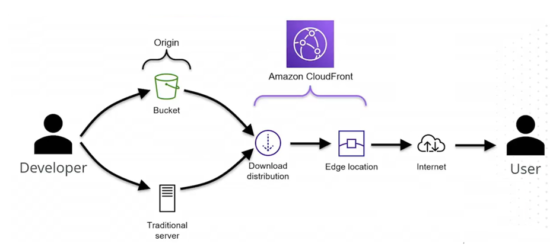

# AWS CloudFront Overview and Demonstration

**Amazon CloudFront** is a global **Content Delivery Network (CDN)** that securely delivers web content such as HTML, CSS, JavaScript, images, and videos with **low latency** and **high transfer speeds**.  
This summary explains how CloudFront works, its integration with **Amazon S3**, and how to deploy a **secure, domain-linked CloudFront distribution** for static website content.

---

[CloudFront Code Example](../CODE/S3/CloudFront/)



## 1. What is CloudFront?

- **CloudFront** is AWS’s CDN service that distributes content from **edge locations** worldwide, bringing data **closer to end users**.
- You create a **CloudFront distribution** that references an **origin server**, which acts as the *“gold master”* for your content.
- The origin can be:
  - An **S3 bucket** (with static website hosting enabled)
  - An **EC2 instance** or **HTTP(S) web server**
  - A **non-AWS server** (on-premises or external)

> ⚠️ If using S3 as an origin for website hosting, the bucket or objects must be **publicly readable** unless you use **signed URLs** or **signed cookies** for private access.

---

## 2. How CloudFront Delivers Content

### Workflow:
1. You upload your content to an **origin server** (e.g., S3 or EC2).
2. You create a **CloudFront distribution** and specify the origin.
3. The **distribution configuration** is pushed to all AWS **edge locations** globally.
4. When a **user requests** content (via the CloudFront domain name), CloudFront routes the request to the **nearest edge location**.
5. The edge location **caches** the content upon the first request.
6. Future requests for that same object are served **directly from cache**, reducing latency and cost.

### Key Points:
- **Content** is cached at edge locations only after the **first request**.
- **Configuration** (not content) is distributed globally to all edge nodes.
- Cached content is **temporary** and expires after a default period (typically **24 hours**).
- You can **manually invalidate cache** objects to remove outdated content.

---

## 3. Cache Invalidation

- **Manual invalidation** removes outdated content from all edge caches.
- Invalidation requests specify **object paths** to clear (e.g., `/index.html`).
- If frequent updates are made (e.g., for security patches or rapid deployments), you can **automate invalidation**:
  - Configure **S3 Event Notifications** to trigger a **Lambda function**.
  - The Lambda function can programmatically **submit invalidation requests** to CloudFront.

> This setup ensures cache is refreshed automatically when S3 content changes.

---

## 4. Creating a CloudFront Distribution (Demo Summary)

This section outlines the steps used to create and configure a CloudFront distribution using an **S3 static website** as the origin.

### Steps:

1. **Prepare the Origin:**
   - Create an S3 bucket (e.g., `test-bucket-adgu`).
   - Upload static website content (`index.html`, `test.html`, `house.png`).
   - Enable **static website hosting** and make content public.
   - Configure **versioning** and verify website endpoint (HTTP only).

2. **Why Use CloudFront?**
   - Direct S3 websites only support **HTTP** (no encryption).
   - CloudFront enables **HTTPS/TLS encryption** with a custom domain, providing a **secure and professional user experience**.

3. **Create the Distribution:**
   - Go to the **CloudFront console** and create a new distribution.
   - **Origin Domain:** specify the S3 static website endpoint.
   - **Settings:**
     - Use all edge locations.
     - Optional: Enable **access logging**.
     - Disable **Origin Shield** unless needed.
   - Add **Alternate Domain Name (CNAME)**: `adgu.awsdev.guru`.

4. **Request an SSL Certificate:**
   - Open **AWS Certificate Manager (ACM)**.
   - Request a **public certificate** for `adgu.awsdev.guru`.
   - Choose **DNS validation**.
   - Add the provided **CNAME record** in **Route 53** to prove domain ownership.
   - Once validated, select the issued certificate in CloudFront.

5. **Finalize Settings:**
   - Set the **Default Root Object** to `index.html` (required for default page loading).
   - Create the distribution and wait for **deployment** (may take several minutes).

6. **DNS Configuration:**
   - In **Route 53**, create an **Alias record** pointing the domain (`adgu.awsdev.guru`) to the CloudFront distribution.
   - Wait for **DNS propagation** (depends on TTL).

---

## 5. Verifying the Deployment

- After a few minutes (to allow propagation), access the domain:
  ```
  https://adgu.awsdev.guru
  ```
- The website should now:
  - Load the static content from the S3 bucket via CloudFront.
  - Display the **lock icon** in the browser (indicating SSL/TLS encryption).
  - Deliver content through **AWS’s global edge network**, ensuring low latency.

---

## 6. CloudFront Key Features

| Feature                           | Description                                                 |
| --------------------------------- | ----------------------------------------------------------- |
| **Global Edge Network**           | Delivers content from edge locations nearest to users       |
| **Caching**                       | Reduces latency and origin load by storing content locally  |
| **SSL/TLS Support**               | Provides secure HTTPS access via custom or ACM certificates |
| **Custom Domains**                | Supports CNAMEs and Route 53 alias records                  |
| **Access Logs**                   | Optionally records detailed request data                    |
| **Invalidation**                  | Allows manual or automated cache clearing                   |
| **Integration with AWS Services** | Works with S3, Lambda@Edge, Route 53, and ACM               |

---

## ✅ Summary

By front-ending an **S3 static website** with **Amazon CloudFront**, you can:
- Distribute content **securely and efficiently** around the world.
- Reduce latency with **edge caching**.
- Enable **HTTPS encryption** for a trusted, professional web presence.
- Maintain flexibility through integration with **Route 53** (DNS), **ACM** (SSL), and **Lambda** (automation).

This setup—`S3 ➜ CloudFront ➜ Custom Domain (Route 53)`—creates a **high-performance, secure, and scalable** architecture for hosting static websites and web assets.
