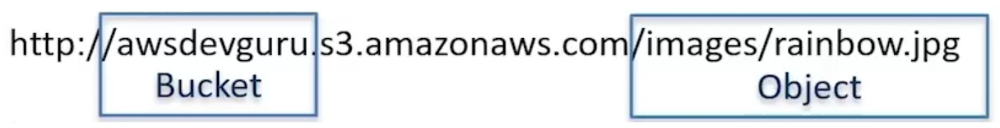

# 10.2 Understanding S3 
 
 # AWS S3: Simple Storage Service

## Introduction

Amazon S3 (Simple Storage Service) is one of the oldest and most widely used services in AWS, launched in **2006**. As Amazon describes it:

> "Object storage built to store and retrieve any amount of data from anywhere."

S3 is intentionally minimal, easy to use, and designed for cloud-based file storage.

---

## Core Concepts

### Buckets
- Containers for storing objects (files + metadata)
- Exist in a specific AWS region
- Globally visible in the AWS Console
- Support fine-grained permissions
- Can store **virtually unlimited data**

### Objects
- Data stored in buckets
- Can be up to **5 TB** in size
- Include metadata (e.g., last modified date)
- Support **client-side** and **server-side encryption**
- Bucket + Key + Version identifies all objects

### Keys
- Unique identifier for each object
- Combined with bucket name and version to form full object path

Example URL:

``` text
https://awsdevguru.s3.amazonaws.com/images/rainbow.jpg
```

 - Bucket: `awsdevguru`
- Key: `images/rainbow.jpg`


---

## Interfaces

- **Web Console**
- **CLI (Command Line Interface)**
- **SDKs / APIs** (REST and SOAP)

---

## Consistency Model

| Operation Type       | Consistency Behavior            |
|----------------------|----------------------------------|
| New Object PUT       | Read-after-write consistency     |
| Overwrite PUT/DELETE | Eventually consistent            |

> ⚠️ Reads may return stale data immediately after overwrite or delete due to replication delays across Availability Zones.

---

## Storage Classes

| Storage Class              | Availability Zones | Access Frequency       | Retrieval Time         |
|----------------------------|--------------------|------------------------|------------------------|
| Standard                   | ≥ 3 AZs            | Frequent               | Immediate              |
| Standard-Infrequent Access| ≥ 3 AZs            | Infrequent             | Immediate              |
| One Zone-Infrequent Access| 1 AZ               | Infrequent             | Immediate              |
| Intelligent-Tiering        | Adaptive           | Variable               | Immediate              |
| Glacier Instant Retrieval | ≥ 3 AZs            | Rare                   | Minutes                |
| Glacier Flexible Retrieval| ≥ 3 AZs            | Rare                   | Hours                  |
| Glacier Deep Archive      | ≥ 3 AZs            | Very Rare (<1/year)    | Several Hours          |
| Reduced Redundancy Storage| 1 AZ               | Legacy                 | Immediate              |

> 🧊 Glacier classes are ideal for archival storage with low cost and slower access times.

---

## Versioning

- **Off by default**
- Once enabled, cannot be disabled (only suspended)
- Maintains multiple versions of an object
- Deletes mark objects as deleted (can be permanently removed)

---

## Lifecycle Management

Define rules to automate transitions and deletions:

### Example Rule
- Transition to **Standard-IA** after 30 days
- Move to **Glacier** after 1 year
- Expire objects after 2 years of inactivity

---

## Public Access Use Case

S3 can serve static content publicly:

- Host images, videos, or documents
- Reference objects in HTML for websites
- Offload bandwidth from web servers

Example:
``` html

```
## Amazon S3 is a foundational AWS service offering:

* Scalable object storage
* Multiple access interfaces
* Fine-grained permissions
* Flexible storage classes
* Lifecycle and versioning controls

Whether you're hosting static content, archiving data, or building cloud-native applications, S3 provides the durability, flexibility, and simplicity needed for modern workloads.

 ## [Context](./../context.md)