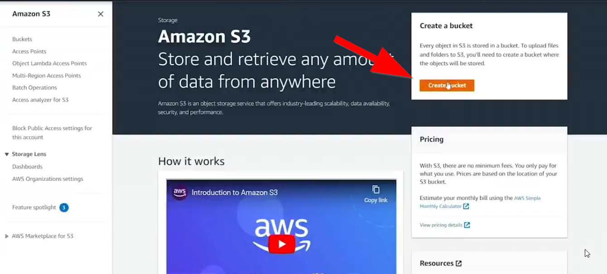
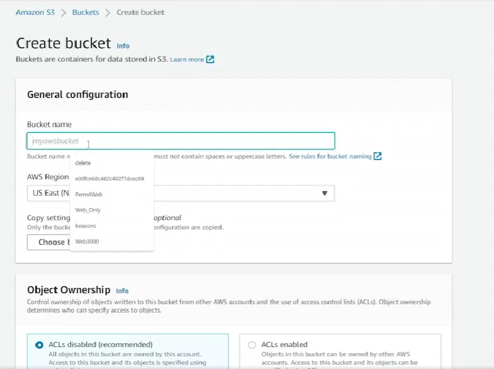
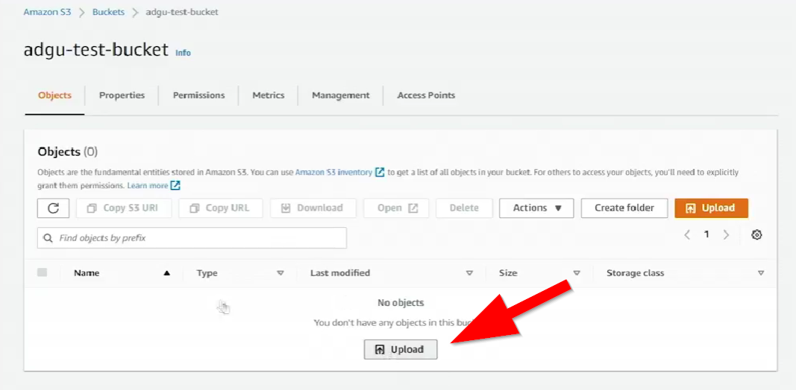
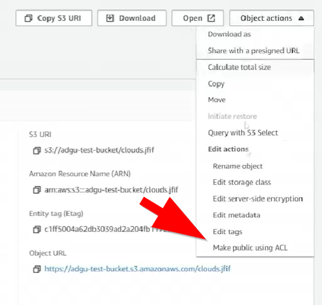
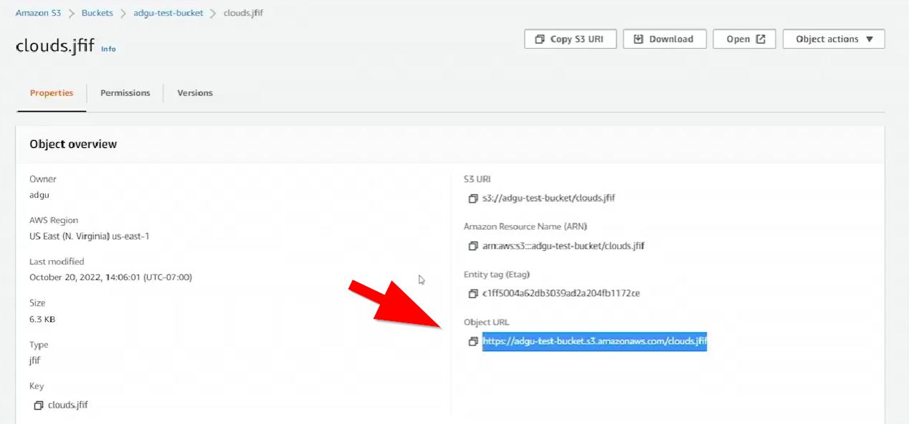
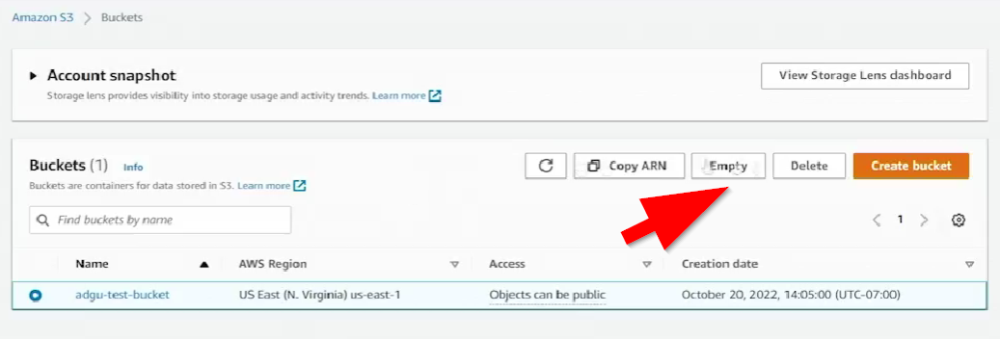
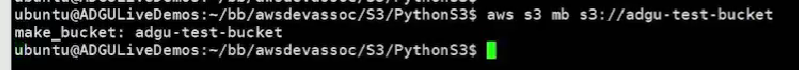

# 10.3 Creating buckets 

 # Summary of S3 Bucket Creation and Object Management

## Overview
This lesson demonstrates **creating and managing S3 buckets** using:
- **AWS Web Console**
- **AWS CLI**
- **Python Boto3 SDK**  
It also covers **uploading objects**, **setting ACLs**, and using the **sync command**.

---

## 1. Creating a Bucket in the Web Console
- **Bucket naming rules**: must follow URL syntax (a–z, 0–9, hyphens), globally unique.
- **Region selection**: example uses `us-east-1`.
- **ACL settings**: ACLs enabled; public access block disabled for demonstration.
- **Versioning**: left disabled (can only be suspended later).
- **Server-side encryption**: optional; left disabled.
- **Object Lock**: not used.

After creation, the bucket is empty and ready for uploads.

---

## 2. Uploading and Managing Objects in the Console
- **Upload an object** (e.g., `clouds.jfif`).

- **Object properties**: storage class, encryption, ACLs.
- **Public access**: object URL initially denied until ACL is set to public-read.

- **Use case**: hosting static website assets.

---

## 3. Deleting Buckets in the Console
- **Buckets must be emptied first**.
- **Confirm deletion** by typing the bucket name.

---

## 4. Creating and Managing Buckets with AWS CLI
- **List buckets**: `aws s3 ls`
- **Create bucket**: `aws s3 mb s3://adgu-test-bucket`

- **Upload file**: `aws s3 cp rainbow.jpg s3://adgu-test-bucket/`
- **Set ACL during upload**:  

  `aws s3 cp rainbow.jpg s3://adgu-test-bucket/ --acl public-read`
- **Delete objects and buckets** using CLI or console.

---

## 5. Using Python Boto3 SDK
- **Configuration**: access key, secret key, region, bucket name.
- **Create bucket programmatically**.
- **Generate temporary files** and upload them.
- **Apply ACLs** to make objects public.
- **Optional cleanup**: delete objects and bucket after script runs.

---

## 6. Using the `sync` Command
- **Create bucket**:  
  `aws s3 mb s3://thisisasuperawesomebucket`
- **Sync directory to bucket**:  
  `aws s3 sync . s3://thisisasuperawesomebucket`
- **Incremental updates**: only changed/new files are uploaded.

---

## Final Summary
This lesson demonstrated:
- **Creating buckets** via console, CLI, and Python.
- **Uploading objects** and managing ACLs.
- **Making objects public** for static content hosting.
- **Deleting buckets safely**.
- **Using AWS CLI sync** for efficient directory uploads.

---

 ## [Context](./../context.md)