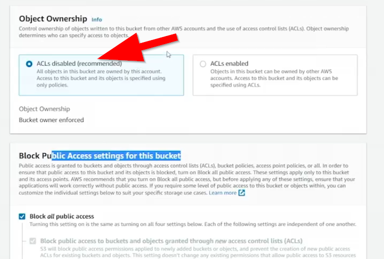
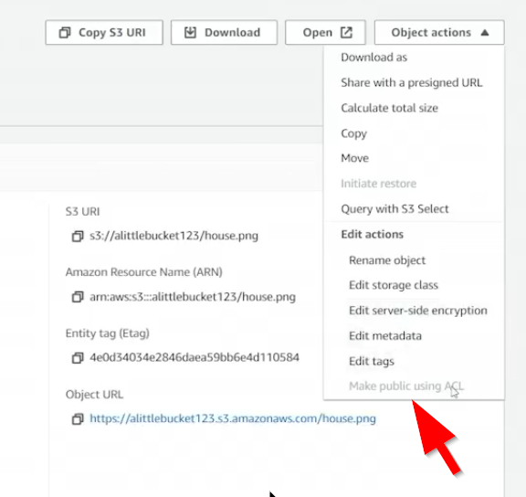
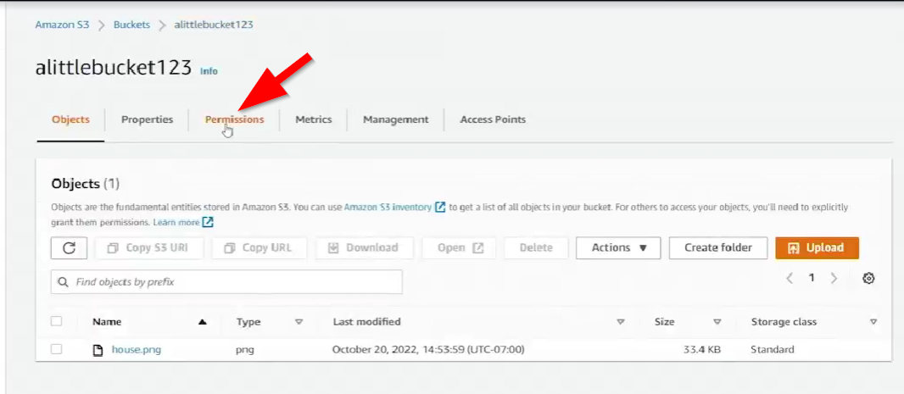
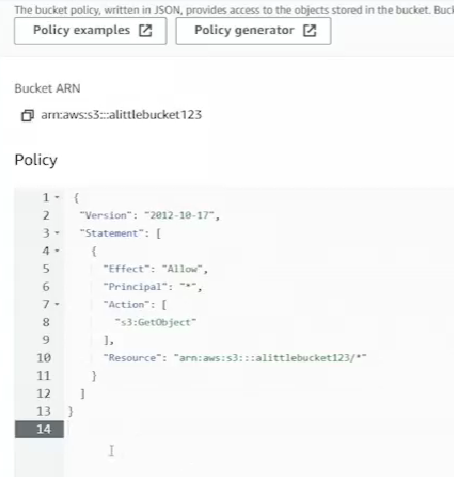

# 10.4 Securing S3 

 # S3 Security — ACLs, Bucket Policies, and Public Access Controls

## Overview
This lesson focuses on **S3 security mechanisms**, specifically how **ACLs**, **bucket policies**, and **public access settings** interact when controlling access to S3 objects.

---

## 1. Creating the First Bucket (alittlebucket123)

### Key Concepts

- **ACLs Disabled**: Modern default option that shifts access control to **bucket policies** instead of per‑object ACLs.
- **Object Ownership**: Determines how permissions are managed.
- **Block Public Access**: A newer feature that prevents accidental exposure.

### What Happened
- A bucket named **alittlebucket123** was created with **ACLs disabled**.
- An object (`house.png`) was uploaded.
- Attempts to:
  - **Access the object URL** → *Access Denied*
  
  - **Make the object public using ACL** → *Denied*, because ACLs were disabled.

### Making Objects Public with ACLs Disabled

Even with ACLs disabled, you can still make objects public using a **bucket policy**:

- A broad policy was applied allowing public `GetObject` access.
- After saving the policy, the bucket displayed a warning: **Public access enabled**.
- The object became publicly accessible.

---

## 2. Creating the Second Bucket (alittlebucket456)

### Key Concepts
- **ACLs Enabled**: Allows per‑object ACLs.
- **Block Public Access Settings**: Prevents ACLs from making objects public.

### What Happened
- A second bucket, **alittlebucket456**, was created with **ACLs enabled**.
- **Block Public Access** remained **on**.
- Uploading `house.png` again:
  - Attempting **Make public using ACL** → *Blocked* due to bucket‑level public access restrictions.

### Modifying Public Access Settings
- The instructor edited the bucket’s **public access settings**, turning off the block.
- After confirming the change:
  - Objects could now be made public via ACL.
  - The ACL‑based “Make public” action succeeded.

---

## 3. Key Takeaways

### ACLs Disabled Scenario
- **ACLs disabled** means:
  - You *cannot* use ACLs to make objects public.
  - You *can* use **bucket policies** to grant public access.
- This is commonly used with **CloudFront origins**, which require the entire bucket to be publicly readable.

### ACLs Enabled + Block Public Access
- Even with ACLs enabled, **Block Public Access** overrides ACLs.
- Best practice:
  - Use **block public access** to prevent accidental exposure.
  - Restrict who can modify these settings via **IAM**.

---

## 4. Final Summary
This lesson demonstrated two major S3 security configurations:

- **ACLs Disabled + Bucket Policy**  
  Allows public access through policies, not ACLs.

- **ACLs Enabled + Block Public Access**  
  Prevents ACLs from making objects public unless the block is manually removed.

Understanding these combinations is essential for secure S3 usage, especially when working with public content or CloudFront distributions.

---
 
 ## [Context](./../context.md)