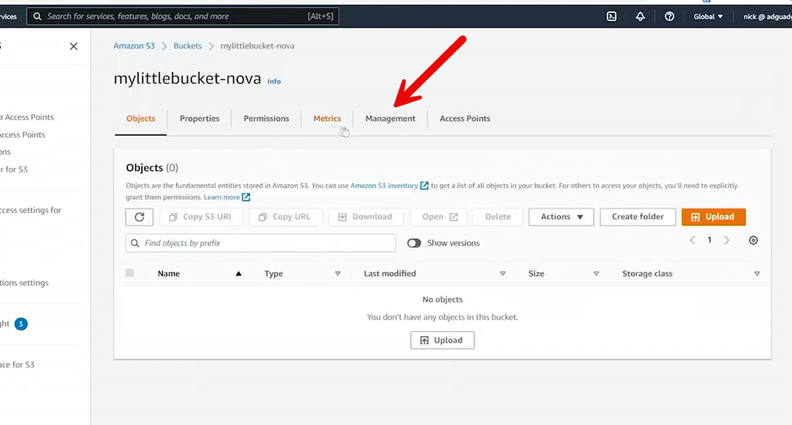
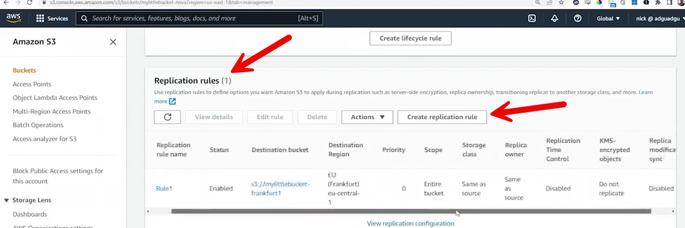
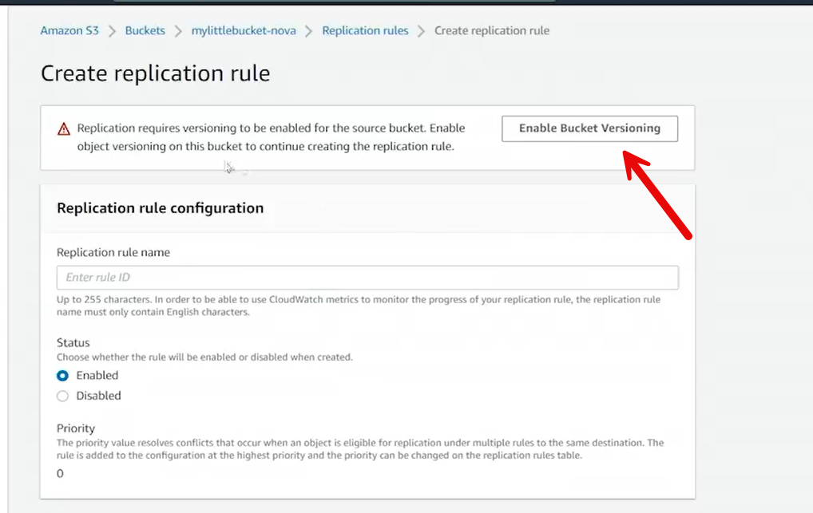
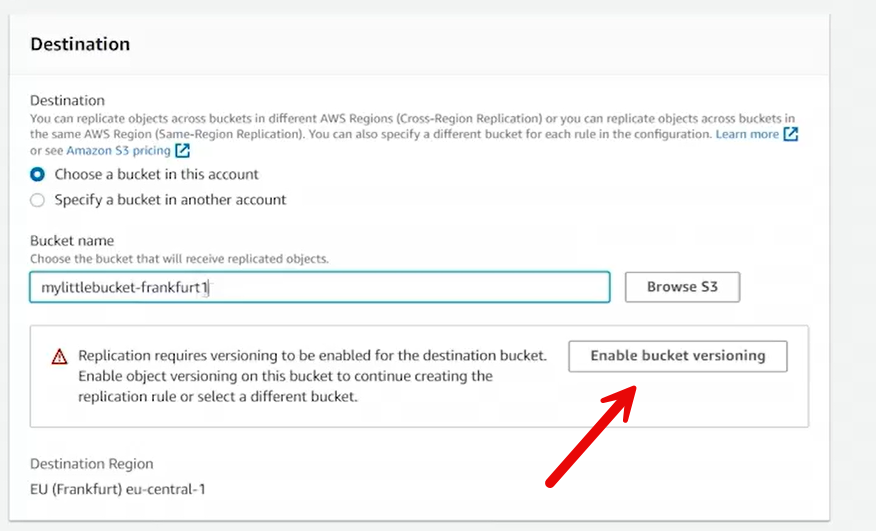
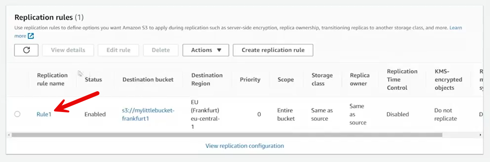
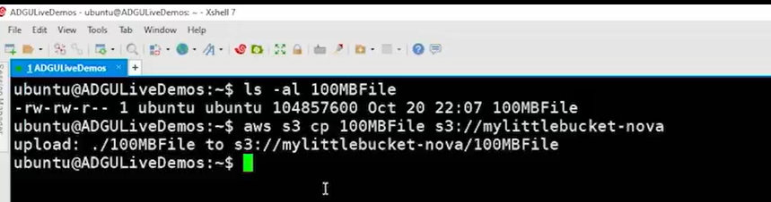
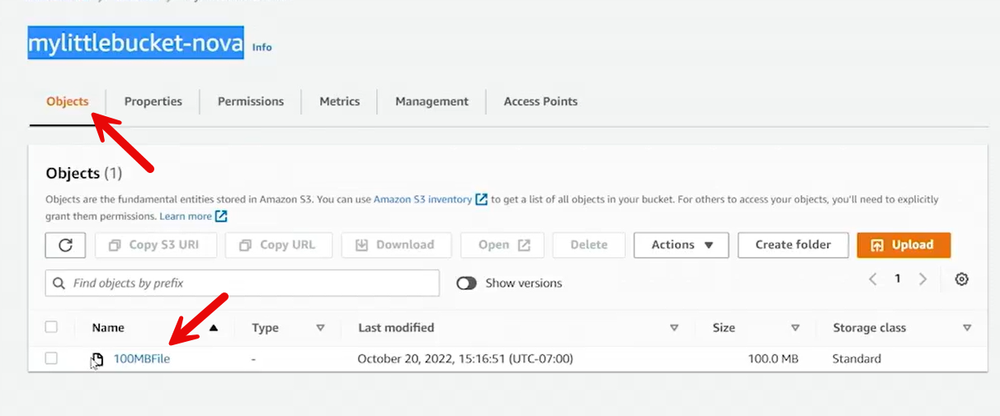

# Configuring S3 Cross-Region Replication Example

This walkthrough demonstrates how to set up **cross-region replication (CRR)** between two Amazon S3 buckets using the AWS Management Console.

---

## 1. Creating the Source Bucket

1. Navigate to **S3 Service** and select **Create bucket**.
2. Name the bucket `mylittlebucket-nova`.
   - Region: **US East (N. Virginia)**
   - Disable “Block all public access”
   - Enable ACLs
3. Acknowledge and **create the bucket**.

---

## 2. Enabling Versioning

Replication requires **versioning** to be enabled:
- Go to the **Properties** tab of `mylittlebucket-nova`.
- Enable **Bucket Versioning**.

---

## 3. Creating a Replication Rule







1. In the **Management** tab, create a **Replication rule**:
   - **Rule ID:** `Rule1`
   - **Status:** Enabled
   - **Source bucket:** `mylittlebucket-nova`
   - **Scope:** Apply to all objects
   - **Destination:** Choose another bucket (must exist beforehand)

---

## 4. Creating the Destination Bucket

Since there’s no existing destination:
1. Create a new bucket named `mylittlebucket-frankfurt`.
   - Region: **EU (Frankfurt)**
   - Enable ACLs
   - Disable “Block all public access”
2. If the name already exists (deletion delay), create `mylittlebucket-frankfurt1` instead.
3. Enable **versioning** on the destination bucket.



---

## 5. Assigning Permissions and Role

Replication requires an **IAM Role**:
- Choose “Create a new role” when prompted.
- AWS automatically creates the role to allow replication between services.

Optional:
- Enable **encryption** during transfer.
- Leave other defaults as is.
- Click **Save**.

---

## 6. Replication Behavior

- Optionally, choose to **replicate existing objects**.
- A completion report is not required.
- Submit the replication job.

If no objects exist yet, nothing is copied initially — replication occurs for **new uploads** going forward.

---

## 7. Testing Replication

See file gets copy from `mylittlebucket-nova` to `mylittlebucket-frankfurt1`

Under the "Management" tab see the Replication rule. 



1. On a Linux instance, create and upload a file:
   ```bash
   aws s3 cp 100MBFile s3://mylittlebucket-nova
   ```



Look at our objects


