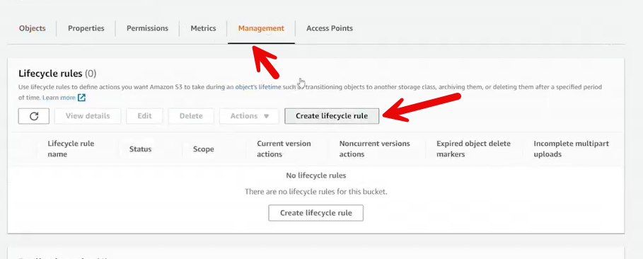
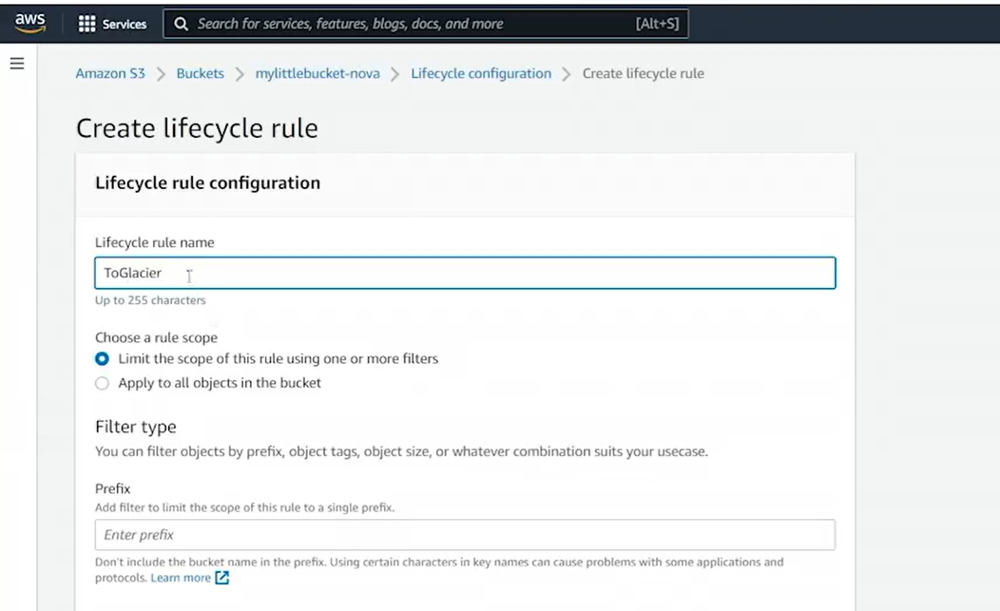
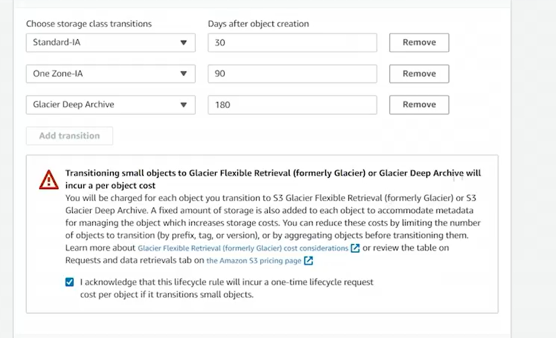
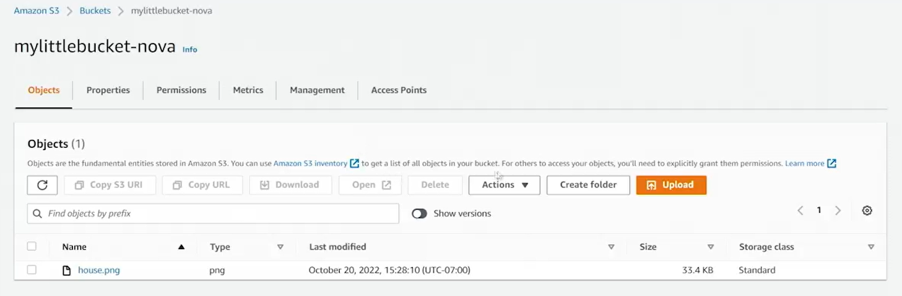
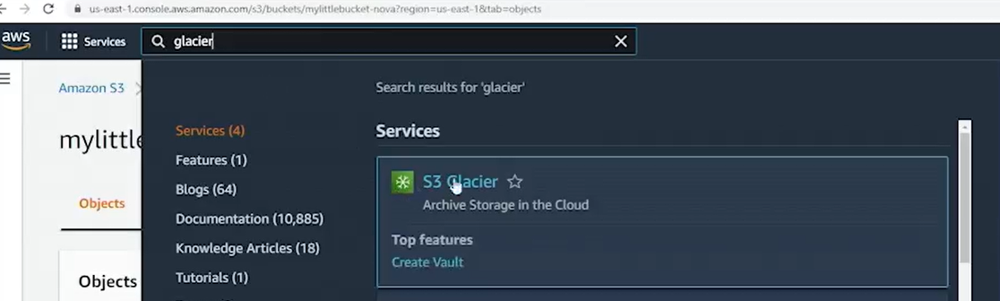
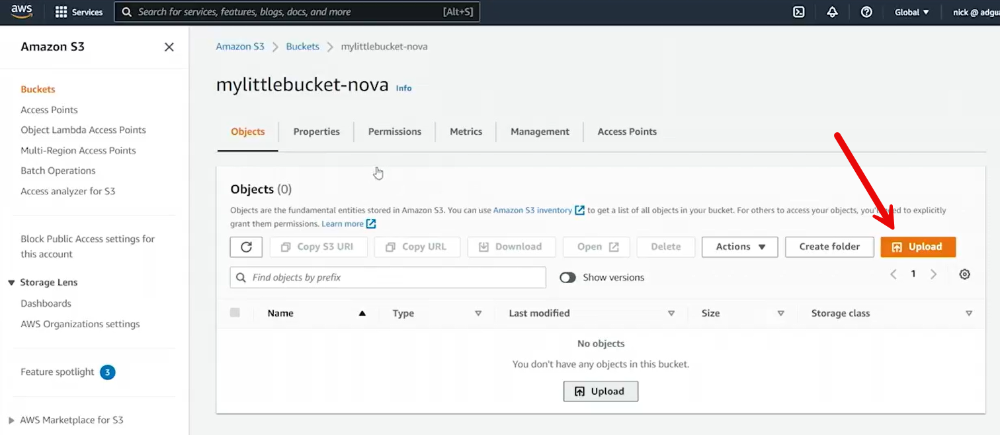
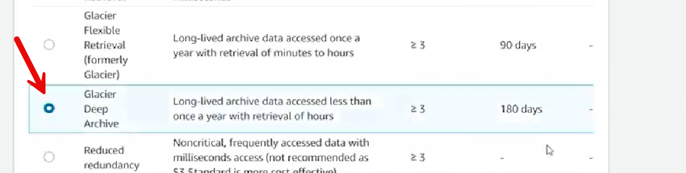
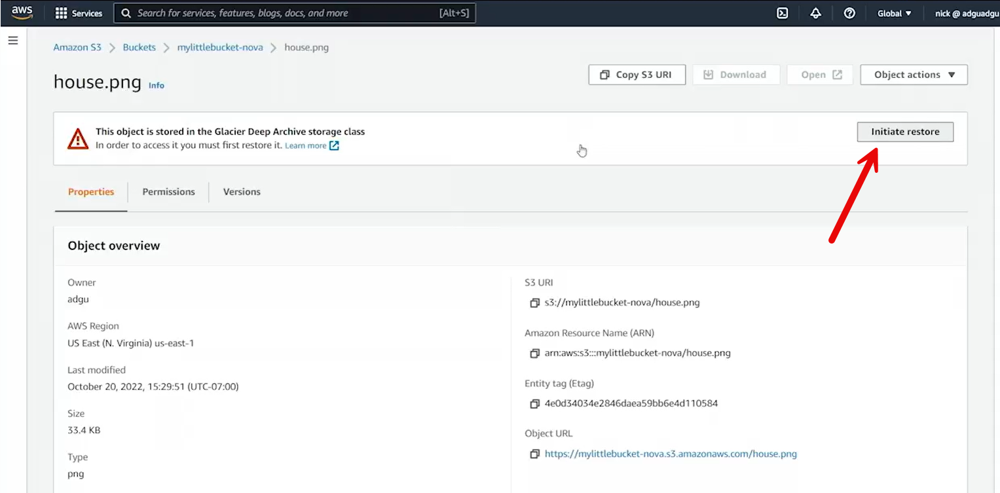
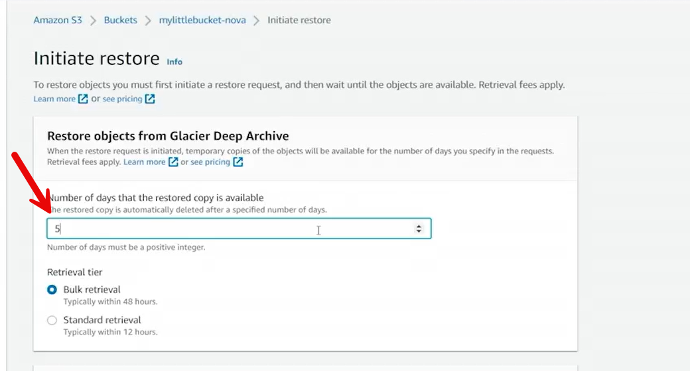
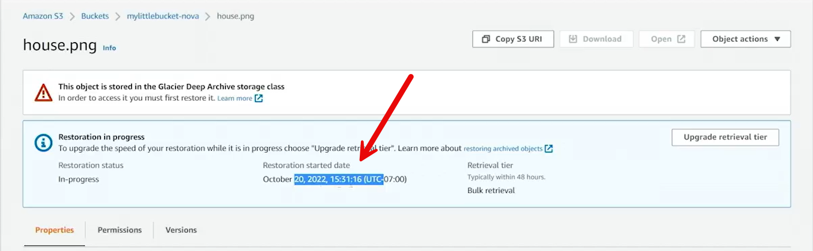

# AWS S3 Glacier Deep Archive and Lifecycle Rules

This demo explores **Amazon S3 Glacier Deep Archive**, a low-cost, long-term storage solution, and demonstrates how to configure **S3 lifecycle rules** and manage object storage transitions, including uploading and restoring data from Glacier.

---

## 1. Overview of Glacier Deep Archive

- **Glacier Deep Archive** represents the **deepest and cheapest** S3 storage class.
- It uses **tape-based storage**, ideal for data accessed **rarely (e.g., once per year)**.
- Best suited for **archival**, **compliance**, or **disaster recovery** data.

---

## 2. Creating a Lifecycle Rule

1. Navigate to the **Management** tab of your S3 bucket.
2. Click **Create lifecycle rule** and name it, for example:  
   **Rule Name:** `to Glacier`
3. Apply the rule to **all objects** in the bucket.

4. Define the **transition actions**:
   - **After 30 days:** Move from **Standard** → **Standard-IA (Infrequent Access)**
   - **After 90 days:** Move to **One Zone-IA**
   - **After 180 days:** Move to **Glacier Deep Archive**

> ⚠️ There is a **per-object cost** for storing data in Glacier and Glacier Deep Archive.

5. (Optional) Add an **expiration policy** to delete objects after a defined period.
6. Save the rule — objects will automatically transition through these storage classes over time.

---

## 3. Uploading and Transitioning an Object

- Upload an object (e.g., `house.png`) to your S3 bucket.
- Initially, it is stored in the **Standard** class.
- Over time, it will automatically transition according to your lifecycle rule:
  - Standard → Standard-IA → One Zone-IA → Glacier Deep Archive.

> Since transitions take time, the demo cannot show real-time class changes.

---

## 4. S3 Glacier Service Integration

AWS has consolidated Glacier into the **S3 storage service**:
- The former standalone **Glacier** console now redirects to the **S3 Console**.
- Glacier storage classes are now managed directly within **S3** under “Storage Class” options.
- You may still see the service labeled **S3 Glacier**, but actions are performed in **S3**.

---

## 5. Uploading Directly to Glacier Deep Archive

To immediately store data in Deep Archive:

1. Open your **S3 bucket** (e.g., `mylittlebucket-nova`).
2. Upload a file, such as `house.png`.

3. In **Properties**, select the **Storage Class** → **Glacier Deep Archive**.
4. Click **Upload**.

The file now resides in **S3 Glacier Deep Archive**.  
However, physical transfer to tape storage may take some time due to internal AWS handling.

---

## 6. Retrieving (Restoring) Objects from Glacier Deep Archive

Since Glacier data is not instantly accessible:
1. Open the object’s **details** in S3.
2. Click **Initiate Restore**.

3. Set the **duration of temporary access** (e.g., 5 days).
4. Confirm the restore action.

After initiating the restore:
- You’ll see a **banner** indicating:  
  “Restoration status: In Progress.”
- AWS begins pulling data from tape.
- **Restoration time** is typically about **2 days**.
- Once completed, the file becomes **temporarily accessible** for the defined duration (e.g., 5 days).
- After that, it’s removed from active access but remains stored in Glacier Deep Archive.

---

## 7. Key Notes and Considerations

| Concept | Description |
|----------|--------------|
| **Deep Archive Storage** | Lowest-cost, long-term (tape-based) archival tier |
| **Transition Automation** | Lifecycle rules move objects automatically |
| **Per-Object Cost** | Glacier classes charge for both storage and retrieval |
| **Retrieval Delay** | May take hours or days to restore from archive |
| **Temporary Access** | Restored objects remain available for a set duration |

---

## 8. Summary

- **Glacier Deep Archive** provides a cost-effective, long-term storage option.
- **Lifecycle Rules** automate movement of data to cheaper tiers over time.
- **Restoration** allows temporary access to archived data after a delay.
- Ideal for use cases involving **rarely accessed** but **critically preserved** data.

---

**✅ Example Summary:**  
In this demo, a lifecycle rule was created to automatically move objects from S3 Standard to Glacier Deep Archive over 180 days.  
An object (`house.png`) was uploaded directly into Glacier Deep Archive, then restored for a temporary access period, demonstrating both **archival** and **retrieval** processes.
