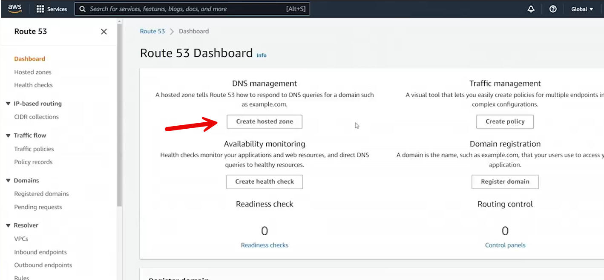
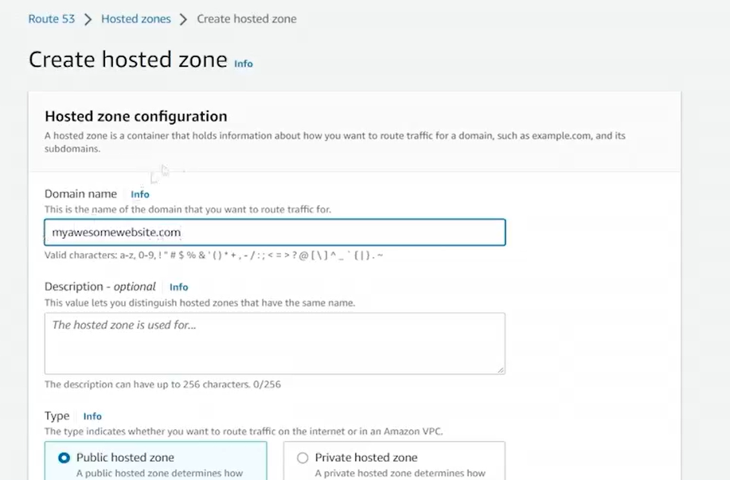
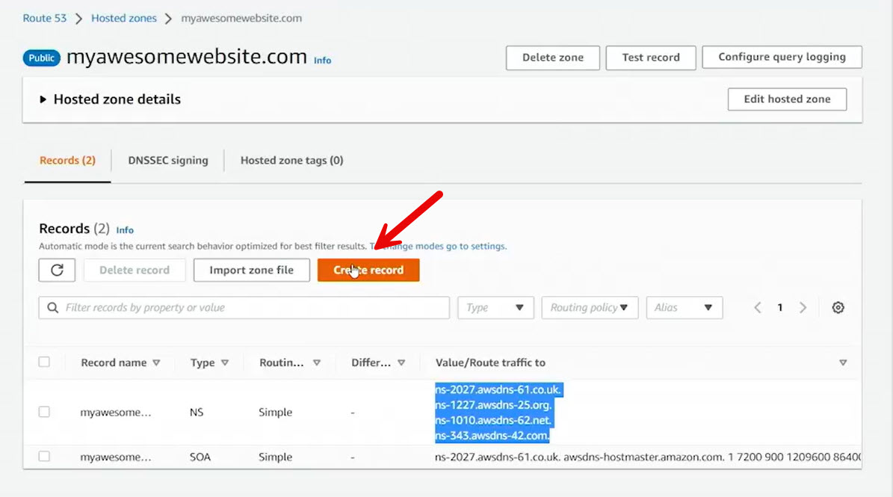
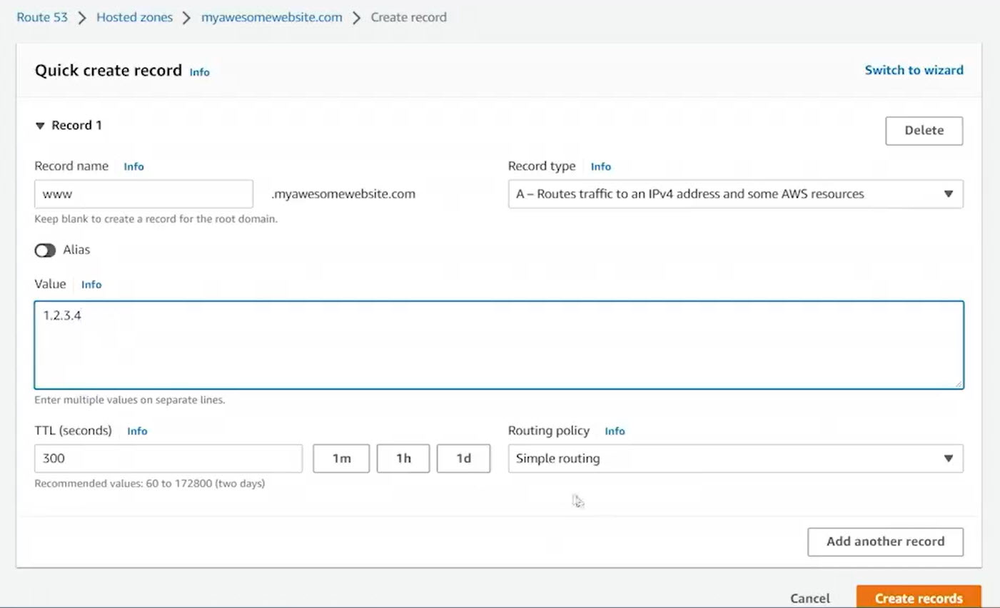
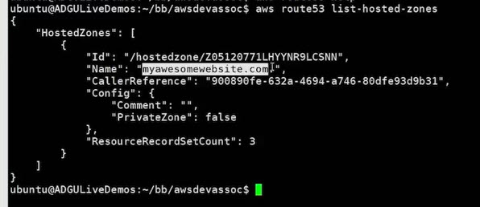

# 11.3 Exploring Route 53 zones 
 
## Exploring Route 53 Zones — Summary

This section demonstrates how to use **AWS Route 53** to create and manage DNS hosted zones and records, both **public** and **private**.

### Public Hosted Zones
- A public hosted zone can be created in Route 53 even if you do **not** own the domain.
- Example domains like `example.com` cannot be used because they are reserved.

- Creating a zone such as `myawesomewebsite.com` is possible, but it will not resolve publicly unless you:
  - Own the domain, and
  - Update the domain’s authoritative name servers at the registrar to point to Route 53.
- By default, Route 53 creates:
  - **NS (Name Server)** records
  - **SOA (Start of Authority)** records, which define TTLs and zone metadata
- You can create DNS records such as:
  - An **A record** (e.g., `www.myawesomewebsite.com` → `1.2.3.4`)

### Managing Route 53 with the CLI
- Route 53 can also be managed using the AWS CLI.
- Example commands include listing hosted zones using `aws route53 list-hosted-zones`.

### Private Hosted Zones (Internal DNS)
- A **private hosted zone** is used for DNS resolution **inside a VPC only**.
- Private zones must be associated with a specific VPC and region.
- These zones allow internal services to resolve private DNS names.
- Example use cases:
  - `db.internal` → internal service IP
  - `www.internal` → `172.16.10.10`

### Split DNS Architecture
- Route 53 supports **split DNS**, which is a recommended design:
  - **Public zone** (e.g., `myawesomewebsite.com`) resolves to public IPs via the internet
  - **Private zone** (e.g., `internal`) resolves to private IPs inside the VPC
- This allows:
  - External users to reach public-facing resources
  - Internal systems to use private IP addresses for the same or related services

### Key Takeaway
Route 53 enables flexible DNS management by supporting both public and private hosted zones, making it easy to build scalable, secure architectures with external access and internal-only name resolution.

 
 
 ## [Context](./../context.md)