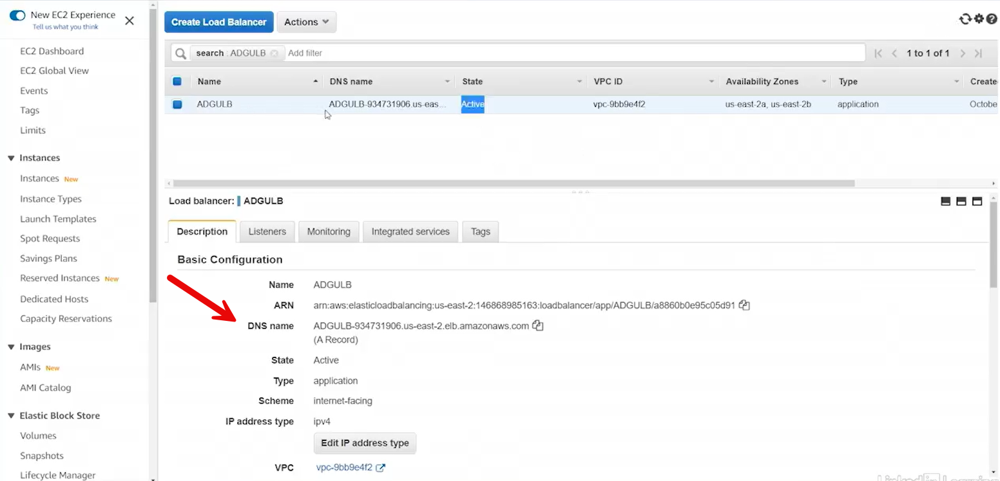
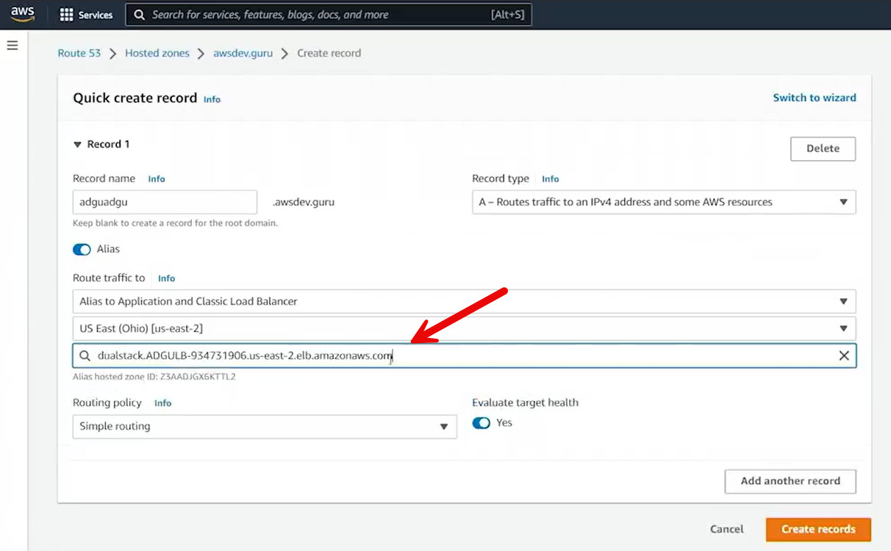

# 11.4 Using zone aliases 
 
 ## Route 53 Alias Records — Summary

This section explains **Route 53 alias records**, a feature unique to AWS that simplifies DNS management for dynamic AWS resources such as load balancers.

### What Is an Alias Record?
- An **alias** is a special type of Route 53 DNS record that performs a **silent translation**.
- Instead of pointing directly to an IP address, the alias points to an AWS resource (e.g., an Elastic Load Balancer).
- Route 53 automatically resolves the alias to the correct IP addresses.

### Why Aliases Are Important
- Load balancers do **not** have fixed IP addresses.
- If a traditional **A record** pointed directly to a load balancer’s IP and the load balancer restarted, the IP could change, breaking DNS resolution.
- Alias records prevent this problem by tracking the load balancer dynamically.

### Example Architecture
- Two EC2 instances:
  - **Web One** and **Web Two**
  - Each runs Apache and has a public IP address
- An **Elastic Load Balancer** in front of the instances:
  - Distributes traffic in a round-robin fashion
  - Uses a target group with health checks against `index.html`
- The load balancer has its own AWS-provided DNS name.

### Creating an Alias Record
- In the Route 53 hosted zone:
  - Create an **A record**
  - Mark it as an **alias**
  - Point it to the Elastic Load Balancer
- Example:
  - `adgu.awsdev.guru` → Alias to the application load balancer in Ohio

  

### Result
- Accessing `adgu.awsdev.guru` routes traffic through the load balancer.
- Repeated requests alternate between **Web One** and **Web Two**, confirming load balancing.
- Route 53 automatically handles any changes in the load balancer’s underlying IP addresses.

### Key Takeaway
Route 53 alias records provide a resilient and AWS-native way to map DNS names to dynamic infrastructure like load balancers, ensuring reliable name resolution without manual updates.

 
 ## [Context](./../context.md)