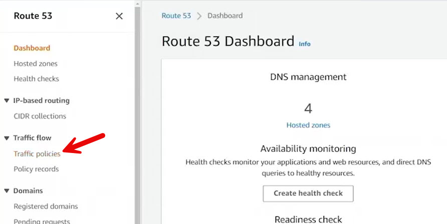
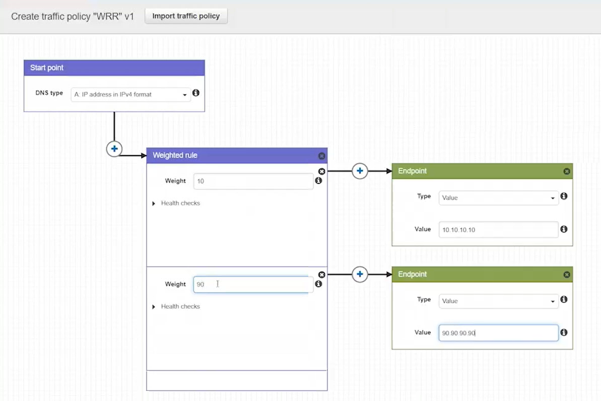

# 11.5 Configuring traffic flow policies 
 
## Summary: Creating a Weighted Round Robin Traffic Policy in Route 53

This walkthrough demonstrates how to create a **Weighted Round Robin (WRR)** traffic flow policy using **Amazon Route 53 Traffic Flow**.

### Steps Overview

- Navigate to **Route 53 → Traffic Policies** and create a new policy named **WRR v1.0**.
- Configure the policy for an **A record**.
- Attach a **Weighted rule**:
  - One endpoint with **weight 10** pointing to **10.10.10.10**
  - Another endpoint with **weight 90** pointing to **90.90.90.90**
- Disable **health checks** for both endpoints.
- Create the traffic policy and associate it with the hosted zone **awsdev.guru**.
- Create a **policy record** for **wrr.awsdev.guru** with a **TTL of 60 seconds**.

### Cost Consideration

Traffic Flow policies are **not free**. If you are using a free-tier or trial account and want to avoid charges, you should not create this type of policy, as it can be relatively expensive.

### Testing and DNS Caching Behavior

- A script queries **wrr.awsdev.guru** every **300 milliseconds** to observe traffic distribution.
- From an EC2 instance, DNS resolution goes through the local resolver **127.0.0.53**, which introduces caching.
- Due to DNS caching, results may appear skewed or temporarily unresolved.
- Querying from a local Windows machine using `nslookup` shows:
  - **90%** of responses resolve to **90.90.90.90**
  - **10%** of responses resolve to **10.10.10.10**
- Because of the **60-second TTL**, cached responses persist, and there is no direct way to inspect the remaining cache time on the resolver.

### Important Configuration Notes

- Traffic policy records **cannot be created or edited directly within the hosted zone**.
- All creation and edits must be done through:
  - **Traffic Policies**
  - **Policy Records**
- Editing a traffic policy record redirects you back to the Traffic Flow policy editor.

### Key Takeaway

Route 53 Traffic Flow provides a **visual, flexible interface** for building advanced DNS routing logic. Even simple configurations like a weighted round robin can be extended into complex flows—such as combining health checks, failover rules, and alternative endpoints (e.g., S3). In this example, traffic resolves **90% to one endpoint and 10% to another**, demonstrating basic WRR behavior in Route 53.

 
 ## [Context](./../context.md)