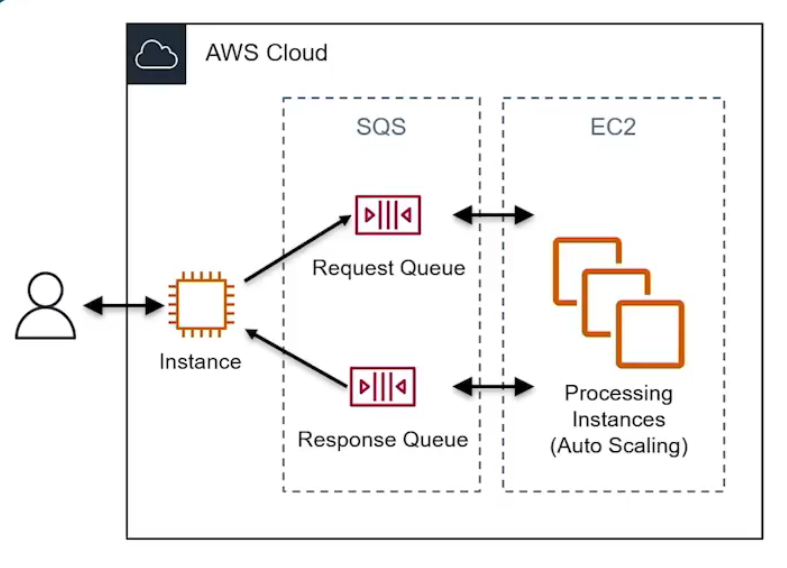
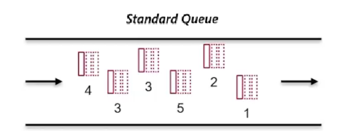
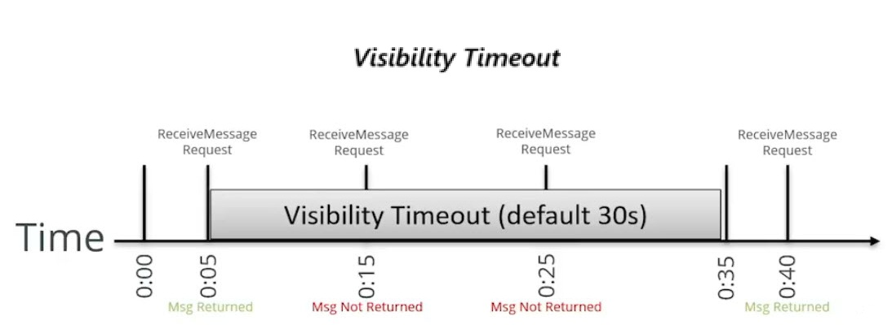
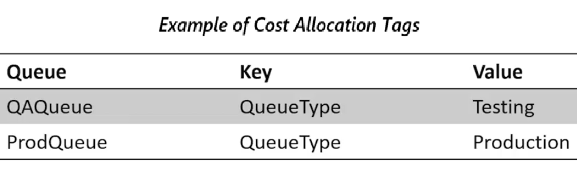

# 12.3 Understanding SQS 
 
 # Amazon Simple Queue Service (SQS) — Summary

 

## Overview
Amazon Simple Queue Service (SQS) is a **fully managed, distributed message queue service** used to decouple producers and consumers in microservices, distributed systems, and serverless applications. It is secure, durable, highly available, scalable, and reliable.

SQS supports two queue types:
- **Standard Queues**
- **FIFO (First-In-First-Out) Queues**

## Why SQS Exists
Direct communication between producers and consumers requires both to be available at the same time. SQS removes this dependency by introducing a queue:
- Producers send messages to the queue.
- Consumers (workers) retrieve and process messages independently.
- This enables loose coupling and better scalability.

## Core Architecture
- Producers place messages into a **request queue**.
- Auto-scaled worker instances poll the queue, process messages, and delete them.
- Processed results can be placed into a **response queue**.
- This creates a flexible and resilient processing pipeline.

## Queue Types

### Standard Queues
- Available in all regions
- Nearly unlimited throughput
- **At-least-once delivery** (messages may be delivered more than once)
- **Best-effort ordering** (messages may arrive out of order)
- Applications must handle deduplication and ordering if required

### FIFO Queues
- Limited regional availability
- Guaranteed message order
- Exactly-once processing
- Throughput:
  - 3,000 messages/second with batching
  - 300 messages/second without batching
- Designed for workloads requiring strict ordering

## Visibility Timeout
- Time during which a message is invisible after being received by a consumer
- Default: **30 seconds**
- Maximum: **12 hours**
- If the consumer does not delete the message before timeout expires, the message becomes visible again and may be reprocessed
- Consumers are responsible for deleting messages after successful processing

## Message Handling Limits
- **In-flight messages (invisible):**
  - Standard queues: up to 120,000
  - FIFO queues: up to 20,000
- **Message size:** up to 256 KB
- **Message retention period:**
  - Default: 4 days
  - Minimum: 1 minute
  - Maximum: 14 days

## Delivery Delay
- Delays message visibility after being added to the queue
- Queue-level or per-message setting
- Default: 0 seconds
- Maximum: 15 minutes
- Not supported on FIFO queues

## Dead Letter Queues (DLQ)
- Used for troubleshooting failed message processing
- Configured via a **redrive policy**
- Messages that exceed a maximum receive count are moved to the DLQ
- DLQs are standard SQS queues
- Messages can be inspected manually or processed by separate workers

## Security
- **Server-side encryption (SSE)** using AWS KMS
  - Encrypts message bodies at rest
  - Does not encrypt queue metadata or metrics
- Encryption state is preserved when moving messages to DLQs
- Authentication and authorization via **IAM**
- Resource-based policies allow controlled public access if required

## Monitoring and Cost Management
- Integrated with **Amazon CloudWatch**
  - Metrics published every 5 minutes
  - Supported for both Standard and FIFO queues
- **Cost allocation tags**
  - Key-value metadata for billing and chargeback purposes

## When to Use SQS vs Kinesis
- Use **SQS** when a single consumer processes each message
- Use **Kinesis** when multiple consumers must read the same data stream

## Key Takeaway
SQS is a simple yet powerful service that enables scalable, fault-tolerant, and decoupled architectures by separating message production from consumption.

 
 ## [Context](./../context.md)