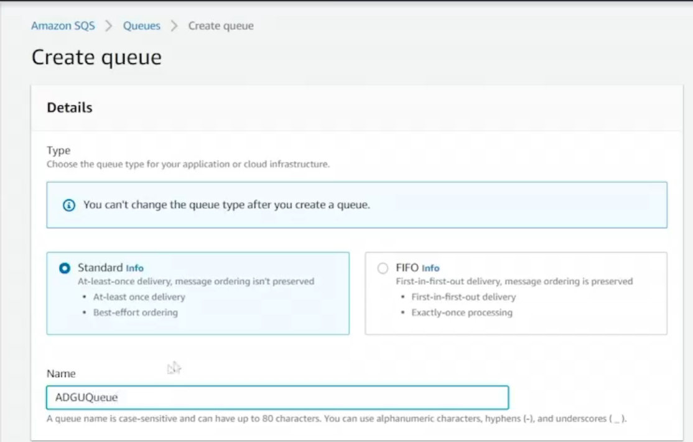
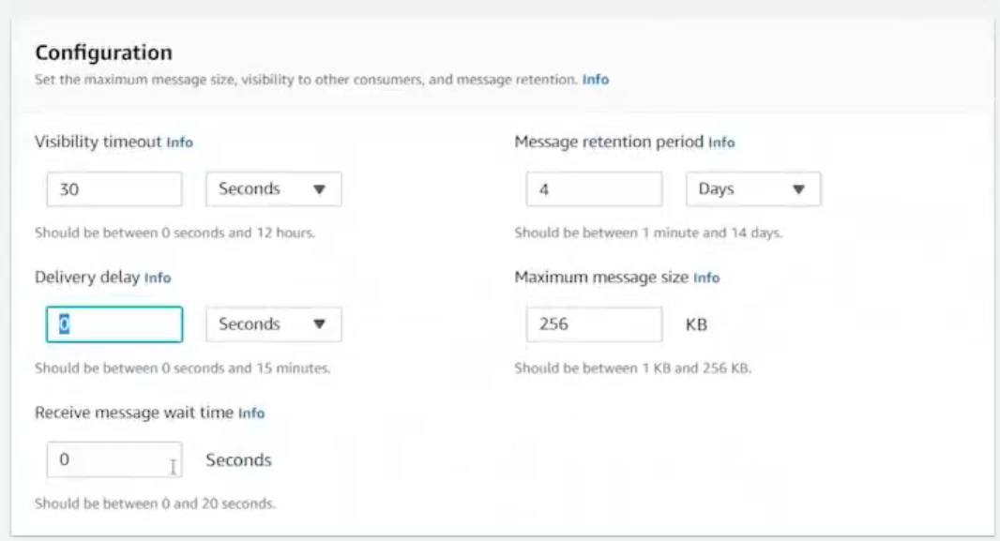
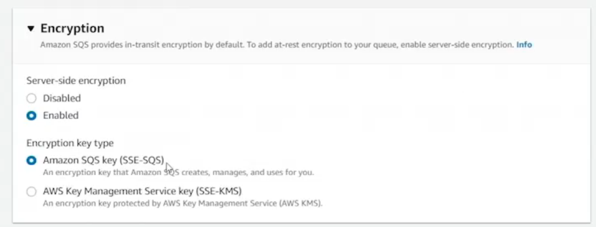
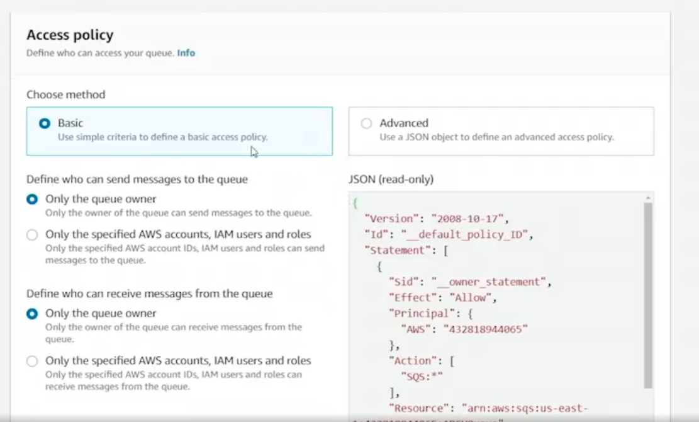
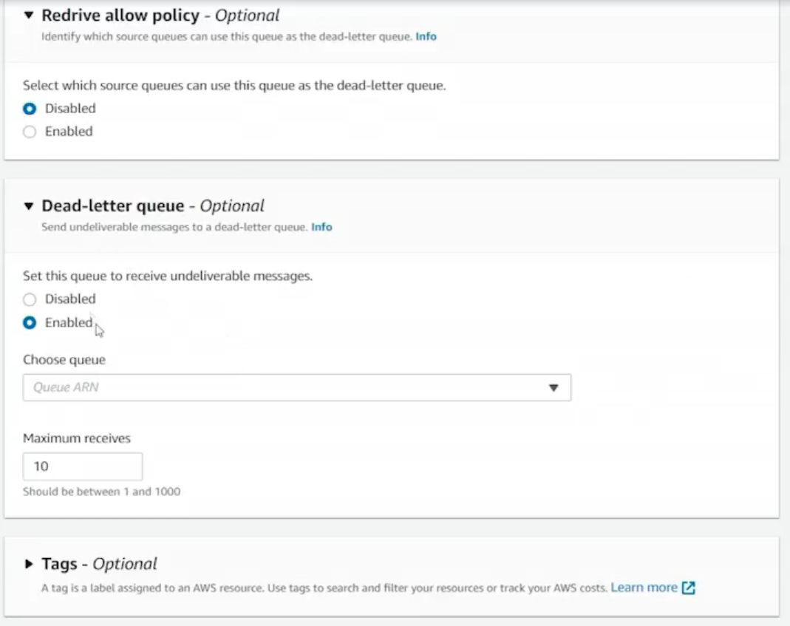
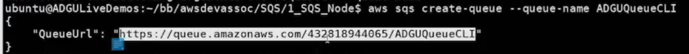
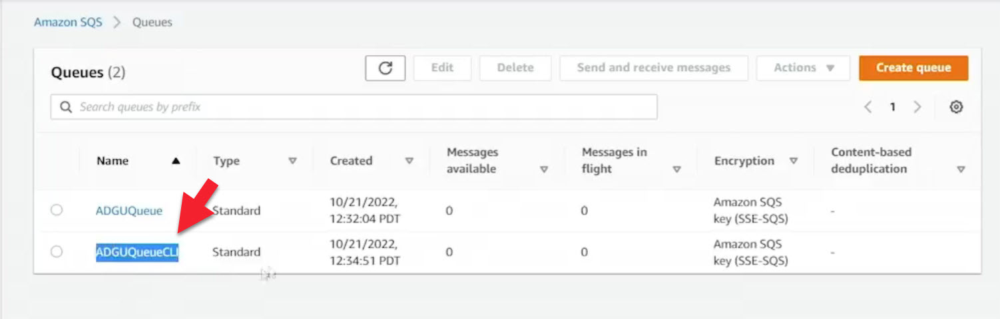
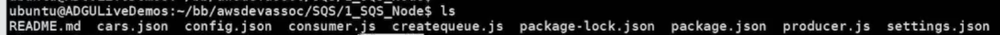

# 12.4 Creating an SQS queue 

# Creating an Amazon SQS Queue (SQSQ)

This summary reviews **three ways to create an Amazon SQS queue**:
1. AWS Management Console  
2. AWS Command Line Interface (CLI)  
3. AWS SDK (Node.js)

---

## 1. Creating an SQS Queue Using the AWS Management Console

### Steps Overview
- Navigate to the **Amazon SQS** service in the AWS Console.
- Region used: **Northern Virginia (us-east-1)**.
- No existing queues initially.

### Queue Type
- **Standard Queue** (as opposed to FIFO).



### Key Configuration Settings
- **Queue Name:** `ADGUQUEUUUE`



- **Visibility Timeout:** 30 seconds (default)
- **Message Retention Period:** 4 days (default)
- **Maximum Message Size:** 256 KB
- **Delivery Delay (Long Polling):** Default



- **Encryption:**
  - Server-Side Encryption enabled
  - Uses Amazon SQS-managed key or AWS KMS (optional custom key)



- **Access Policy:** Default (to be discussed later)



- **Redrive Policy (Dead Letter Queue):**
  - Optional
  - Requires an existing queue
  - Redirects messages after a defined number of failed receives
- **Tags:** Optional (disabled in this demo)

After completing these steps, the **standard SQS queue is successfully created**.


---

## 2. Creating an SQS Queue Using the AWS CLI

### Commands Used
#### View SQS help:
```bash
  aws sqs help
```
#### Required Parameter
- Queue Name (only required argument)

```bash
 aws sqs create-queue --queue-name ADGUQCLI
```



#####  Result

* The command returns a Queue URL (QURL).
* The Queue URL is required for all future SQS interactions (e.g., receiving messages).
* The queue appears in the AWS Console as a standard queue. 



## 3. Creating an SQS Queue Using the AWS SDK (Node.js)

### Setup

* Uses the AWS SDK for JavaScript (Node.js).
* Script file: createq.js.

### Core Logic

* Create an SQS service object.
* Call SQS.createQueue() with parameters:
    - QueueName
* Handle success or error in a callback.

### Conceptual Example



* [createqueue.js](./../CODE/SQS/1_SQS_Node/createqueue.js)
* [consumer.js](./../CODE/SQS/1_SQS_Node/consumer.js)
* [producer.js](./../CODE/SQS/1_SQS_Node/producer.js)
* [README.md](./../CODE/SQS/1_SQS_Node/README.md)

``` js
sqs.createQueue(params, function(err, data) {
  if (err) console.log(err);
  else console.log("Queue created:", data.QueueUrl);
});

```
The script is not executed in the demo, but creating a queue via the SDK is as simple as providing parameters and handling the response.

## Summary

Amazon SQS queues can be created using:

* AWS Management Console (GUI-based)
* AWS CLI (command-line automation)
* AWS SDK (programmatic access, e.g., Node.js)

All three methods ultimately create the same resource—a standard SQS queue—and differ only in how they are accessed and automated.
 
 ## [Context](./../context.md)
