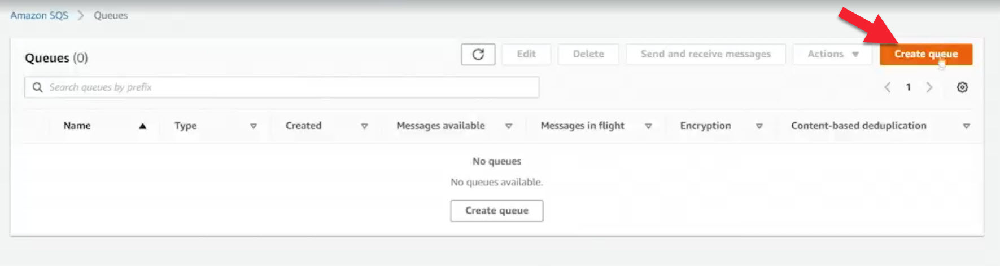
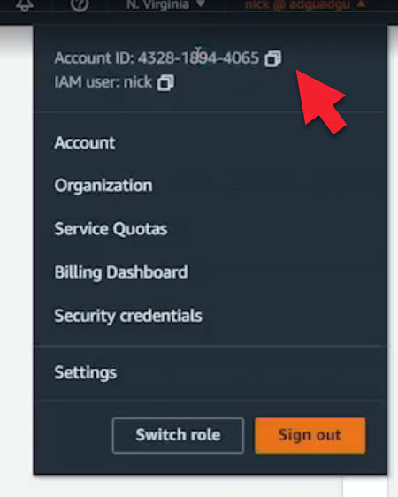
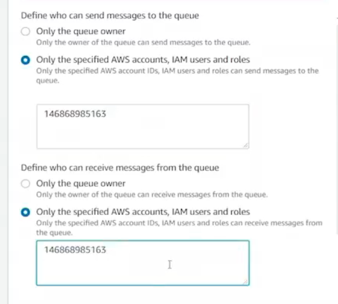
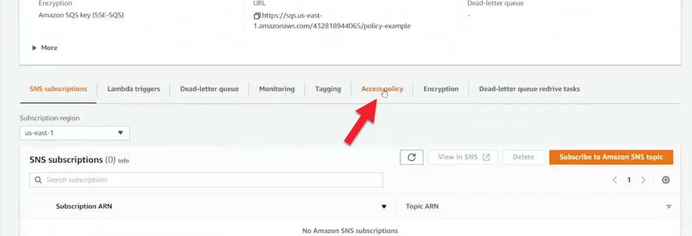
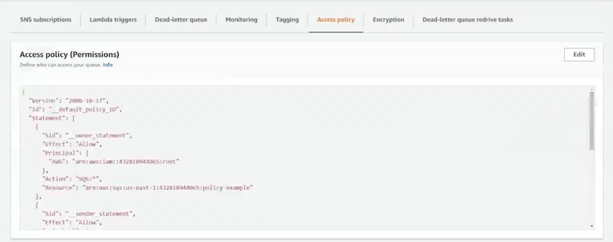
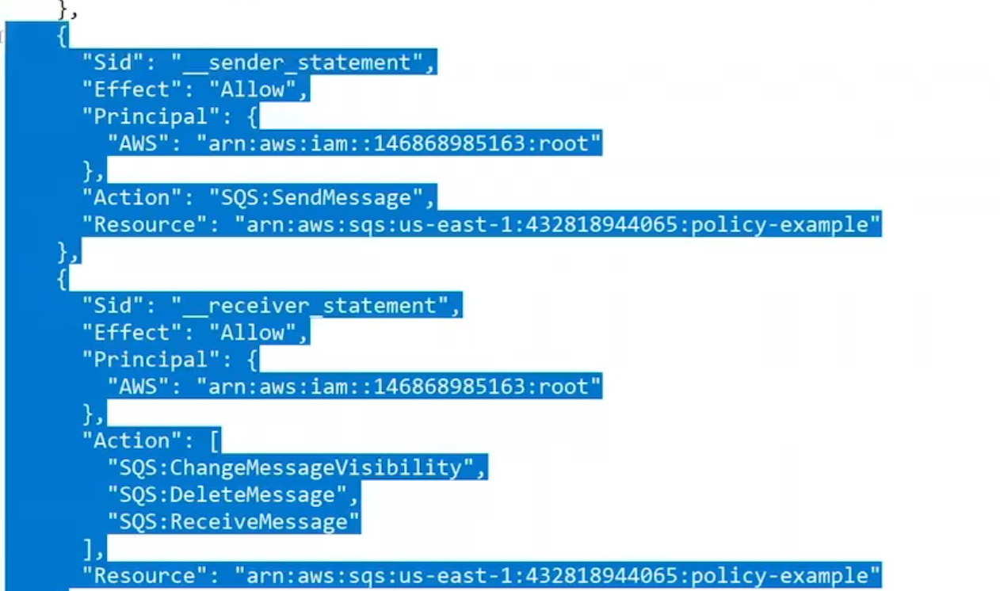
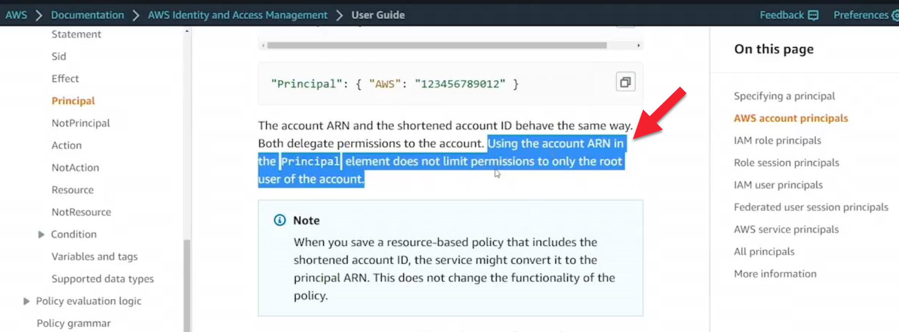

# 12.5 Securing SQS 
 
 # SQS Cross-Account Access Policy Demonstration

## Overview
This demonstration shows how to implement an **SQS queue access policy** that allows **cross-account message publishing and reception**. Instead of attaching permissions to IAM users, we attach a **resource-based policy directly to the SQS queue**, enabling another AWS account to interact with it.

---

## IAM Policy vs. SQS Queue Policy

[Using identity-based policies](https://docs.aws.amazon.com/AWSSimpleQueueService/latest/SQSDeveloperGuide/sqs-using-identity-based-policies.html)

AWS supports two equivalent permission models for SQS:

- **IAM Policy (User-Based)**
  - Attached to IAM users or roles
  - Grants permissions like `SendMessage` and `ReceiveMessage`
  - Example: Users *Bob* and *Susan* can send/receive messages

- **SQS Queue Policy (Resource-Based)**
  - Attached directly to the queue
  - Specifies which principals (users/accounts) can access the queue
  - Functionally equivalent to the IAM policy above

In this demo, we focus on the **queue-based policy**, which is required for **cross-account access**.

---

## Queue Creation and Policy Configuration





- Created a **Standard SQS queue** named `policy-example`
- Left all settings at default **except the Access Policy**
- Configured the policy to allow:
  - `SendMessage`
  - `ReceiveMessage`
- Granted permissions to:
  - **Local account**: `4065`
  - **External account**: `51635163`

When the queue is created, AWS automatically generates a queue policy containing statements that reference the external account.



---

## Understanding `:root` in the Principal





In the generated policy, the principal appears as:



```
arn:aws:iam::<ACCOUNT_ID>:root
```

### Important Clarification



- `:root` **does NOT** mean only the root user
- It represents **the entire AWS account**
- This is confirmed in IAM documentation under *Account Principals*

These two are equivalent:
- `arn:aws:iam::<ACCOUNT_ID>:root`
- `"AWS": "<ACCOUNT_ID>"`

Both grant permissions to **any IAM user or role in that account**, as long as their IAM policies also allow it.

---

## Cross-Account Verification (CLI Demo)

### Step 1: Confirm Active Account
From the external account (`51635163`):

```
aws sts get-caller-identity --query Account --output text
```


Result confirms CLI credentials belong to the external account.

---

### Step 2: List Queues
- External account:

```
aws sqs list-queues
```

→ No queues listed (expected)

- Owning account (`4065`):
  
→ Shows the newly created queue

---

### Step 3: Cross-Account Send Message

From the external account:

```
aws sqs send-message
--queue-url <QUEUE_URL>
--message-body "Hello there, people"
```


✅ Message successfully delivered to the queue  
This confirms **cross-account publishing works**.

---

### Step 4: Receive Message

From either:
- AWS Console (poll messages), or
- CLI:

```
aws sqs receive-message --queue-url <QUEUE_URL>
```

Result:
- Message body: **"Hello there, people"**
- Metadata and attributes visible

This confirms **cross-account message reception** is also permitted.

---

## Key Takeaways

- **SQS queue policies** are required for cross-account access
- Queue policies are **resource-based**, not user-based
- `arn:aws:iam::<ACCOUNT_ID>:root` represents the **entire account**
- With the correct policy:
- External accounts can send messages
- External accounts can receive messages
- By default, SQS denies cross-account access unless explicitly allowed

---

## Conclusion
This demonstration illustrates how attaching an **access policy directly to an SQS queue** enables secure and controlled **cross-account message publishing and consumption**, without modifying IAM users in the owning account.


 
 ## [Context](./../context.md)