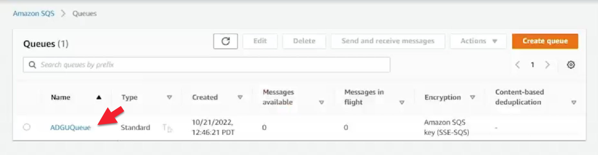
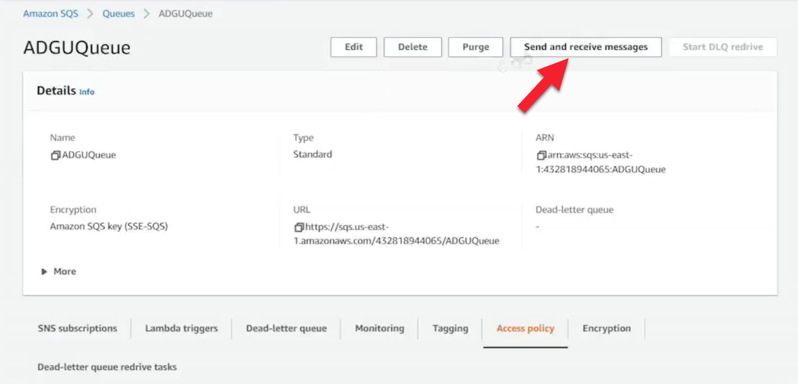
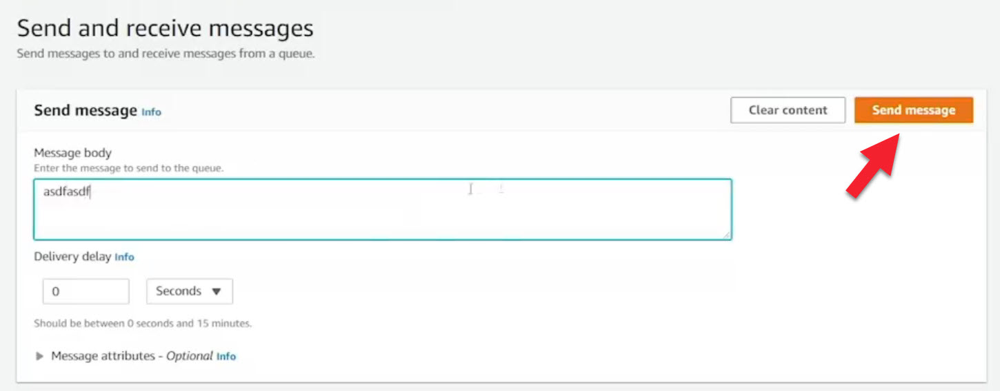
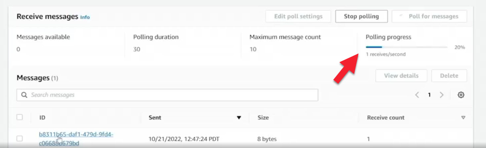
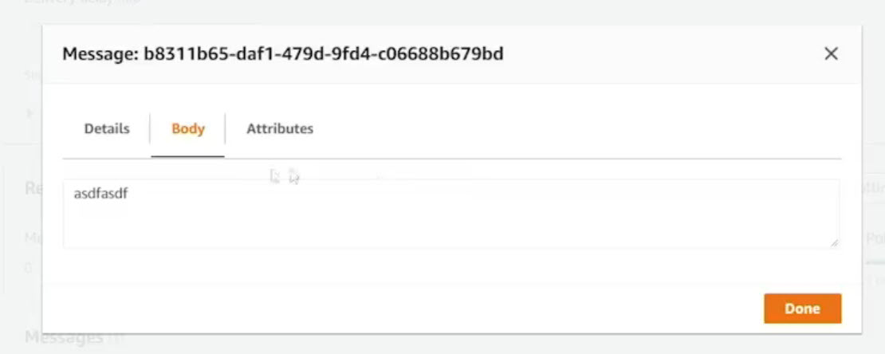
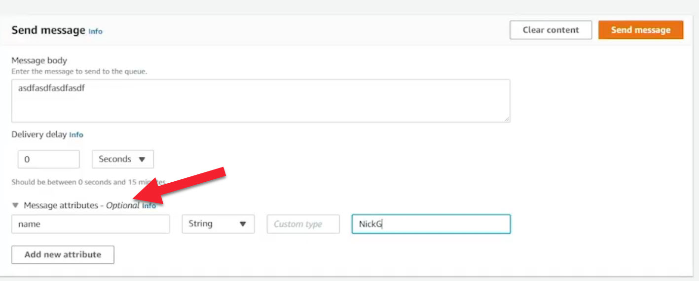

# 12.6 Interacting with an SQS queue 
 
 # Interacting with Amazon SQS Queues

## Overview
In a previous lesson, an Amazon SQS **standard queue** was created using three methods:
- AWS Management Console  
- AWS Command Line Interface (CLI)  
- Software Development Kit (SDK)

This lesson focuses on **interacting with that queue**—sending, receiving, and processing messages—using the same three approaches.

---

## Interacting with SQS via the AWS Management Console



- A standard queue named **A-D-G-U-Q-U-E-U-E** already exists.
- Key properties visible in the console:
  - Queue type: **Standard**
  - Queue URL is displayed
  - **Server-side encryption** is enabled for data at rest



### Sending and Receiving Messages



1. A message (`asdfasdf`, 8 bytes) is sent to the queue.
   




2. Polling the queue returns the message successfully.
3. A second message is sent with:



   - Body size: 16 bytes
   - Message attribute:  
     - `name` (String) = `NickG`
4. Polling returns both messages.

> **Important Note:**  
> Message **attributes are not encrypted**, even when encryption at rest is enabled.

While the console is useful for demonstrations and troubleshooting, real-world applications typically interact with SQS using the **CLI or SDK**.

---

## Interacting with SQS via the AWS CLI

### Exploring Available Commands
- `aws sqs help` lists available SQS operations.
- Key commands demonstrated:
  - `list-queues`
  - `receive-message`
  - `delete-message`
  - `delete-queue`

### Receiving Messages
1. Retrieve the queue URL using:
```bash
aws sqs list-queues
```

2. Receive messages:
``` bash
aws sqs receive-message --queue-url <QUEUE_URL>
```
3. Messages are returned one at a time.
4. While the visibility timeout is active, messages cannot be received again.
5. After the timeout expires, messages become visible and can be received again.

#### Long Polling

* Long polling is enabled using:

``` bash
aws sqs receive-message --queue-url <QUEUE_URL> --wait-time-seconds 20
```
* This allows the CLI to wait up to 20 seconds for a message to become available, reducing empty responses.


#### Receive Count

* Each message tracks how many times it has been received.
* Since no maximum receive count or dead-letter queue is configured, messages can be received many times.

---

## Interacting with SQS via the SDK (Node.js Example)

A Node.js application demonstrates a real-world SQS use case:         
A televised singing competition where viewers vote for contestants.

### Application Components

* Code Basic
    - [createqueue.js](./../CODE/SQS/1_SQS_Node/createqueue.js)
    - [producer.js](./../CODE/SQS/1_SQS_Node/producer.js)
    - [consumer.js](./../CODE/SQS/1_SQS_Node/consumer.js)

* createqueue.js
    - Creates a standard SQS queue.
* producer.js
    - Simulates voters.
    - Sends random votes to the queue.
* consumer.js
    - Polls the queue.
    - Processes votes.
    - Stores results in a local SQLite database.

#### Configuration (settings.json)

* Queue name
* Number of messages (votes)
* List of contestants
* Consumer polling frequency

---

## SDK Workflow Demonstration

1. Queue Creation

* A queue named AWSdevqueue is created in the us-east-2 (Ohio) region.

2. Producing Messages

* The producer sends 10 random votes to the queue.
* Each message is a JSON object containing:
    - Vote ID
    - Contestant name

3. Consuming Messages

* The consumer polls the queue once per second.
* Each message is processed and recorded in a SQLite database.
* On termination (Ctrl+C), the script outputs the final vote tally.

### Initial Result

* A three-way tie between Sally, Jim, and John.

### Scaling the System
Increased Load Test

* Producer sends 5,000 messages.
* Consumer polling frequency increased to every 100 ms.
* Queue quickly fills with thousands of messages.

### Parallel Consumers

* Multiple consumers are launched simultaneously.
* Each consumer:
    - Receives messages
    - Processes them
    - Deletes them from the queue

* Messages are:
    - Processed out of order (expected behavior for standard queues)
    - Handled concurrently for faster throughput

### Final Result

* All messages are consumed successfully.
* Sally wins the competition with the highest vote count.

### Key Takeaways

* SQS enables decoupling of message producers and consumers.
* The AWS Console is best for learning and debugging.
* The CLI provides direct, scriptable access.
* The SDK is ideal for real-world, scalable applications.
* Standard queues:
    - Allow at-least-once delivery
    - Do not guarantee ordering
    - Support horizontal scaling with multiple consumers

This lesson demonstrates how SQS efficiently handles large-scale, distributed workloads by separating message production from consumption.
 
 ## [Context](./../context.md)