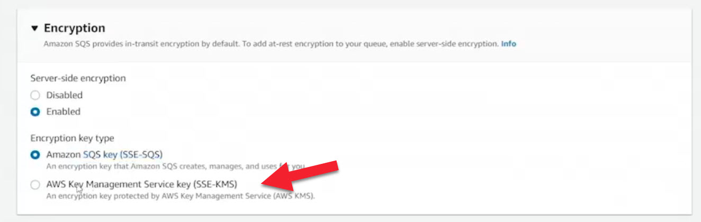
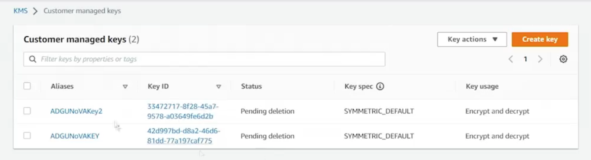
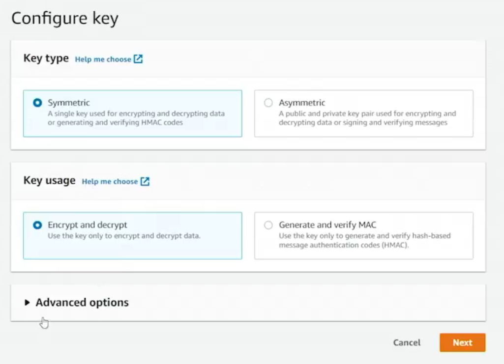
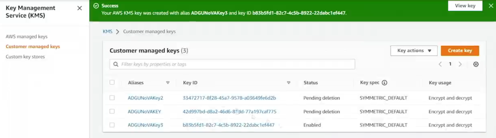
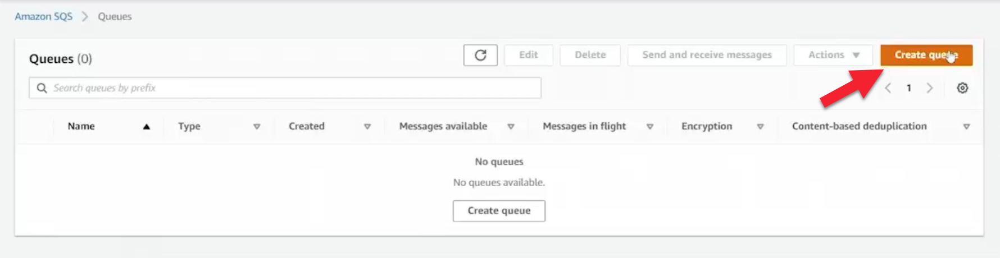
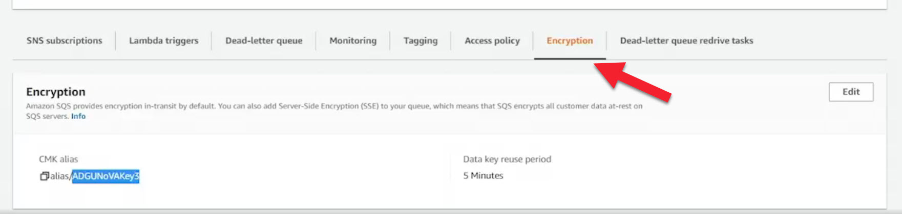
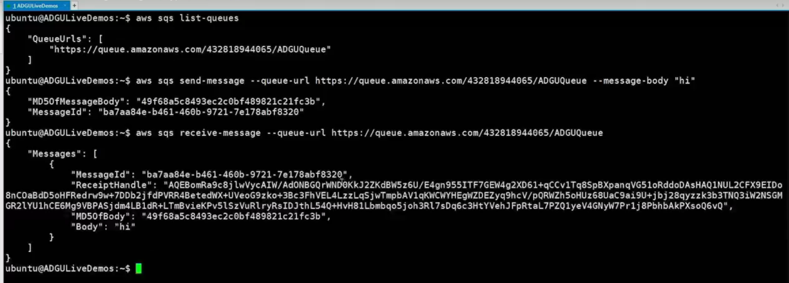

# 12.7 Using message encryption 
 
 # Server-Side Encryption for Amazon SQS Using AWS KMS

## Overview
By default, when an Amazon SQS queue is created, **server-side encryption (SSE)** is automatically enabled using an **AWS-managed SQS key**. While this provides encryption at rest with no additional configuration, you may want **greater control and security** by using your own **customer-managed key** from **AWS Key Management Service (KMS)**.

This lesson demonstrates how to:
- Create a customer-managed KMS key
- Attach it to an SQS queue
- Interact with the encrypted queue
- Safely disable and delete a KMS key

---

## Default SQS Encryption
- Encryption at rest is **enabled by default**
- Uses an **AWS-managed SQS key**
- Requires no user configuration
- Limited control over key permissions and lifecycle

---

## Creating a Customer-Managed KMS Key

[SQS Least Privilege Policy](https://docs.aws.amazon.com/AWSSimpleQueueService/latest/SQSDeveloperGuide/sqs-least-privilege-policy.html)

### Step 1: Navigate to AWS KMS

- Open the **Key Management Service (KMS)** console
- Create a new key

### Step 2: Key Configuration

- **Key type:** Symmetric  
- **Key usage:** Encrypt and decrypt  
- **Key origin:** AWS KMS (default)
  - External key material is supported but requires additional responsibility and acknowledgement
- **Region:** Single-region key

-> Click the Next Button

### Step 3: Key Details
- **Key name:** ADGU Nova Key (example)
- **Tags:** None

-> Click the Next Button

### Step 4: Permissions
- **Key administrators:** Nick (allowed to manage and delete the key)
- **Key users:** Nick (allowed to use the key)
- Optional: Grant usage permissions to other AWS accounts

-> Click the Next Button

### Step 5: Create the Key
- The key is created, enabled, and ready for use

-> Click the Next Button

> **Important Note:**  
> KMS keys cannot be deleted immediately. Deletion must be scheduled with a mandatory waiting period.

---

## Creating an SQS Queue with KMS Encryption

### Queue Configuration
- **Queue type:** Standard
- **Queue name:** ADGU Queue
- **Encryption type:**  
  - Server-Side Encryption (SSE) using **AWS KMS**
- **Customer-managed key:** ADGU Nova Key
- **Data key reuse period:**  
  - Default: 5 minutes  
  - Configurable between 1 minute and 24 hours

After creation, the queue behaves exactly like any other SQS queue.

---

## Interacting with an Encrypted Queue

- Encryption does **not** change how you send or receive messages
- Messages can be:
  - Sent via AWS CLI
  - Received via AWS CLI
  - Processed via SDKs

Example CLI interaction:
- `aws sqs list-queues`
- Send a message
- Receive a message

All operations work identically to an unencrypted queue.

---

## Encryption in Transit and at Rest

- **In transit:**  
  - All SQS messages are encrypted using **TLS**
- **At rest:**  
  - Message data is encrypted using the **customer-managed KMS key**
  - Key access is controlled via:
    - SQS queue policies
    - KMS key policies
    - IAM permissions

This provides an additional security boundary compared to AWS-managed keys.

---

## Disabling and Deleting a KMS Key

### Disabling a Key
1. Go to **Customer Managed Keys**
2. Select the key
3. Disable the key
4. Confirm the action

### Scheduling Key Deletion
1. Select the disabled key
2. Choose **Schedule deletion**
3. Minimum waiting period: **7 days**
4. Confirm deletion

> **Critical Warning:**  
> Deleting a KMS key is **permanent**.  
> If the key is used to encrypt data and is deleted, **that data can never be recovered**.

---

## Key Takeaways

- SQS enables encryption at rest by default using an AWS-managed key
- Customer-managed KMS keys provide:
  - Greater control
  - Stronger security boundaries
  - Fine-grained access management
- Encrypted queues behave exactly like unencrypted queues
- KMS key deletion is irreversible—use with extreme caution

This demonstrates how to securely encrypt SQS data at rest using AWS KMS while maintaining full functionality.

 
 ## [Context](./../context.md)