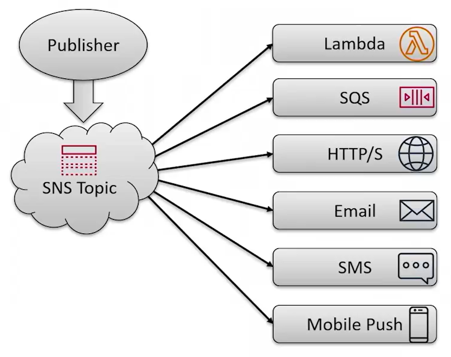

# 13.2 An SNS overview 
 
 ## Amazon Simple Notification Service (SNS) — Summary

- Amazon Simple Notification Service (SNS) is a fully managed **publish-subscribe** messaging service.
- SNS is similar to Simple Queue Service (SQS), but uses a **push-based** delivery model instead of pull-based.
- Publishers send messages to an **SNS topic**, and subscribers receive those messages automatically.

 

- SNS supports multiple subscriber types:
  - AWS Lambda
  - Amazon SQS
  - HTTPS webhooks
  - Email
  - SMS
  - Mobile push notifications
- SNS enables **fan-out architectures**, where a single message is delivered to multiple subscribers.
- Unlike SQS, where a message is consumed by a single consumer, SNS allows the same message to be processed by multiple systems.
- A common use case is order processing:
  - An order event is published to an SNS topic
  - The message is sent to fulfillment systems, analytics pipelines, and data warehouses
- SNS is commonly used with **CloudWatch alarms** to notify administrators when metrics breach thresholds.
- **Filter Policies** allow selective message delivery based on message attributes.
- Each subscriber can define its own filter policy.
- Message attributes (such as event type, price, or customer interest) are evaluated against filter policies to determine delivery.
- Filter policies are useful for targeted messaging, such as sending newsletters to specific customer interest groups.

SNS provides a scalable, flexible, and intelligent way to distribute messages and notifications across multiple systems and recipients.

 
 ## [Context](./../context.md)