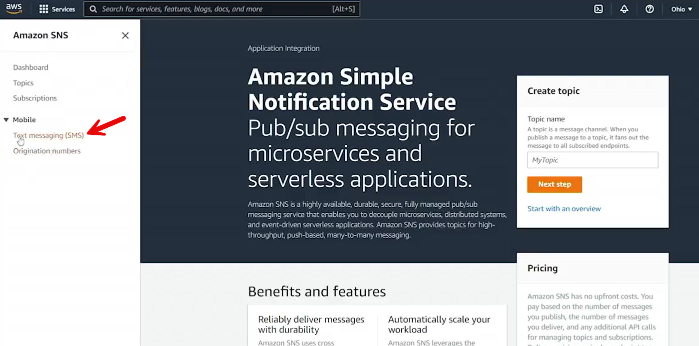
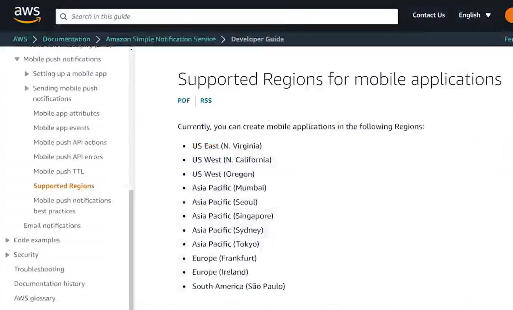
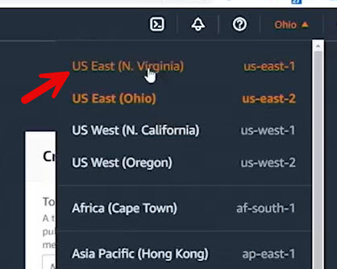
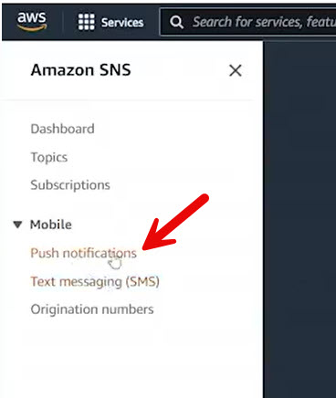
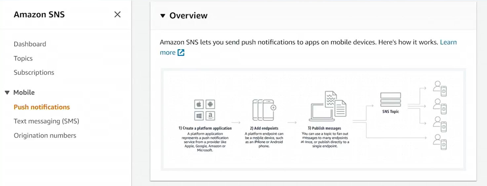
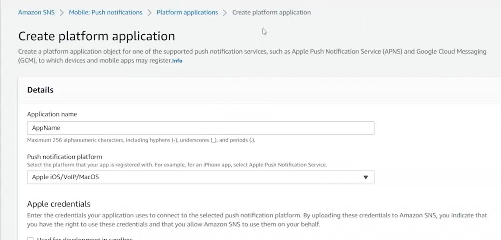
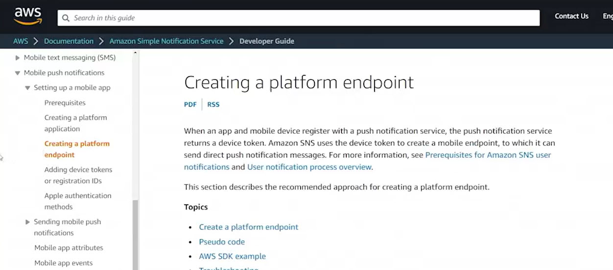

# 13.5 Using SNS platform applications 
 
 - Amazon Simple Notification Service **SNS** supports mobile push notifications.
- Supported mobile platforms include Apple, Android, Baidu, Google, and Microsoft Windows.
- The goal is to publish a message to an SNS topic and have it delivered as a mobile push notification to users.

- Integrating mobile push notifications with SNS is more complex than other notification methods.

- Not all AWS regions support mobile push notifications.

- In the United States, only specific regions support mobile push; Northern Virginia is one such region.

- In regions that support it, the SNS console includes a **Push Notifications** option.

- The overall workflow for mobile push notifications is:
  - Create a platform application
  - Add endpoints
  - Publish messages
- Adding endpoints is a **client-side responsibility**.
- Each mobile device must register itself as an endpoint with SNS through the mobile application.
- Before adding endpoints, a **platform application** must be created.
- A platform application represents an application that SNS is authorized to push notifications to.

- When creating a platform application, you must:
  - Provide an application name
  - Select the mobile platform for example, **Apple iOS**
  - Choose the push notification service type **certificate or token**
  - Configure event notifications and delivery status logging
- A full mobile push notification demo is not shown due to the complexity and lack of a prepared application.

- AWS documentation clearly explains:
  - Supported regions
  - Platform application creation
  - Endpoint creation
  - Example code
- AWS SDK examples are provided, including a Java example for registering a client endpoint.
- The documentation covers device token registration and Apple authentication methods.
- SNS documentation should be referenced when implementing mobile push notifications.

 
 ## [Context](./../context.md)