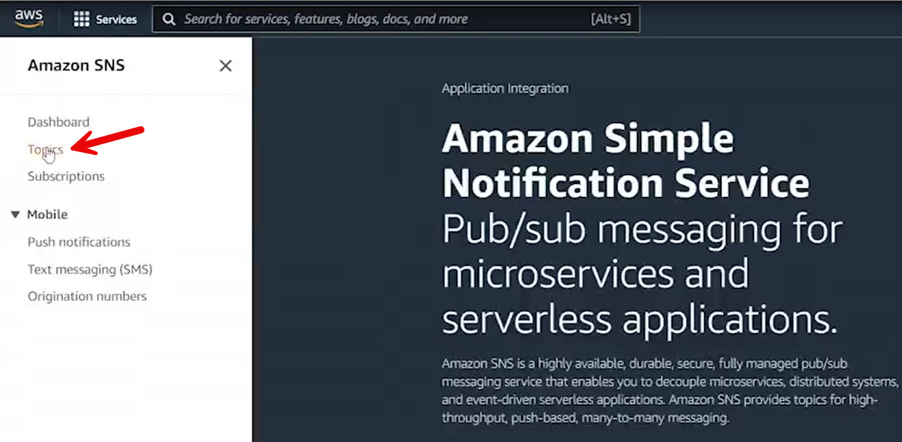
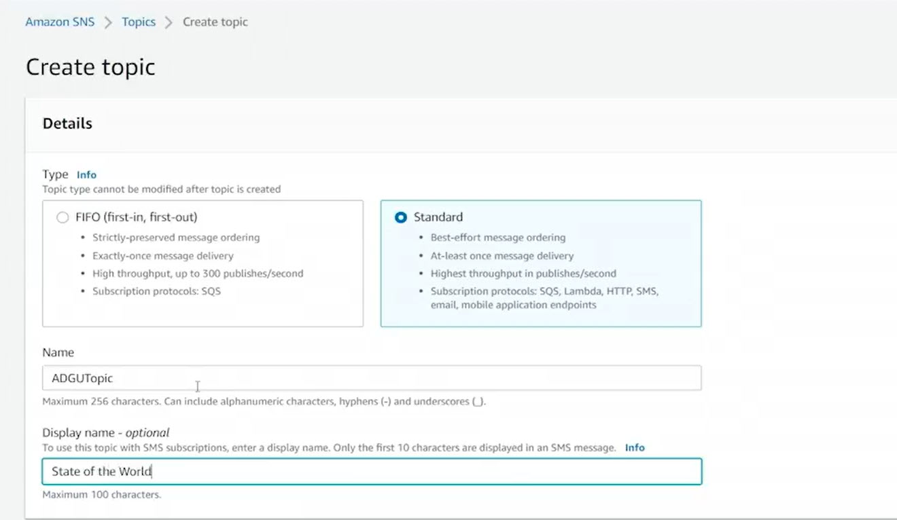
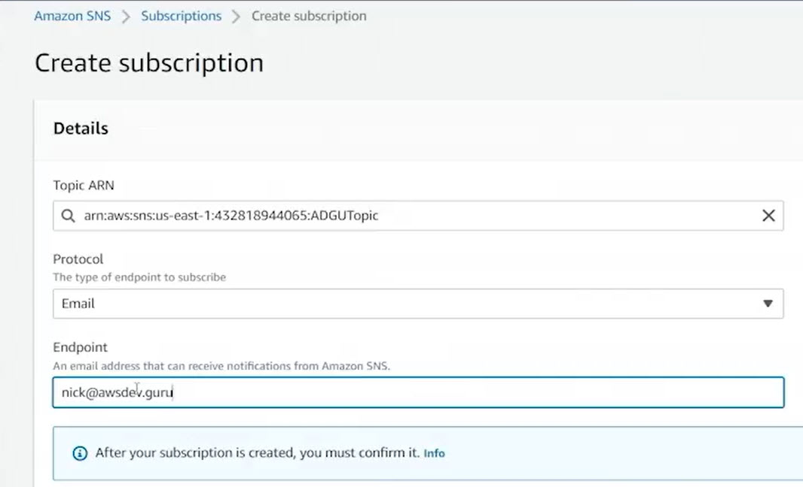
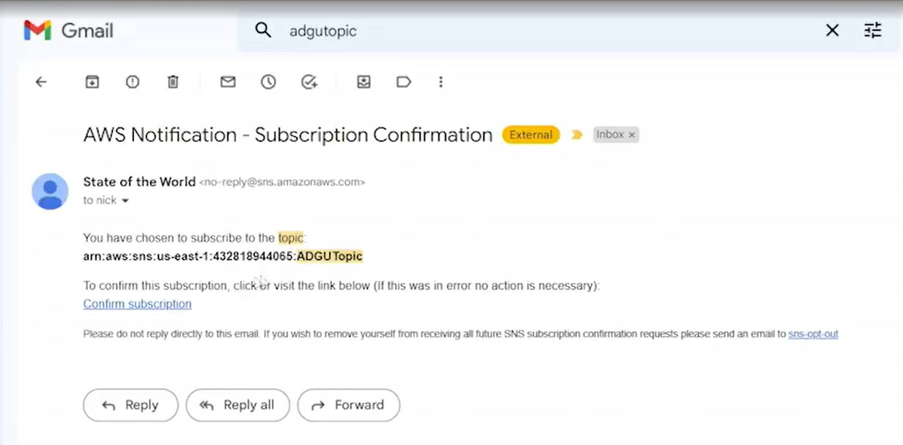
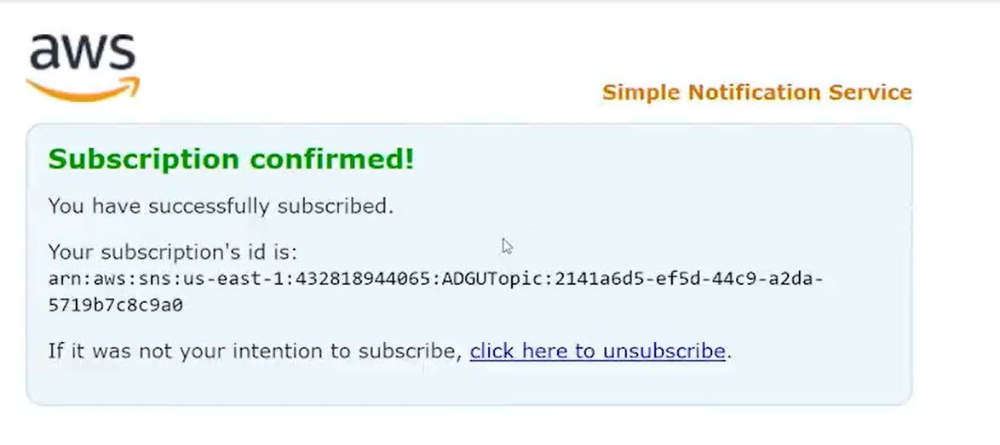
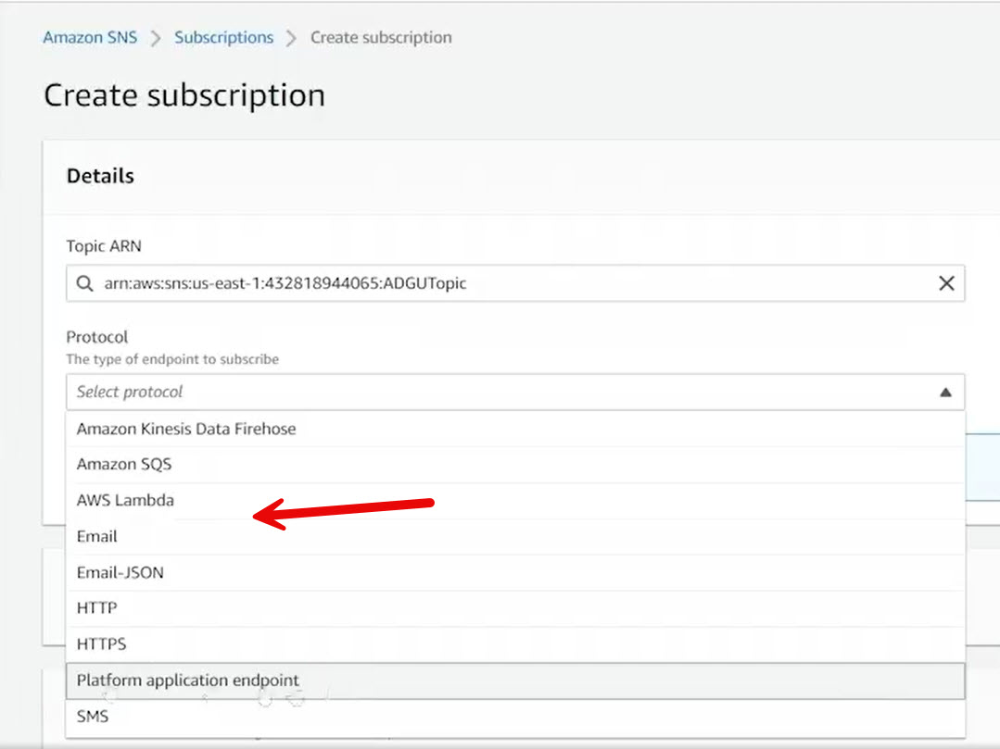
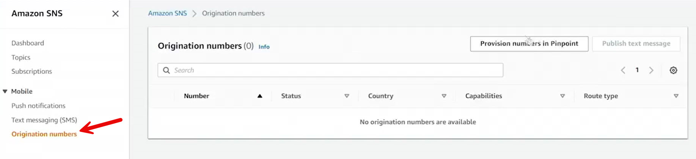
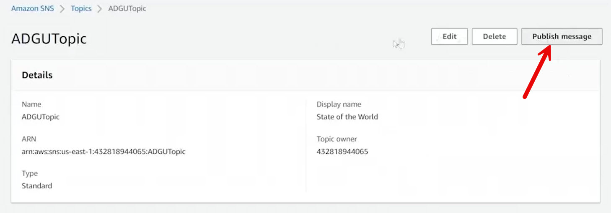
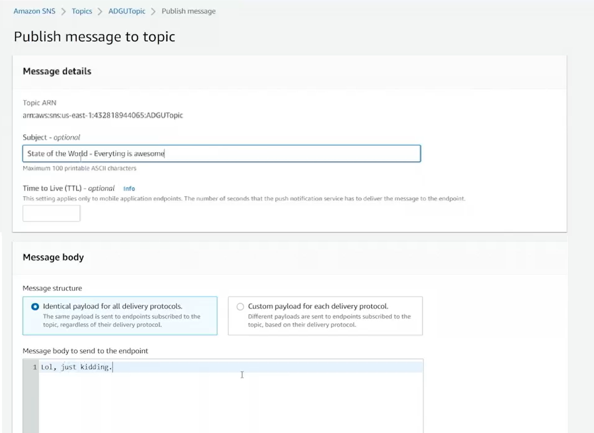
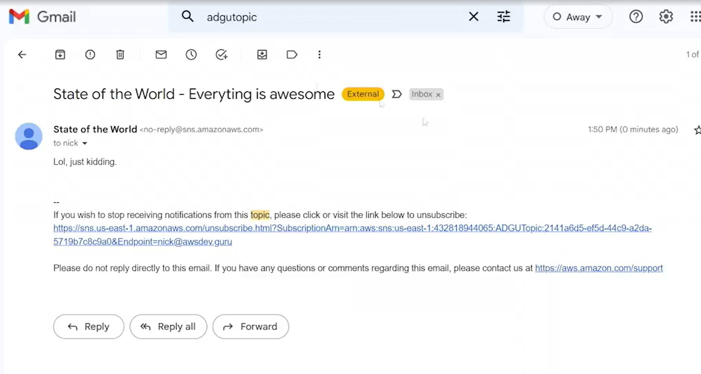

# 13.6 Emailing and texting using SNS 
 
 - A demonstration is shown for sending an email using Amazon Simple Notification Service **SNS**.
 
- A **standard SNS topic** named `ADGUTopic` is created.
- The topic display name is set to **State of the World**.

- Additional settings such as encryption, access policy, delivery retry policy, status logging, and tags are left at their default values.
- Initially, the topic has no subscribers, so a subscription must be created before publishing messages.
- An **email subscription** is created for `nick@awsdev.guru`.

- Subscription options such as filter policy and redrive policy are available but left unchanged.
- SNS enforces **anti-spam compliance**, requiring email subscribers to confirm their subscription.
- The subscriber receives a confirmation email and must click **Confirm Subscription**.

- Once confirmed, the subscription becomes active and can receive messages.

- SNS supports multiple subscription protocols, including:
  - SQS
  - Lambda
  - Email
  - Email-JSON
  - HTTP webhook
  - HTTPS webhook
  - Platform application endpoint **mobile push**
  - SMS **text messages**
  
- Sending SMS messages requires a more complex setup:
  - Provisioning a toll-free origination number via Amazon Pinpoint
  
  - Registering a business as a toll-free registrant
  - Approval by Amazon and mobile carriers
- Due to these requirements, SMS is not practical for a simple or free-tier demonstration.

- A message is published to the topic with:
  - Subject: **State of the World - Everything is awesome**
  - Message body containing a typo and a follow-up statement : **Lol, just kidding**
  
- Because the email subscription is confirmed, the message is delivered as an email.
- The received email includes a mandatory footer required for anti-spam compliance.
- The footer contains an **unsubscribe link**, which cannot be removed.
- Clicking the unsubscribe link removes the subscription.

- The SNS console reflects the subscription as deleted after unsubscribing.
- Overall workflow demonstrated:
  - Create a topic
  - Add and confirm an email subscription
  - Publish a message
  - Unsubscribe the user

 
 ## [Context](./../context.md)