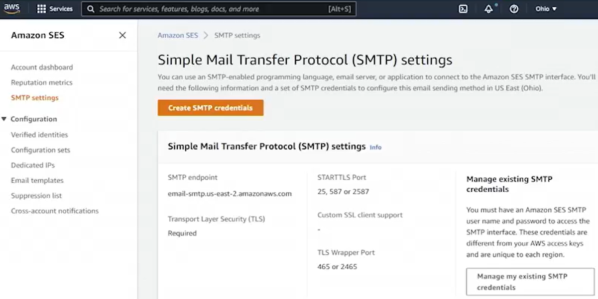

# 14.2 Understanding SES 

 
 - AWS offers multiple “Simple” messaging services:
  - Simple Queue Service (SQS)
  - Simple Notification Service (SNS)
  - **Simple Email Service (SES)**
- **SES** is an Amazon service designed for sending emails at scale
  - Capable of sending **millions of emails** efficiently
- Amazon describes SES as:
  - **Cost-effective**
  - **Flexible**
  - **Scalable**
  - Suitable for sending email from **any application**
- Emails can be sent using multiple interfaces:
  - AWS SDKs (e.g., from a **Lambda function**)
  - AWS CLI (via shell scripts)
  - **SMTP (Simple Mail Transfer Protocol)**
- Email reputation is critical:
  - IP address reputation determines spam filtering
  - Amazon strictly enforces anti-spam policies
  - High-volume sending requires **approval**
  - Amazon uses **high-reputation IP addresses** to protect deliverability
- SES supports multiple authentication mechanisms:
  - **SPF (Sender Policy Framework)**
  - **DKIM (DomainKeys Identified Mail)**
  - **DMARC (Domain-based Message Authentication, Reporting & Conformance)**
- SES provides **VPC connectivity**
  - Enables sending emails while staying within a VPC
- Supports:
  - Distribution lists and subscriptions
  - Detailed email metrics and statistics, including:
    - Sends
    - Deliveries
    - Opens
    - Clicks
    - Bounces
    - Complaints
    - Rejections
- SMTP features:
  - Supports **STARTTLS** for encrypted connections
  - Provides SMTP endpoints for client configuration
  - Supports TLS wrapper ports for secure communication
- SES includes a **Delivery Dashboard**
  - Displays charts and metrics for email activity
  - Sandbox accounts typically show limited activity
- **Sandbox vs. Production environments**:
  - All new accounts start in the **sandbox**
  - Sandbox limitations:
    - Emails can only be sent to **verified addresses**
    - Maximum of **200 emails per 24 hours**
    - Sending rate limited to **1 email per second**
  - Sandbox prevents sending unsolicited emails
- **Production access**:
  - Must be requested and approved
  - Requires justification (e.g., transactional vs marketing use)
  - Once approved, all sandbox restrictions are removed
- SES includes a **mailbox simulator**:
  - Allows testing of delivery scenarios without real email addresses
  - Common simulator addresses:
    - `success@simulator`
    - `bounce@simulator`
    - `complaint@simulator`
    - `suppressionlist@simulator`
  - Simulator tests do not count against sandbox quotas
- **Pricing**:
  - Free tier includes **62,000 outbound emails per month**
  - Charges apply per 1,000 emails beyond the free tier
  - Additional fees for:
    - Email attachments (charged per GB)
  - Incoming email pricing:
    - First **1,000 received emails** are free
    - Charges apply per 1,000 thereafter
    - Attachment data is billed separately
- SES supports **email address labeling**
  - Uses plus (`+`) addressing for tracking and filtering

 ## [Context](./../context.md)