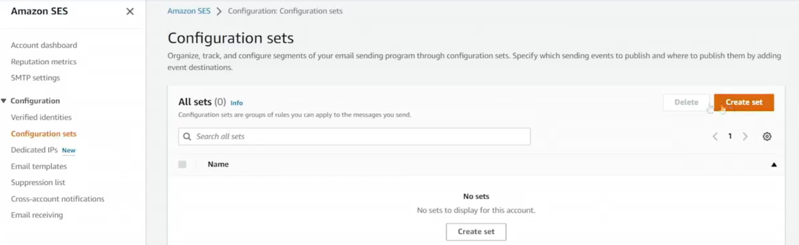
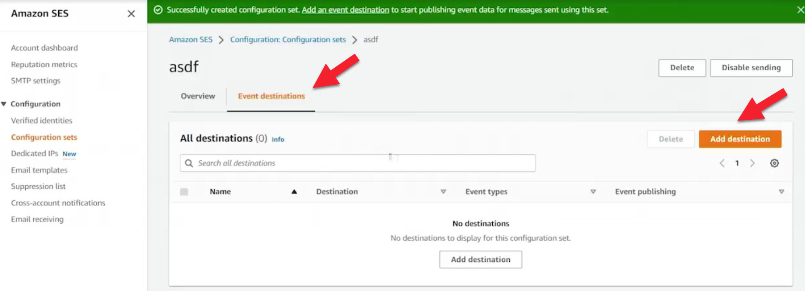
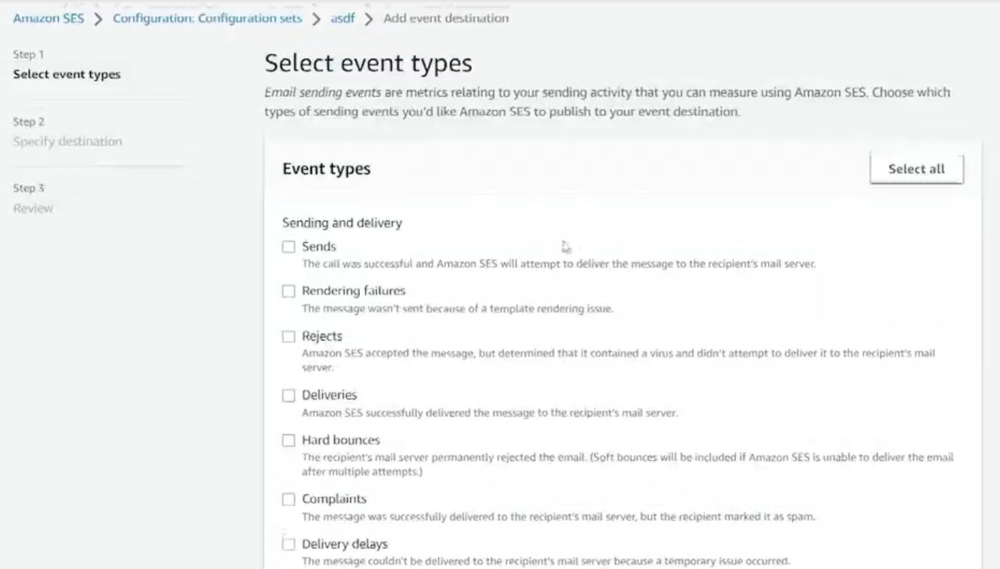
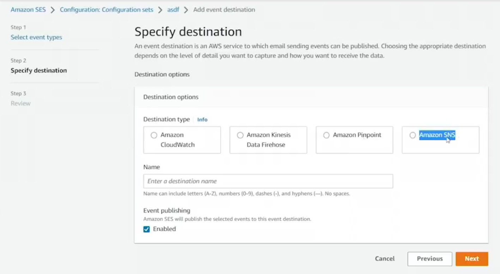
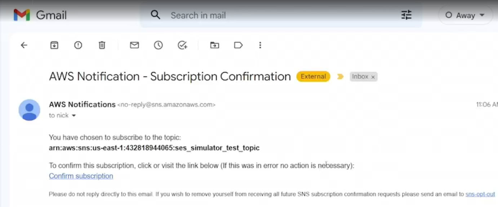
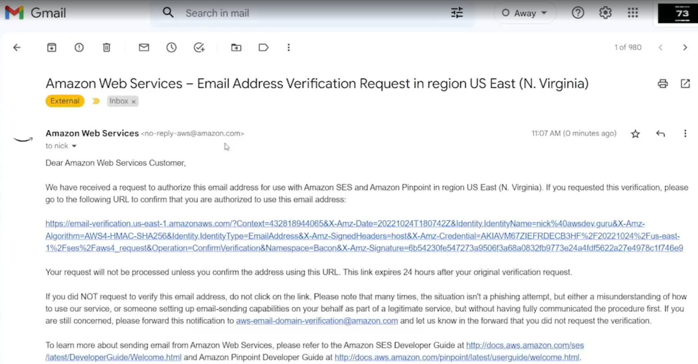
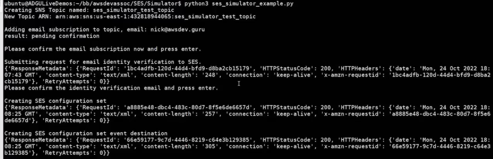
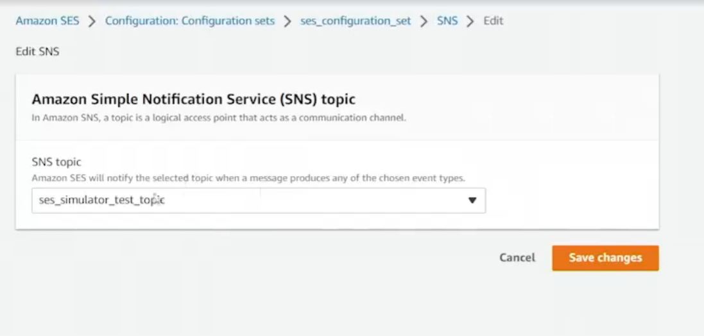
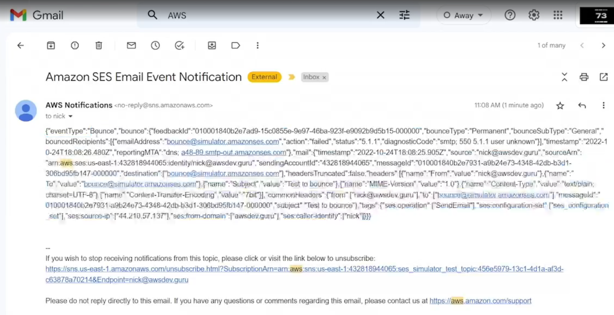
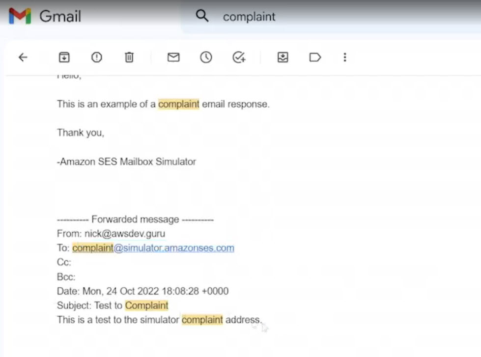

# 14.3 Using the SES simulator 
 
 # Using the Amazon SES Simulator (Sandbox)

## Purpose of the SES Simulator
When Amazon SES is in **sandbox mode**, testing real-world email behaviors (such as bounces, complaints, and out-of-office replies) requires the **SES simulator**. The simulator allows you to safely experiment with these scenarios without affecting real sender reputation.

This demo uses a **Python application** to send simulated emails and log the resulting events.

---

## Key Concepts

### Verified Identities
- In the SES sandbox, **all sender and recipient email addresses must be verified**.
- Verification involves:
  - Creating an email identity in SES
  - Receiving a verification email
  - Clicking the confirmation link
- Without verified identities, SES will not allow sending emails.

---

### Configuration Sets

- **Configuration sets** control what happens *after* an email is sent.
- When attached to an email send action, they enable:
  - Event tracking (send, bounce, complaint, delivery, rejection, etc.)
  - Routing of those events to destinations such as:
    - Amazon SNS
    - Amazon Kinesis Firehose
    - Amazon Pinpoint
- Reputation metrics can be enabled to visualize bounces and complaints (may incur additional charges).

---

## Configuration Set Event Destinations

Within a configuration set, you can define **event destinations**:

- Examples of tracked events:
  - Send
  - Reject
  - Bounce
  - Complaint
  - Delivery

- Each event can publish structured JSON data to an SNS topic.
- Common use cases:
  - Forward complaint notifications to an administrator
  - Trigger automated workflows (via Lambda)
  - Monitor sending behavior programmatically

---

## Python SES Simulator Application Overview

[ses_simulator_example.py](./../CODE/SES/Simulator/ses_simulator_example.py)

### Setup

The script (`ses_simulator_example.py`) performs the following:
- Reads AWS credentials, region, and email address
- Exits if credentials are not configured
- Creates:
  - An **SNS client**
  - An **SES client**

---

### SNS Workflow

1. Create an SNS topic (`ses_simulator_test_topic`)
2. Subscribe an email address (`nick@awsdev.guru`)
3. Manually confirm the SNS subscription via email

---

### SES Workflow
1. Create a **verified email identity**
   - Requires manual confirmation via email
2. Create a **configuration set**
3. Attach an **SNS destination** to the configuration set
   - All events (send, bounce, complaint, delivery, reject) are routed to SNS

---

### Simulated Emails Sent
The script sends three simulated emails using SES simulator addresses:
- **Bounce**
- **Out-of-office**
- **Complaint**

Each simulated event generates SNS notifications.

---

## Results and Observations

### SNS Notifications

- Multiple emails are received as SNS notifications
- Messages are delivered as **JSON payloads**
- Each message includes:
  - Event type (bounce, complaint, send, delivery)
  - Metadata about the email
- In production, these SNS subscriptions would typically trigger **Lambda functions**, not email inboxes

---

### Complaint Example

- A complaint email was sent using the simulator
- SES automatically generated a complaint notification
- The complaint response was sent back to the original sender
- Demonstrates how SES handles recipient complaints and feedback loops

---

## Cleanup
The script includes cleanup steps to:
- Remove SNS topics
- Delete configuration sets
- Avoid unnecessary AWS charges

---

## What This Demo Achieved
- Created an SNS topic and email subscription
- Verified an SES email identity (sandbox requirement)
- Programmatically created an SES configuration set
- Routed SES simulator events to SNS
- Simulated bounce, complaint, and out-of-office scenarios
- Observed real-time event notifications via SNS

---

## Summary
This example demonstrates how to safely test Amazon SES email behavior in the sandbox using:
- Verified identities
- Configuration sets
- Event destinations
- SNS notifications
- SES simulator email addresses

It provides a complete, end-to-end view of how SES integrates with other AWS services for monitoring and handling email events.

 
 ## [Context](./../context.md)