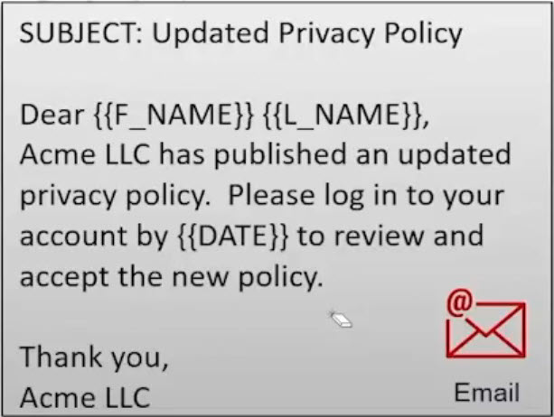

# 14.4 Using SES templates 
 
 # Using SES Templates — Summary

Amazon SES allows you to define reusable email templates and send emails to many recipients by substituting variables dynamically at send time.

## Key Concepts

- **SES Templates** contain placeholders (variables) such as `firstName`, `lastName`, or `date`.
- When sending an email, you specify:
  - The template name
  - A set of key–value pairs that replace the variables in the template
- This approach makes it easy to send personalized emails at scale.

## Python Example Overview

### Code Base
* [delete_template.sh](./../CODE/SES/UsingTemplates/delete_template.sh)
* [ses_template_demo.py](./../CODE/SES/UsingTemplates/ses_template_demo.py)

- A Python script (`ses_template_demo.py`) is used to demonstrate SES templates.
- The script:
  1. **Creates an SES client** to interact with Amazon SES.
  2. **Verifies an email identity** (required when operating in the SES sandbox).
  3. **Creates an email template** with variables (e.g., `name`, `todaysState`).
  4. **Sends a templated email** using `send_templated_email`.
     - Template data is passed as a stringified dictionary.
     - Keys match template variable names.
  5. **Optionally deletes the template** after sending.
     - Deleting is required to rerun the example successfully.

## Variable Substitution
- Variables in the subject and body are replaced at send time.
- Example:
  - Subject: `{{name}}'s Newsletter`
  - Body: `Dear {{name}}, Everything is {{todaysState}}!`
- Resulting email:
  - Subject: *Nick's Newsletter*
  - Body: *Dear Nick, Everything is awesome!*

## Results
- The email is successfully received with all variables substituted correctly.
- SES confirms template creation, email sending, and deletion via responses.

## Benefits
- Enables programmatic email sending to large audiences.
- Supports personalization at scale (e.g., thousands of recipients).
- Fully automated using Python and AWS SES APIs.

## Conclusion
Using SES templates with Python allows you to create, send, and manage personalized emails efficiently. Variable substitution works seamlessly, making SES a powerful solution for bulk and transactional email delivery.

 
 ## [Context](./../context.md)