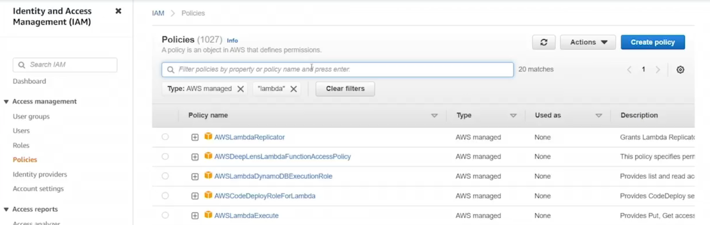
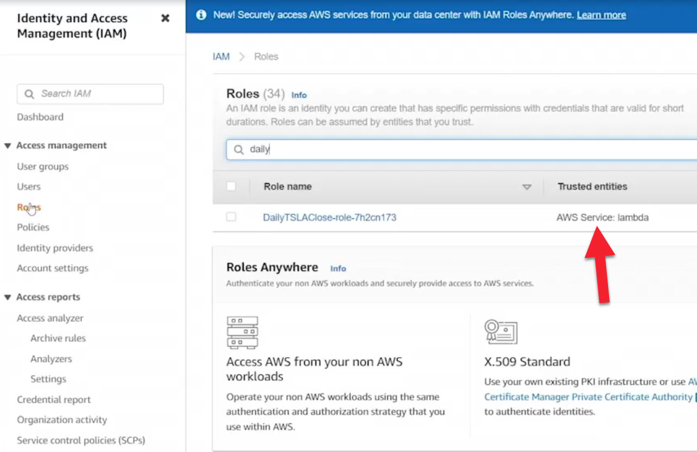

# 15.5 Exploring Lambda security 
 
 # Exploring AWS Lambda Security

- **What to Secure in Lambda**
  - User access to the Lambda service itself
  - What Lambda functions are allowed to access and do



- **IAM Integration**
  - Lambda is tightly integrated with AWS IAM
  - IAM policies control:
    - Who can access the Lambda service
    - Who can invoke specific Lambda functions
    - What resources a Lambda function can access

- **Network Security**
  - Lambda functions can be attached to a VPC
  - Enables use of:
    - Security Groups
    - Network Access Control Lists (NACLs)
  - Controls inbound and outbound network traffic between Lambda and other resources

- **Compliance**
  - AWS Lambda complies with major standards, including:
    - SOC
    - HIPAA
    - PCI
    - ISO
  - AWS provides documentation listing all supported compliance programs

- **Lambda Execution Role**
  - An IAM role associated directly with a Lambda function
  - Defines permissions for actions the function is allowed to perform
  - Example use cases:
    - Writing logs to CloudWatch
    - Accessing DynamoDB
    - Publishing messages to SNS

- **AWS Managed Policies**
  - AWS provides managed IAM policies specifically for Lambda
  - These can be attached to execution roles to simplify setup

- **Practical Example**
  - A Lambda function triggered by EventBridge (cron job)
  - Function retrieves stock data and sends an email notification
  - Execution role permissions include:
    - Basic Lambda execution role (CloudWatch logging)
    - SNS access to publish messages to a topic
  - SNS topic sends email notifications to a subscribed user

- **Best Practices**
  - Avoid granting full access unless absolutely necessary
  - Follow the principle of least privilege
  - Grant only the permissions required for the Lambda function to operate

---



# 🟦 What an AWS IAM Role Is

An **AWS IAM role** is a set of permissions that define what actions a service or user is allowed to perform in AWS.

Think of it as a **digital badge** that says:

> “You are allowed to access these AWS resources and perform these actions.”

Roles are **not tied to a specific person**. Instead, AWS services (like **Lambda**) can **assume a role** to gain **temporary permissions**.

---

# 🟩 What a Lambda Execution Role Is

When you create an **AWS Lambda function**, AWS asks for an **execution role**.

This role tells Lambda:

- What AWS services it can **read from**
- What AWS services it can **write to**
- What **logs** it can create

### Example permissions a Lambda function might need:

- Read stock data from an external API (via internet access)
- Write logs to **Amazon CloudWatch**
- Send SMS messages using **Amazon SNS**

The **execution role** grants these permissions.

---

# 🟧 Putting It All Together  
## “Lambda role which pulls car company stock price and sends text message to phone”

Here’s how the workflow typically looks:

---

## 1. Lambda Function

The Lambda function:

- Runs your code (Python, Node.js, etc.)
- Calls a stock-price API (e.g., Alpha Vantage, Yahoo Finance)
- Gets stock prices for companies like:
  - Tesla
  - Ford
  - GM
- Sends the result to **Amazon SNS** to deliver an SMS

---

## 2. IAM Role for Lambda

This role must include permissions such as:

| Permission                         | Why It’s Needed                  |
| ---------------------------------- | -------------------------------- |
| `logs:CreateLogGroup`              | Create CloudWatch log groups     |
| `logs:CreateLogStream`             | Create log streams               |
| `logs:PutLogEvents`                | Write logs to CloudWatch         |
| `sns:Publish`                      | Send SMS messages via Amazon SNS |
| *(Optional)* VPC permissions       | If Lambda runs inside a VPC      |
| *(Optional)* Secrets Manager / SSM | Securely store API keys          |

This role is **attached to the Lambda function**, allowing it to perform these actions securely.

---

# 🟨 Example Architecture

```text
CloudWatch Event (cron)
        ↓
      Lambda
        ↓
Fetches stock price
        ↓
Publishes message to SNS
        ↓
      SMS to your phone

```

# 🟪 Why IAM Role Is Important

Without the IAM role:

* ❌ Lambda cannot send SMS
* ❌ Lambda cannot write logs
* ❌ Lambda cannot access secure API keys
* ❌ Lambda cannot access other AWS services

✅ The IAM role is the security gatekeeper that enables the Lambda function to do its job safely and securely.
 
 ## [Context](./../context.md)