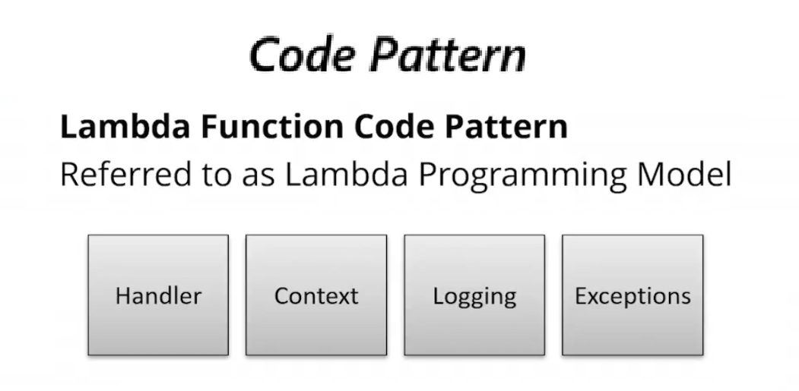

# 15.6 Using Lambda functions 
 
# Using AWS Lambda Functions

- **Lambda Programming Model Overview**
  - Simple lifecycle: develop → upload → execute → monitor → maintain
  - Functions are event-driven and execute in managed containers
  - AWS handles servers, OS, scaling, and infrastructure

- **Key Design Questions When Developing a Function**
  - Which programming language to use:
    - Node.js, Python, C#, Java, Go
  - What external or third-party dependencies are required
  - Which development tools and environments to use

- **Development Tools by Language**
  - **Node.js**: Lambda Console, Visual Studio plugin, CLI, or custom environment
  - **Python & Go**: Lambda Console or custom environment
  - **C# (.NET Core)**: Visual Studio plugin or custom environment
  - **Java**: AWS Toolkit for Eclipse or custom environment

- **Lambda Programming Model Components**
  - **Handler**: Entry point called by the Lambda runtime
  - **Event**: Data passed to the function by the trigger
  - **Context**: Runtime metadata and execution information
  - **Logging**: Standard output sent to CloudWatch Logs
  - **Exceptions**: Used to signal success or failure



 
All programming models are defined in the AWS Lambda documentation.
* http://docs.aws.amazon.com/lambda/latest/dg/programming-model-v2.html 

[What is AWS Lambda?](https://docs.aws.amazon.com/lambda/latest/dg/welcome.html)

#### Lambda Programming Model – Context  
Node.js  Programming Model – Event

To investigate the event data passed to your Lambda function, you can log or return the event object. For example:
``` js
exports.myHandler = function(event, context, callback) {
    var response = {
        "isBase64Encoded": false,
        "statusCode": 200,
        "headers": {"Content-Type":"application/json"},
        "body": JSON.stringify(event)
    }
    callback(null, response);
}

```

- **Handler Function**
  - Defined in the function code
  - Invoked when the function is triggered
  - Receives:
    - Event data (first parameter)
    - Context object (second parameter)
  - Best practice: branch logic out of the handler for better testability

- **Context Object**
  - Provides access to runtime information, such as:
    - Remaining execution time
    - Function name
    - Memory allocation
    - Log group and log stream names
    - Invocation ID (globally unique)

- **Runtime Configuration**
  - Runtime (e.g., Node.js version) is specified when creating the function
  - Multiple runtime versions may be available
  - Older runtimes continue to work but may be deprecated
  - AWS notifies users when runtimes are scheduled for deprecation

- **Event Data Example (API Gateway)**
  - API Gateway with Lambda proxy integration passes full request data
  - Event includes:
    - HTTP method
    - Query string parameters
    - Request metadata
    - (Optional) Cognito user identity details

- **Callback and Responses**
  - Callback is used to return results to the Lambda runtime
  - For API Gateway proxy integrations, responses must include:
    - HTTP status code (e.g., 200, 403)
    - Headers (if needed)
    - Body content
  - Incorrect response formatting may result in generic “Internal Server Error”

- **Exception Handling**
  - Successful execution returns a valid response
  - Errors can be:
    - Thrown as Lambda execution errors
    - Returned as client-side HTTP errors using status codes

- **Monitoring and Logging**
  - Lambda console displays metrics such as:
    - Invocations
    - Execution duration
    - Concurrent executions
  - All standard output is sent to CloudWatch Logs
  - Logs can be accessed via:
    - Lambda console link
    - CloudWatch Logs log groups and streams
  - JSON logs are automatically formatted for easier viewing
 
 
 ## [Context](./../context.md)