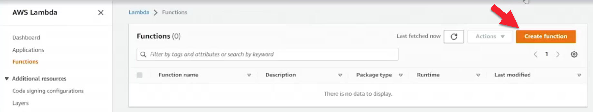
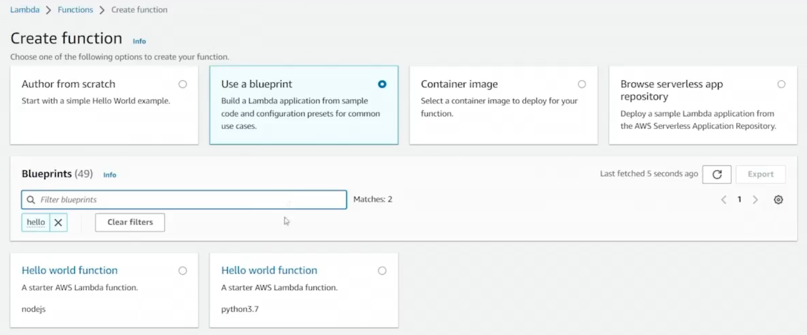
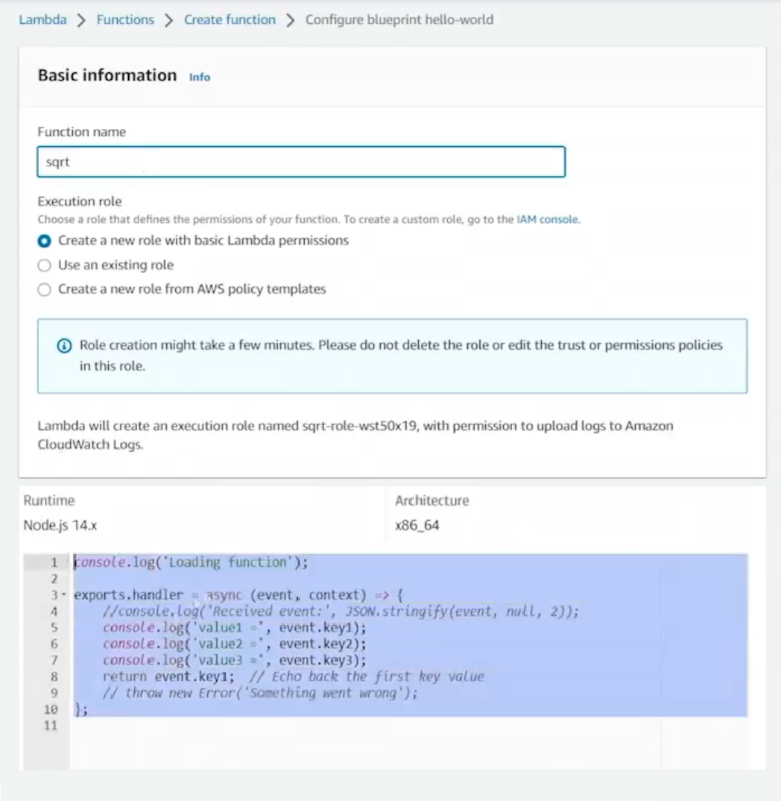
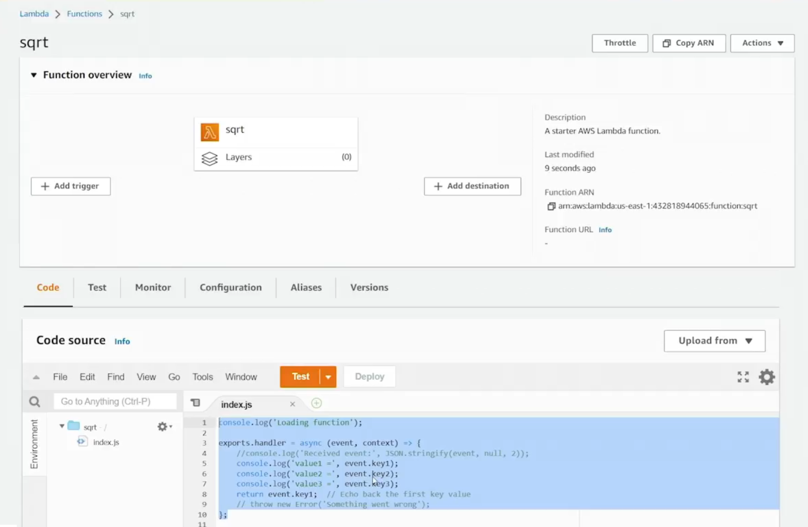
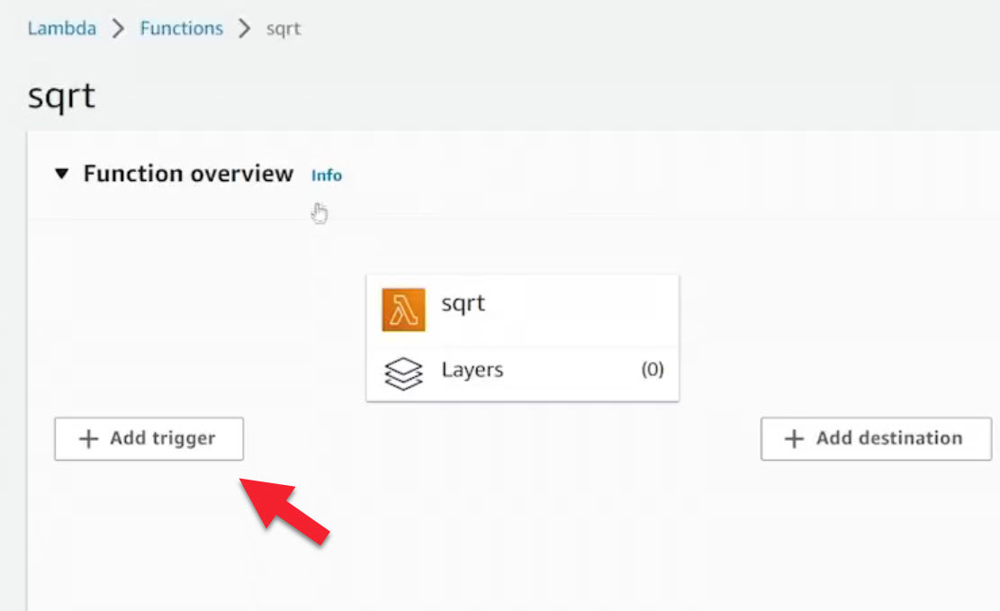
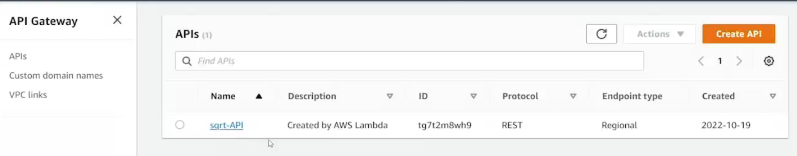
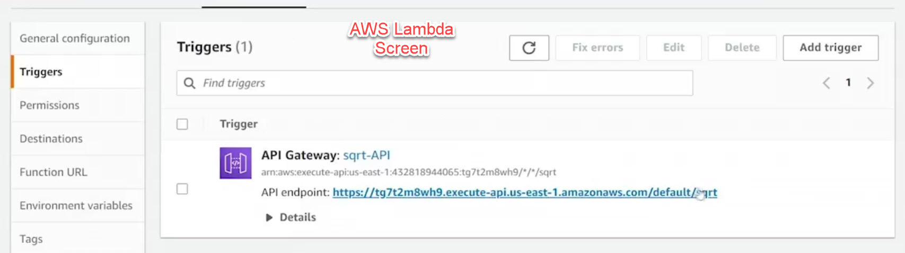

# 15.7 Deploying a Lambda function 
 
# Deploying a Lambda Function





- **Common Use Case**
  - Lambda is often integrated with Amazon API Gateway
  - Enables REST endpoints that trigger Lambda functions

- **Creating the Lambda Function**
  - Navigate to the Lambda service in the AWS Console
  - Create a new function using a blueprint
  - Select a “Hello World” blueprint (Node.js in this example)
  
  

  - Name the function (e.g., `sqrt`)
  - Create a new execution role with basic Lambda permissions
    - Allows writing logs to CloudWatch

- **Execution Role**
  - Required for every Lambda function
  - Determines what AWS services the function can access
  - Basic role allows logging to CloudWatch
  - Additional permissions are needed for services like DynamoDB or SNS



- **Modifying and Deploying Code**
  - Default blueprint code can be edited in the console
  - Custom logic added to:
    - Parse query string parameters
    - Calculate the square root of an input number
    - Return a JSON response with HTTP status code and headers
  - Deploy updates using the **Deploy** button

- **Handler Logic Overview**
  - Exports a handler function
  - Receives `event`, `context`, and `callback`
  - Reads query string parameters from the event object
  - Performs calculation
  - Returns response via callback



- **Adding an API Gateway Trigger**
  - Configure API Gateway as a trigger for the Lambda function
  - Create a new REST API
  - Set it to be publicly accessible
  - Use Lambda proxy integration
  - Any HTTP method sent to the endpoint invokes the Lambda function





``` js
'use strict';

console.log('loading function');

exports.handler = (event, context, callback) => {
    var ret = {};
    ret.query = parseInt(event.queryStringParameters.num);
    ret.sqrt = Math.sqrt(ret.query);
    console.log("calc'ing the sqrt of " + ret.query + " to be " + ret.sqrt);
    var response = {
        "isBase64Encoded": false,
        "statusCode": 200,
        "headers": {"Content-Type":"application/json" },
        "body": JSON.stringify(ret)
    }
    callback(null, response);
};

```

- **Testing the API Endpoint**
  - API Gateway provides an endpoint URL
  - Initial request without parameters results in:
    - “Internal Server Error”
    - Caused by missing or invalid input
  - Adding query parameters (e.g., `?num=81`) resolves the error
  - Function returns the correct square root result

- **Troubleshooting with CloudWatch Logs**
  - Lambda automatically logs to CloudWatch
  - Errors can be inspected via log groups and log streams
  - Each deployment creates a new log stream
  - Example error:
    - Missing query string parameter caused function crash

- **Improving Logging**
  - Use `console.log` to write custom logs
  - Standard output is sent to CloudWatch Logs
  - Logs help verify calculations and debug behavior

- **Observations**
  - Lambda + API Gateway enables fully serverless APIs
  - AWS manages infrastructure, OS, scaling, and availability
  - You only pay when the function is executing
  - Easily extensible with services like API Gateway or EventBridge
 
 
 ## [Context](./../context.md)