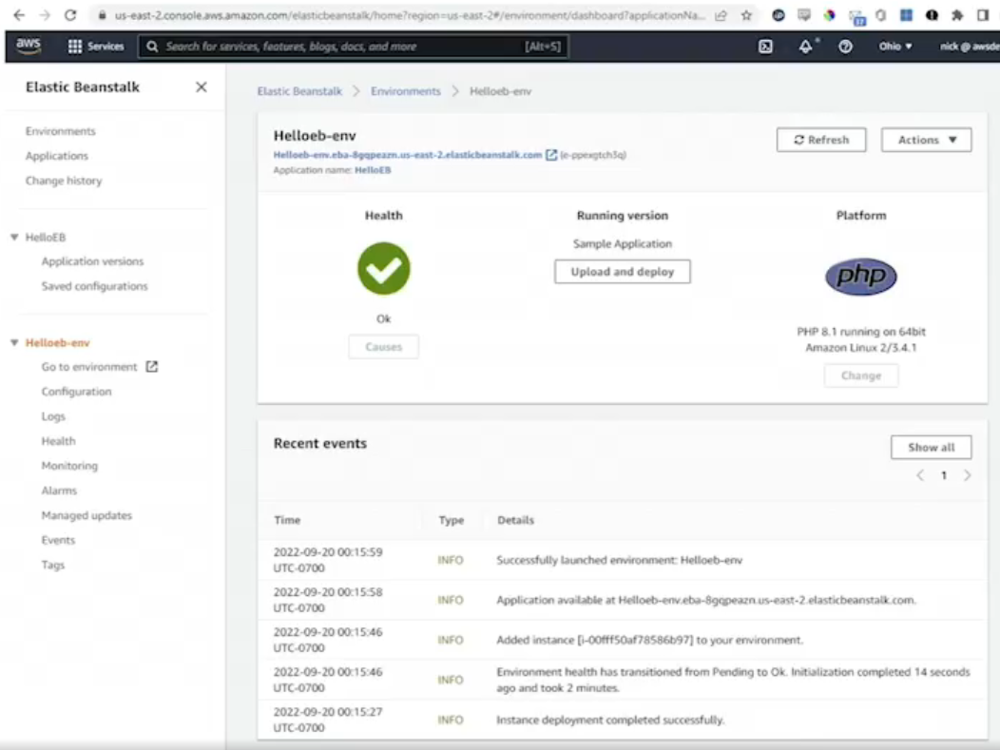

# 16.2 Understanding Elastic Beanstalk 
 
# Understanding Elastic Beanstalk

- **Purpose of Elastic Beanstalk**
  - Allows developers to focus on application code
  - AWS handles infrastructure provisioning and management
  - Described by AWS as “easy to begin and impossible to outgrow”

- **What AWS Manages**
  - Capacity provisioning
  - Auto scaling
  - Load balancing
  - Health monitoring
  - EC2 instances running the application

- **Developer Responsibilities**
  - Write and maintain application code
  - Upload application versions to Elastic Beanstalk

- **Underlying Infrastructure**
  - Applications run on Amazon EC2 instances
  - Infrastructure is provisioned using AWS CloudFormation (managed automatically)

- **Supported Platforms and Languages**
  - Go
  - Java
  - .NET
  - Node.js
  - Apache Tomcat
  - PHP
  - Python
  - Ruby
  - Docker

- **Environment Configuration**
  - Defines how the application runs
  - Includes:
    - Software stack
    - Instance types and sizes
    - Load balancers
    - Security roles
    - Auto scaling settings
    - Network configuration (VPC)
    - Database configuration (e.g., Amazon RDS)
    - Environment tags for cost allocation

- **Deployment and Application Lifecycle**
  - Create an application
  - Upload application code (e.g., WAR file, ZIP archive)
  - Launch an environment based on configuration
  - Manage and monitor the environment
  - Deploy new application versions
  - Migrate or replace environments when needed

- **Updates and Version Management**
  - Rolling updates supported for minor version upgrades
  - Major version upgrades require deploying a new environment
  - Environments can be swapped using “Swap Environment URL”
    - Commonly used for blue-green deployments

- **Health Monitoring**
  - Standard health monitoring included
  - Enhanced health monitoring available (paid feature)
  - Provides detailed metrics and health status indicators

- **Monitoring and Metrics**
  - Visual dashboards show application and environment health
  - Metrics include:
    - Application response time
    - CPU utilization
    - Instance health
  - Metrics reflect EC2 instances launched via CloudFormation
 
 
 ## [Context](./../context.md)