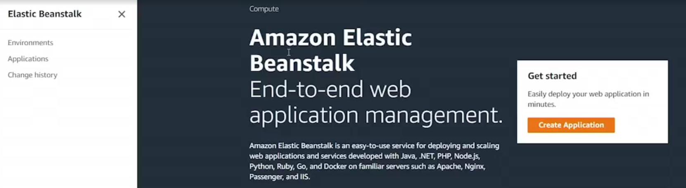

# 16.3 Development stacks 

 
# Development Stacks (Elastic Beanstalk)

- **Application Deployment Options**
  - Applications can be created using:
    - Elastic Beanstalk web console
    - Elastic Beanstalk Command Line Interface (EB CLI)
  - Web console allows:
    - Creating an application
    - Selecting a platform (e.g., PHP)
    - Deploying a sample or production application
    - Configuring options such as VPC and databases

- **Elastic Beanstalk CLI (EB CLI)**
  - Installed using `pip3 install awsebcli`
  - Published and maintained by AWS
  - Provides a command-line alternative to the web console
  - Uses CloudFormation behind the scenes

- **Creating an Application with EB CLI**
  - Initialize a project directory
  - Run `eb init` to:
    - Select AWS region
    - Choose a platform (e.g., PHP)
  - EB CLI creates:
    - An `.elasticbeanstalk` directory with configuration files
    - A `.gitignore` file to exclude EB config files

- **Authoring Application Code**
  - Code is written in the language matching the selected platform
  - Example:
    - PHP platform
    - `index.php` file that outputs PHP information
  - All files in the directory are packaged and deployed

- **Creating an Environment**
  - Use `eb create <environment-name>` to:
    - Upload application code
    - Provision infrastructure
    - Launch the environment
  - Process mirrors what happens in the web console
  - CloudFormation provisions:
    - EC2 instances
    - Auto Scaling groups
    - CloudWatch alarms
    - Load balancers and related resources

- **Viewing the Deployed Application**
  - Elastic Beanstalk console shows:
    - Application and environment status
    - Health indicators
    - Public URL for the environment
  - Accessing the URL displays the running application

- **Updating an Application**
  - Modify files in the project directory
  - Use `eb deploy` to push updates
  - EB CLI uploads new code and updates the environment

- **Platform Selection**
  - Platform is specified during initialization
  - Determines:
    - Runtime environment
    - Supported language and framework
  - All supported platforms are available via both the console and EB CLI

- **Key Takeaway**
  - Elastic Beanstalk simplifies application deployment
  - EB CLI enables repeatable, scriptable deployments
  - Infrastructure is fully managed using CloudFormation

 
 ## [Context](./../context.md)