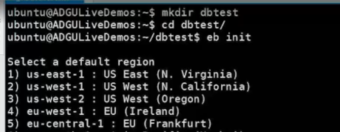
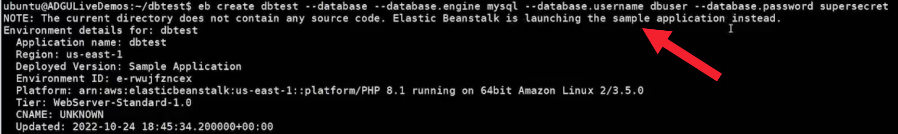
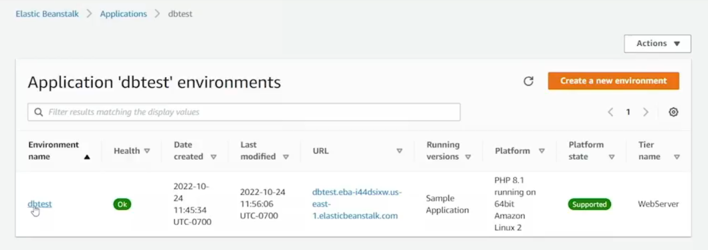
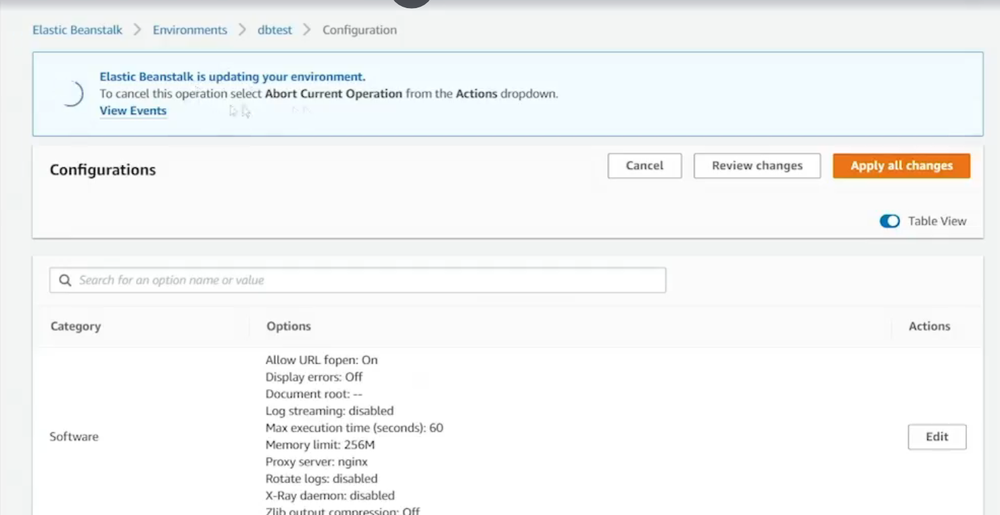

# 16.4 Interacting with databases 
 
- **Goal**
  - Launch an Elastic Beanstalk application using the CLI
  - Attach a relational database (RDS MySQL) during environment creation

- **Project Setup**
  - Created a working directory (`dbtest`) in the home directory
  - Used the interactive initialization method with `eb init`

- **Elastic Beanstalk Initialization**
  - Selected **Northern Virginia (us-east-1)** region
  - Created a new application named **dbtest**
  - Chose **PHP** platform (PHP 8.1)
  - Skipped CodeCommit setup
  - Disabled SSH access to instances

- **Environment Creation**
  - Ran `eb create dbtest` with database options:
    - Database engine: **MySQL**
    - Username: **dbuser**
    - Password: **supersecret**
  - Elastic Beanstalk deployed a **sample PHP application** automatically
  - Environment creation took ~11 minutes total
    - Database creation took ~8 minutes

- **Verification in Elastic Beanstalk Console**
  - Confirmed environment was successfully launched
  - Accessed the sample application via the environment URL
  - Located the database endpoint under **Configuration → Database**
  - Database endpoint can be used in PHP code for connectivity

- **Code Update and Deployment**
  - Modified `index.php` to display PHP info
  - Deployed changes using `eb deploy`
  - Elastic Beanstalk packaged the code, uploaded it to S3, and updated EC2
  - Verified successful deployment via the web console and browser

- **Database Confirmation**
  - Verified the database instance in the **RDS console**
  - Confirmed MySQL database is running and associated with the environment

- **Outcome**
  - Created a new Elastic Beanstalk application and environment
  - Automatically provisioned and attached an RDS MySQL database
  - Successfully deployed and updated application code
  - Application is now ready to connect to the database using the provided endpoint
 
 
 ## [Context](./../context.md)