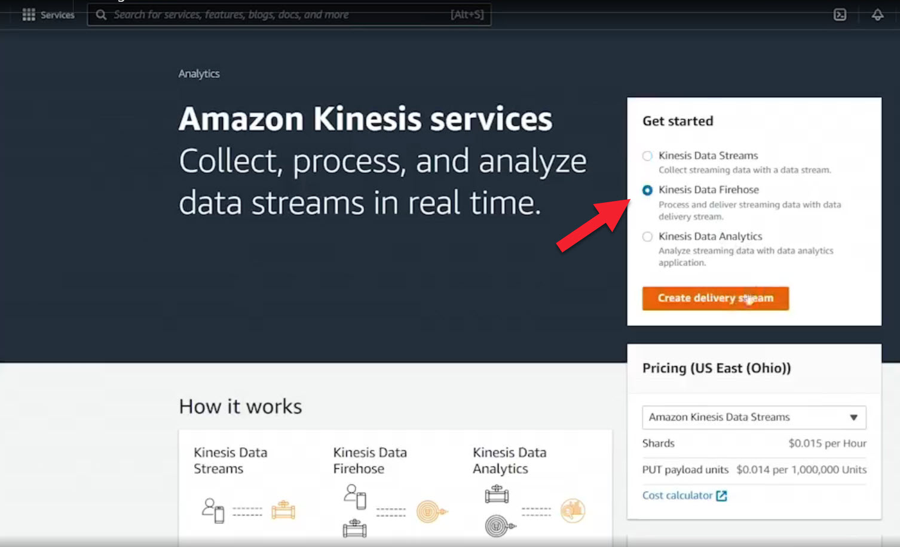
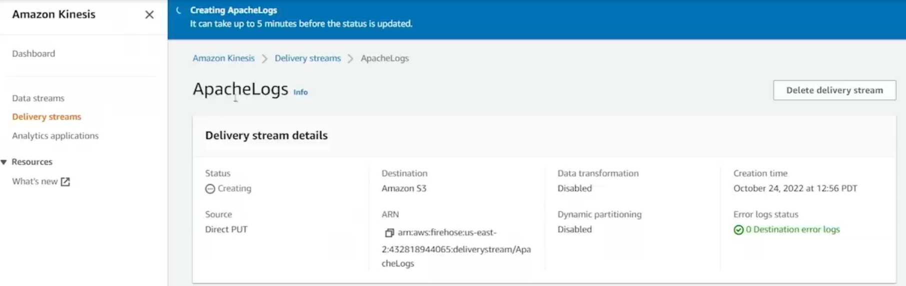
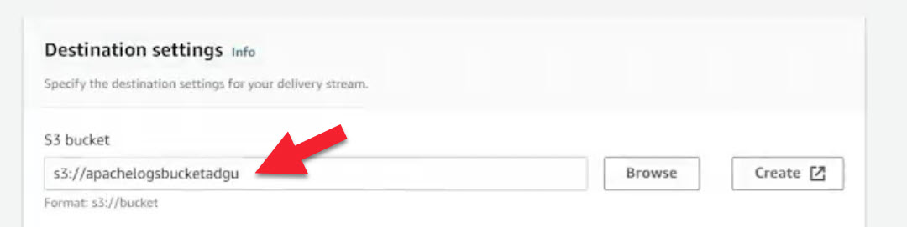
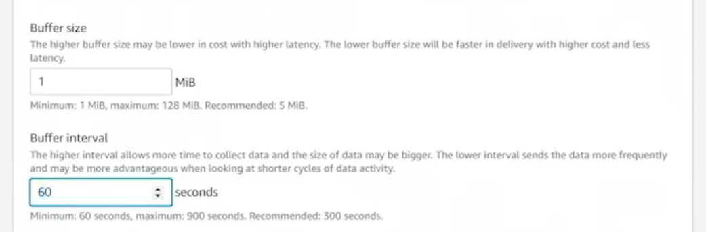
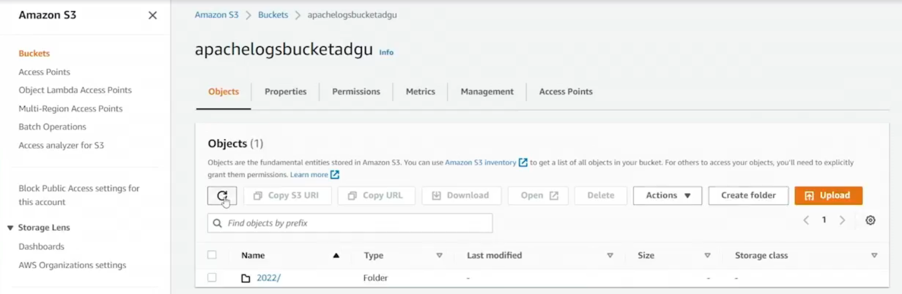

# 17.4 Using Firehose 
 
- **Purpose of the Demo**
  - Demonstrates using **Kinesis Data Firehose** to ingest data
  - Data is pushed directly into Firehose and delivered to **Amazon S3**

- **Firehose Setup**

  - Created a **Kinesis delivery stream**
  - Source type: **Direct Put**
  - Destination: **Amazon S3**

  - Delivery stream name: **ApacheLogs**

- **Code Base**
  - [producer.py](./../CODE/Kinesis/2_firehose/producer.py)
  - [config.json](./../CODE/Kinesis/2_firehose/config.json)

- **Firehose Architecture Notes**
  - Firehose can be chained with other Kinesis services
    - Data Streams → Firehose → Analytics
  - This demo uses a simple **direct ingestion** approach

- **S3 Bucket Configuration**

  - Created a new S3 bucket: **apachelogsbucketadgu**
  - Selected bucket as Firehose destination
  - No partitioning, prefixes, or error output configured
  - ACLs enabled (optional)

- **Buffering Settings**
  
  - Firehose buffers data before writing to S3
  - Buffer configuration adjusted to:
    - **1 MiB** or **60 seconds**
  - No compression enabled

- **Firehose Activation**
  - Delivery stream became active within seconds
  - Ready to receive data once active

- **Producer Application**
  - Producer script reads from an **Apache log file**
  - Configuration defined in `config.json`:
    - Stream name
    - AWS region (**us-east-2 / Ohio**)
    - Access keys
  - Producer sends log data directly to Firehose

- **Data Delivery to S3**
  
  - Firehose writes buffered log data to S3 automatically
  - Files stored in time-based folder structure (year/month/day/hour)
  - Objects contain raw Apache log lines

- **Results**
  - Log data successfully delivered from Firehose to S3
  - Verified by opening the generated S3 objects

- **Key Takeaways**
  - Firehose simplifies streaming data ingestion to S3
  - Supports many producers sending data to a single destination
  - Ideal for log ingestion, archival, and downstream analytics
  - Data stored in S3 can be analyzed using **Kinesis Data Analytics** or other tools

 
 ## [Context](./../context.md)