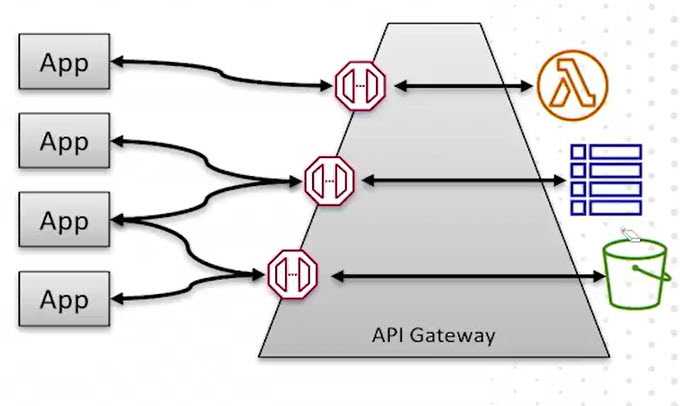
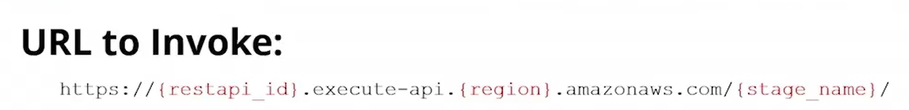

# 18.2 An API Gateway overview 
 
 - **What is API Gateway**
  - Acts as a primary **entry point into AWS**
  - Commonly used for applications sending data to AWS services
  - Frequently integrated with **AWS Lambda** in serverless architectures

- **API Gateway Purpose**
  - Create, maintain, and secure APIs at any scale
  - Provides **RESTful APIs** for applications

- **Roles and Responsibilities**
  - **App Developer**
    - Writes applications that call APIs
    - Does **not** need IAM credentials unless explicitly required
  - **API Developer**
    - Creates and manages APIs in API Gateway
    - Requires IAM credentials

- **API Gateway Architecture**

  - Internet-facing API endpoints
  - Backend integrations within AWS (the “backplane”)
  - API Gateway routes requests from clients to backend services

- **Core API Components**
  - **APIs**
  - **Resources** (e.g., `/pets`)
  - **Methods** (HTTP verbs: GET, POST, PUT, DELETE, PATCH)
  - **Integrations** (connect methods to backend services)

- **Example Use Case**
  - Application uploads a photo via API Gateway
  - API Gateway stores the photo in S3
  - S3 triggers a Lambda function to resize the image

- **Serverless Integration**
  - API Gateway is the **app-facing layer**
  - Lambda contains business logic
  - Tight integration makes them commonly deployed together
  - Core components of the **AWS Serverless Application Model (SAM)**

- **Integration Types**
  - **Lambda Integration**
    - Most common integration type
    - Preferred approach is **Lambda Proxy Integration**
    - Passes full request context (headers, body, query strings, path variables, identity info)
    - Custom integrations allow request/response manipulation
  - **HTTP Integration**
    - Proxies requests to HTTP endpoints
    - Can target private resources inside a VPC
    - Supports proxy and custom modes
  - **Private Integration**
    - Exposes private VPC resources through API Gateway
  - **Mock Integration**
    - Returns simulated responses
    - Useful when backend services are not yet implemented

- **Access Control Options**
  - Gateway resource policies
  - IAM authorization
  - CORS configuration
  - **Lambda authorizers**
  - **Cognito User Pool authorizers**
  - Client-side certificates
  - Usage plans for throttling and billing

- **Authentication and Authorization**
  - Cognito authorizers require users to authenticate before invoking backend services
  - Authorization occurs before Lambda execution

- **API Deployment and URLs**

  - Deploying an API generates a URL with:
    - `restapi_id`
    - AWS region
    - Stage name
  - Stages allow **versioning** of APIs

- **Testing APIs**
  - Built-in testing in the API Gateway console
  - External tools supported:
    - Postman
    - cURL
    - wget
    - Paw

- **SDK Generation**
  - API Gateway can generate client SDKs
  - Supported languages:
    - Java
    - Android
    - JavaScript
    - Ruby
    - iOS (Objective-C and Swift)
  - SDKs simplify API integration into applications

- **Additional Features**
  - Integration with **AWS Amplify** for web applications
  - **AWS X-Ray** support for tracing and monitoring API calls

- **Key Takeaway**
  - API Gateway is a foundational AWS service for building secure, scalable, and serverless APIs
  - Provides flexible integrations, strong security controls, and rich developer tooling

 
 ## [Context](./../context.md)