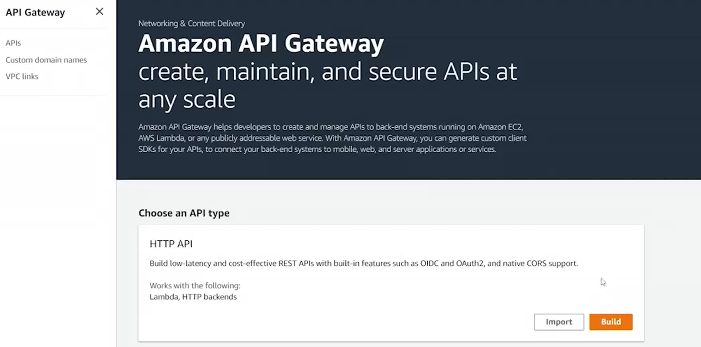
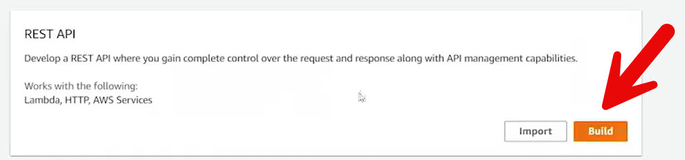
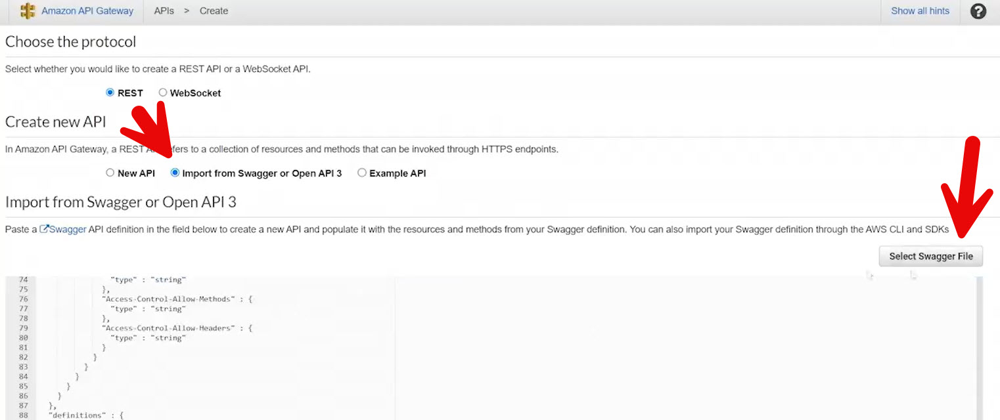
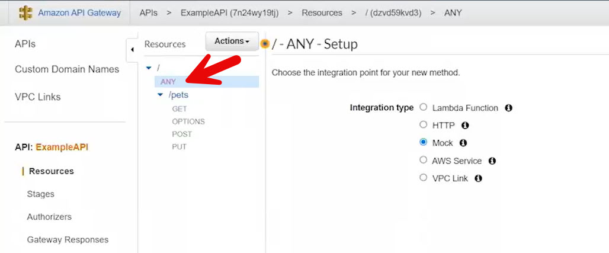
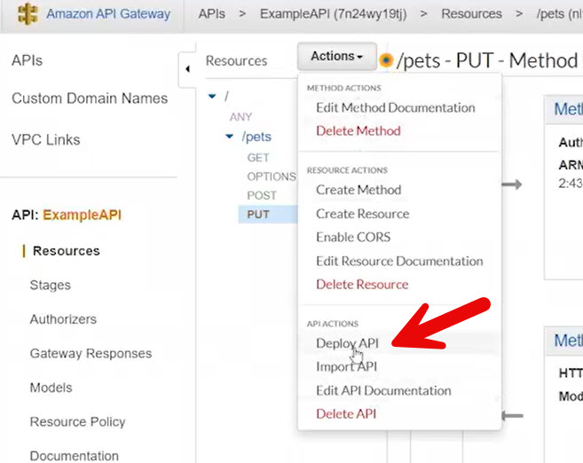
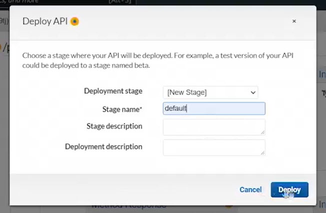
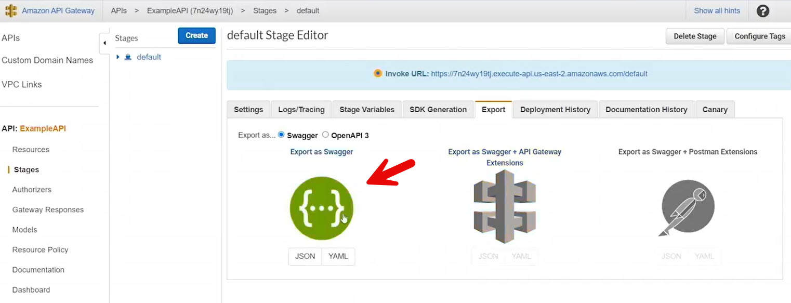

# 18.3 Creation from template 
 
 - **Purpose of the Demo**
  - Demonstrates creating an **API Gateway REST API** using a **Swagger (OpenAPI) template**
  - Shows how APIs can be defined and deployed from a specification file

- **Code Base**
* [APIG_Import_From_Template.png](./../CODE/API_Gateway/1_API_Gateway_From_Template/APIG_Import_From_Template.png)
* [ExampleAPI-default-swagger.json](./../CODE/API_Gateway/1_API_Gateway_From_Template/ExampleAPI-default-swagger.json)

- **Swagger Template Usage**
  - Used a pre-created Swagger JSON file (`ExampleAPI-default-swagger`)
  - Swagger file defines:
    - API structure
    - Resources
    - Methods
  - File does **not** initially include integration definitions

- **API Creation Process**

  - Navigated to **API Gateway → Build REST API**

  
  - Selected **Import from Swagger**
  - Pasted Swagger JSON (or could upload the file)
  - Chose **Regional endpoint**
  - Imported the API successfully

- **API Structure After Import**
  - Resources and methods were created automatically

  
  - Root resource included the **ANY** method
  - Additional HTTP methods (GET, POST, PUT, etc.) present
  - API was not yet deployed

- **Integrations Configuration**
  - Each method required an integration to function
  - Configured all methods with **Mock integrations**
  - Mock integrations simulate responses without backend services

- **Deployment**

  - Deployed the API using **Actions → Deploy API**

  - Created a new stage (stage name becomes part of the API URL)

  - Received an **invocation URL** for the deployed API

- **Swagger Export Insight**

  - Original Swagger file was generated by exporting an API
  - Exporting **without API Gateway extensions** excludes integrations
  - Exporting **with API Gateway extensions** includes:
    - Integration types
    - API Gateway–specific configuration
  - Using extensions avoids manual integration setup after import

- **Testing the API**
  - Used **Postman** to send a GET request to the invocation URL
  - Received a **200 OK** response
  - No response body due to Mock integration configuration

- **Key Takeaways**
  - Swagger templates enable rapid API creation in API Gateway
  - Mock integrations are useful for testing and development
  - Including API Gateway extensions in Swagger simplifies imports
  - The created API will be reused in later lessons

 
 ## [Context](./../context.md)