# 18.4 Using Lambda integrations 

[2_API_Gateway_with_Lambda/](./../CODE/API_Gateway/2_API_Gateway_with_Lambda/)
 
 - **Goal of the Demo**
  - Integrate **API Gateway methods** with a **Lambda function**
  - Use Lambda to interact with **DynamoDB**
  - Test the API using **Postman**

- **Project Structure**
  - Repository includes directories to:
    - Create a DynamoDB table
    - Populate the table with data
    - Create a Lambda function
    - Integrate API Gateway with Lambda
    - Test the API

- **DynamoDB Table Creation**
* [app.py](./../CODE/API_Gateway/2_API_Gateway_with_Lambda/1_create_table/app.py)
* [pets.json](./../CODE/API_Gateway/2_API_Gateway_with_Lambda/1_create_table/pets.json)

  - Used a Python script (`app.py`) to:
    - Create a DynamoDB table named **pets**
    - Wait for the table to become active (~7 seconds)
    - Load data from `pets.json`
    - Insert 20 pet records into the table
  
  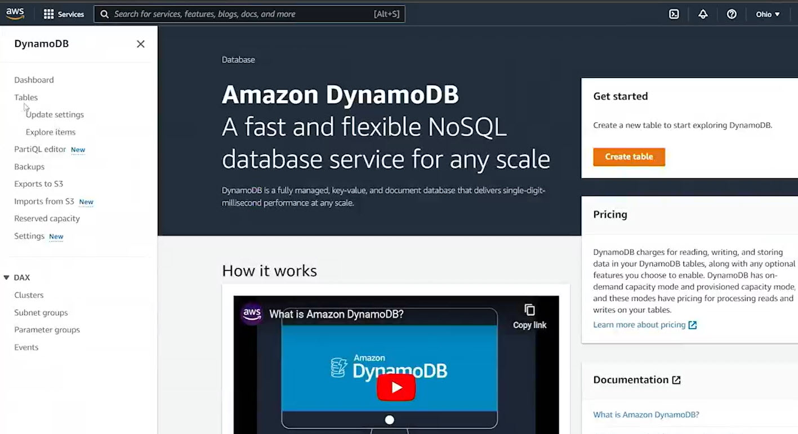
  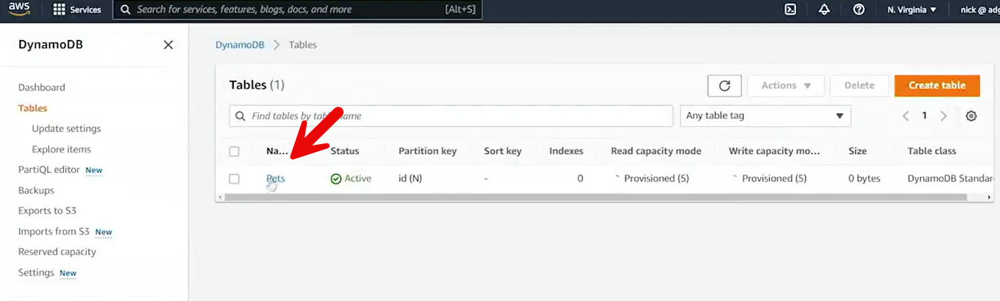
  - Verified table and items in the DynamoDB console (Northern Virginia region)

- **Lambda Function Setup**
- Code Base
* [lambda_code.js](./../CODE/API_Gateway/2_API_Gateway_with_Lambda/2_lambda/lambda_code.js)

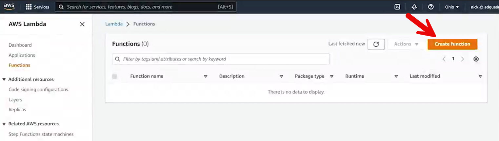

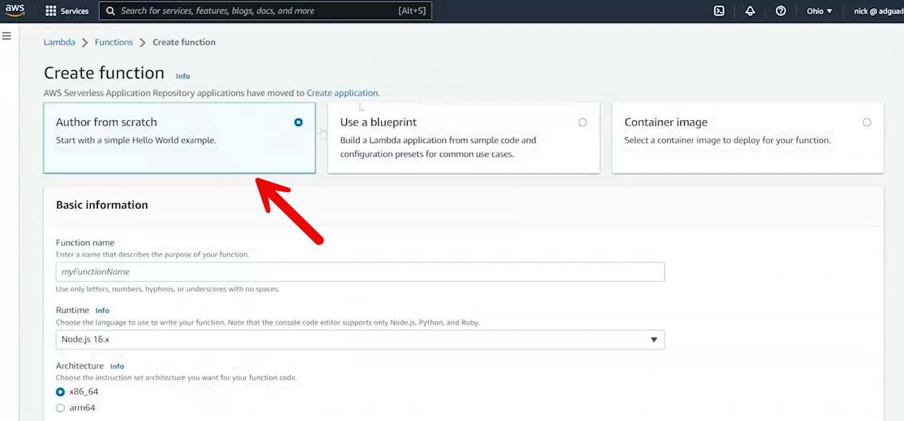
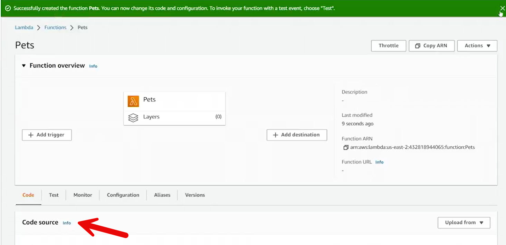
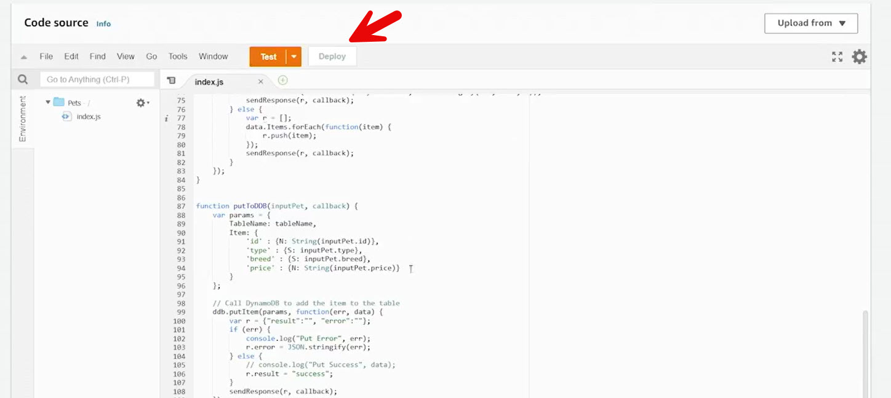

  - Created a Lambda function manually
  - Runtime: **Node.js 16**
  - Function name: **Pets**
  - Initial execution role included basic logging permissions only

- **Lambda Function Logic**
  - Uses DynamoDB client and document client
  - Handles HTTP methods via API Gateway:
    - **GET**: Retrieve all pets from DynamoDB
    - **POST**: Insert a new pet if required attributes are provided
  - Parses event data from API Gateway proxy integration
  - Returns responses back to API Gateway

- **IAM Role Configuration**
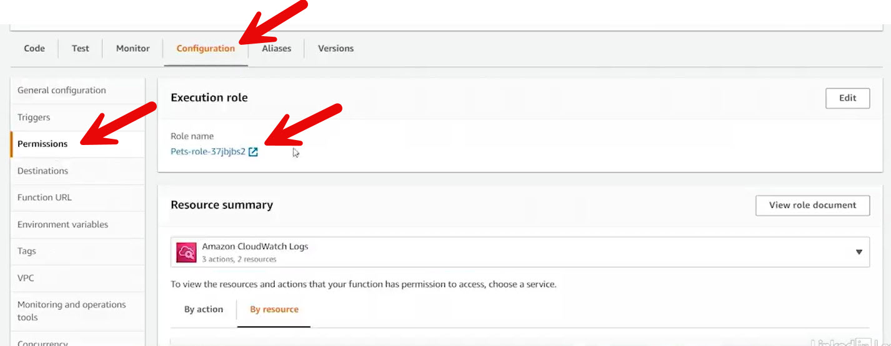
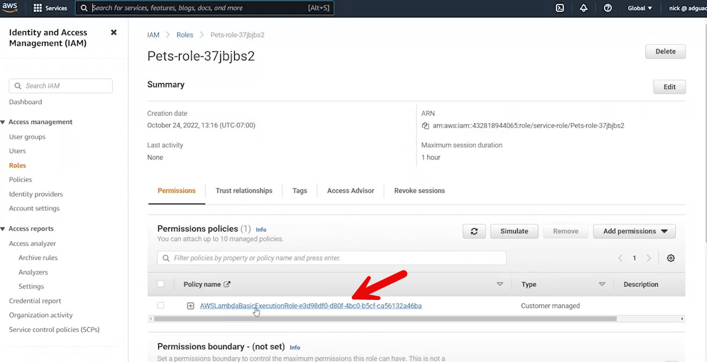
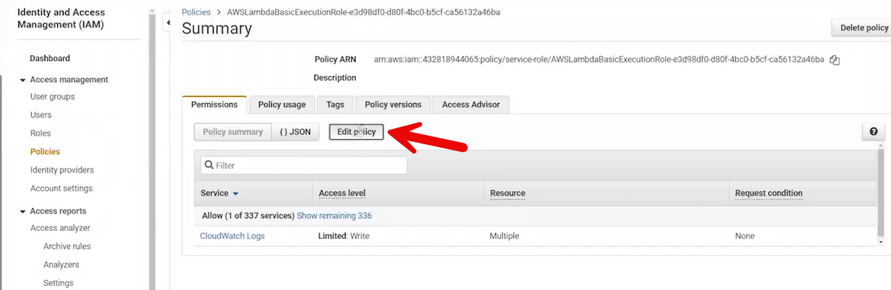
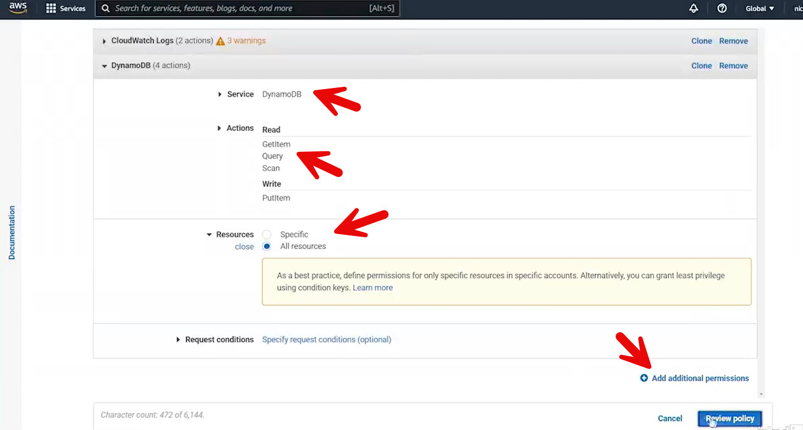
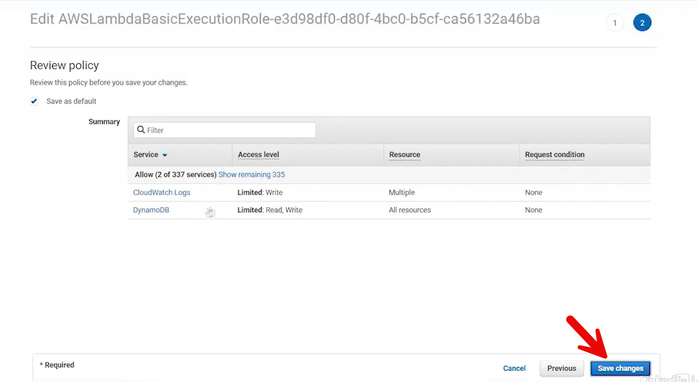

  - Updated Lambda execution role to allow DynamoDB access
  - Added permissions:
    - Read: `Query`, `Scan`, `GetItem`
    - Write: `PutItem`
  - Applied permissions broadly to all DynamoDB resources (for demo simplicity)

- **API Gateway Integration**
  - Integrated `/pets` resource methods with Lambda:
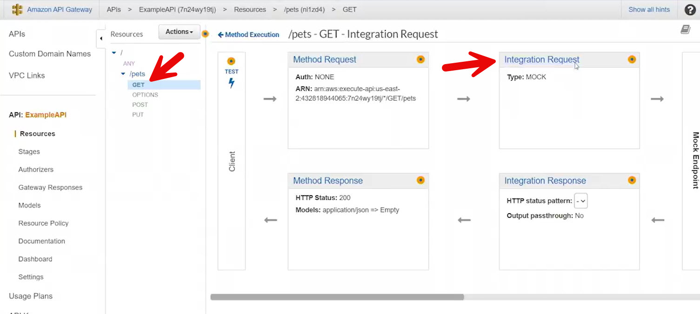
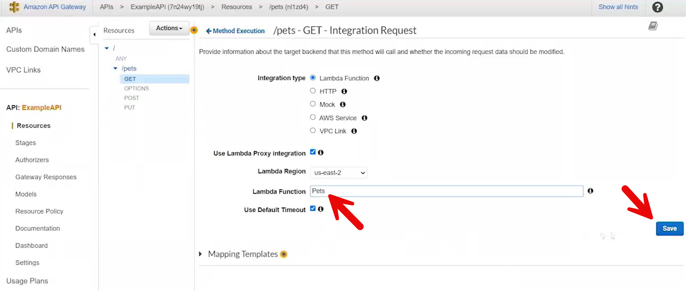
    - **GET** → Lambda proxy integration
    - **POST** → Lambda proxy integration
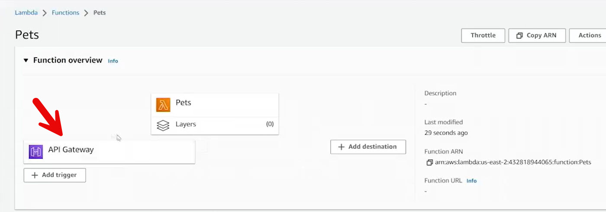
  - API Gateway automatically added itself as a trigger to the Lambda function

- **API Deployment**
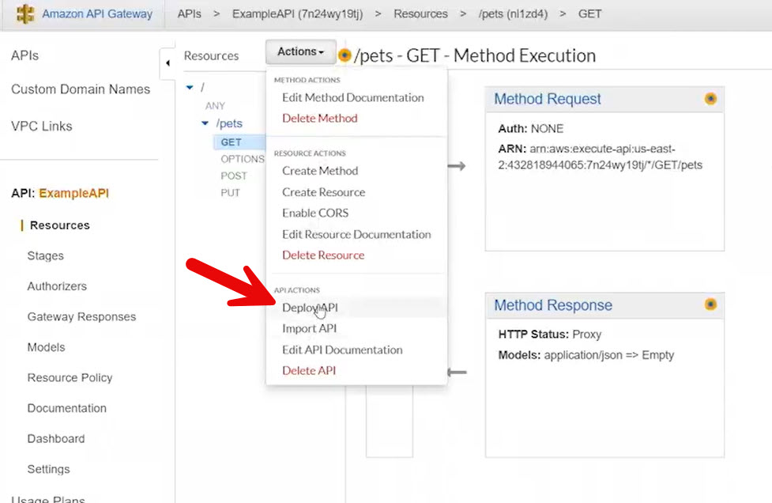
  - Deployed the API to the default stage
  - Invocation URL remained unchanged

- **Testing with Postman**
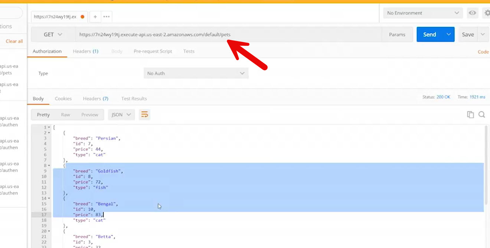
  - Sent a **GET** request to `/pets`
  - API Gateway invoked Lambda
  - Lambda queried DynamoDB and returned data
  - Response received as JSON in Postman
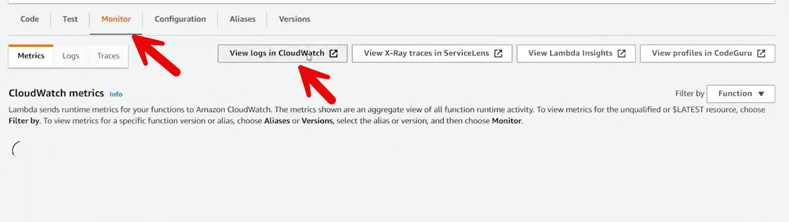
  - Logs available in **CloudWatch Logs**

- **POST Method Behavior (Not Executed)**
  - Accepts JSON body with:
    - `id`
    - `type`
    - `breed`
    - `price`
  - Validates required fields
  - Inserts item into DynamoDB
  - Returns success or error response

- **Key Takeaways**
  - API Gateway + Lambda proxy integration enables full request/response handling
  - Lambda roles must explicitly allow access to backend services
  - DynamoDB data types are enforced even when input is provided as strings
  - This pattern is core to **serverless REST API design**

 
 ## [Context](./../context.md)