# 18.5 Integrating using HTTP 
 
 - **Purpose of the Demo**
  - Demonstrates using an **HTTP private integration** in API Gateway
  - Exposes a resource inside a **VPC** through API Gateway

- **Backend Setup**
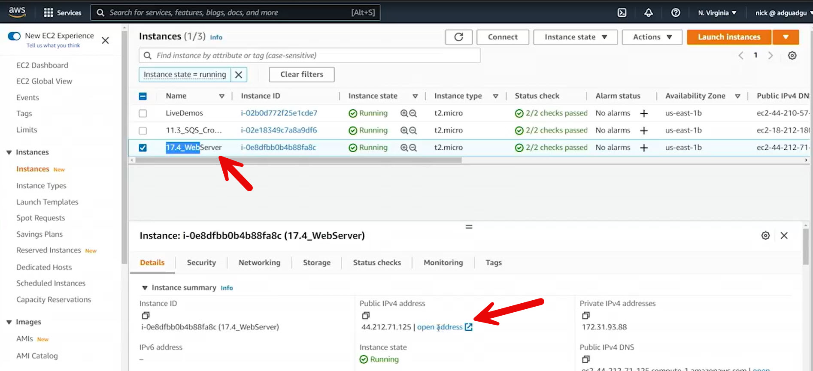
  - Launched an **EC2 Ubuntu instance** running Apache
  - Instance located in **Northern Virginia (us-east-1)**
  - Web server accessible over HTTP (Apache default page)
  - Instance placed inside a VPC
  - Public IP used only for demo verification

- **VPC Link Creation**
An AWS VPC Link is a feature in **Amazon API Gateway** that allows you to connect your **APIs to private resources** inside your **Virtual Private Cloud (VPC)** without exposing those resources to the public internet. 
It acts as a secure **"bridge"** that allows API Gateway to "see" and send traffic to your internal backend services. 

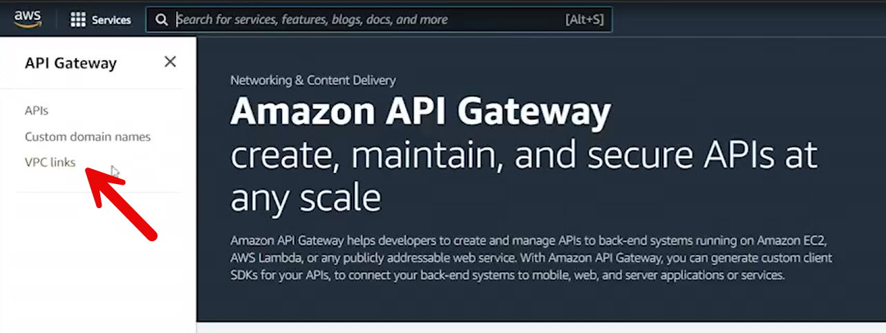

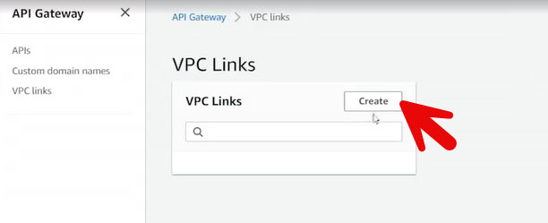

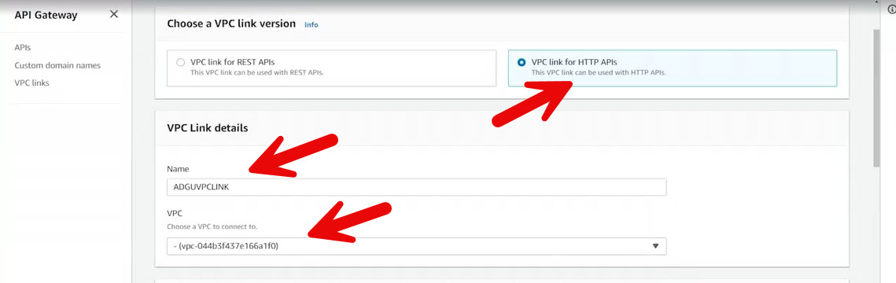

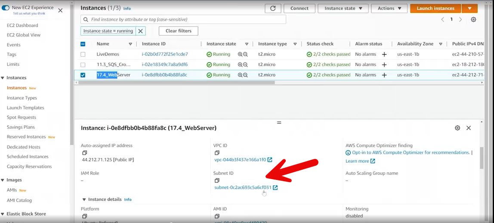

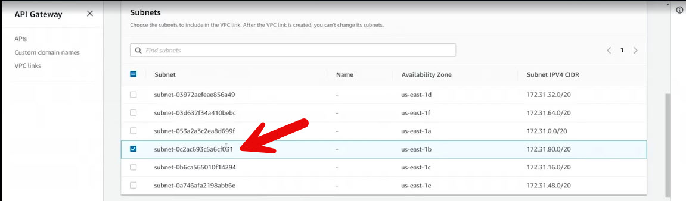

!api_gateway_security_groups.jpg)](./IMAGES/18.5_Integrating_using_HTTP/api_gateway_security_groups.jpg)

  - Created a **VPC Link for HTTP APIs**
  - Selected:
    - Correct VPC
    - Subnet containing the EC2 instance
    - Security group allowing HTTP (port 80)
  - VPC link creation took several minutes

- **API Gateway Configuration**
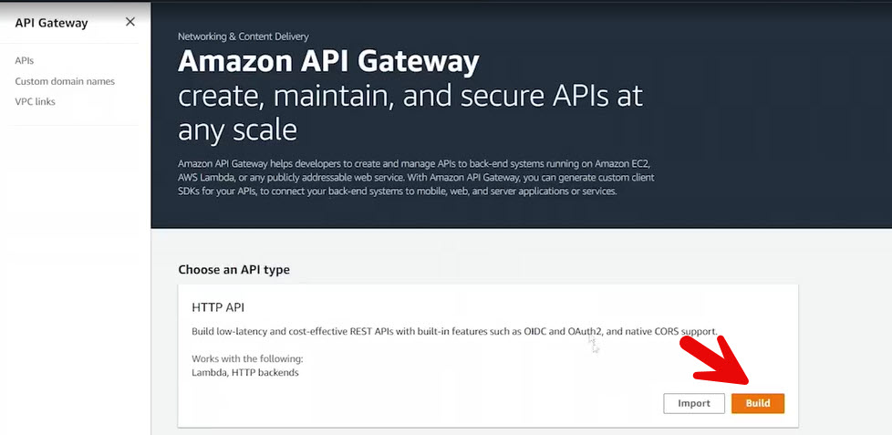

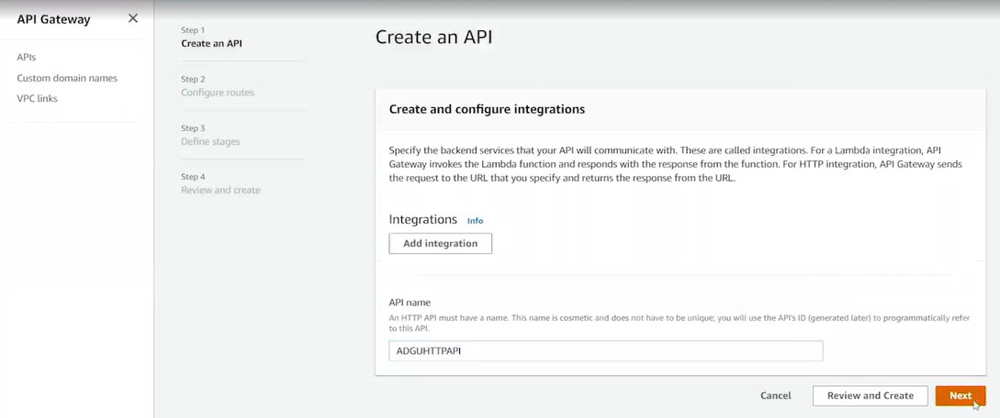

- No routes

  - Created a new **HTTP API**

  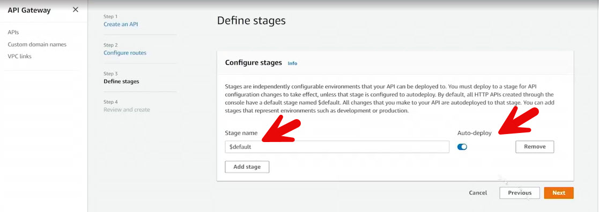

  - Enabled **auto-deploy** (no manual deployment required)
  - Used default stage

  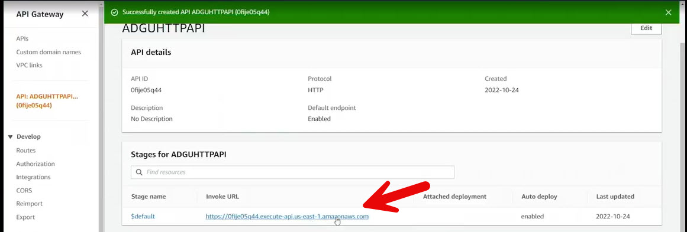

  - Obtained an invocation URL automatically

- **Route Setup**

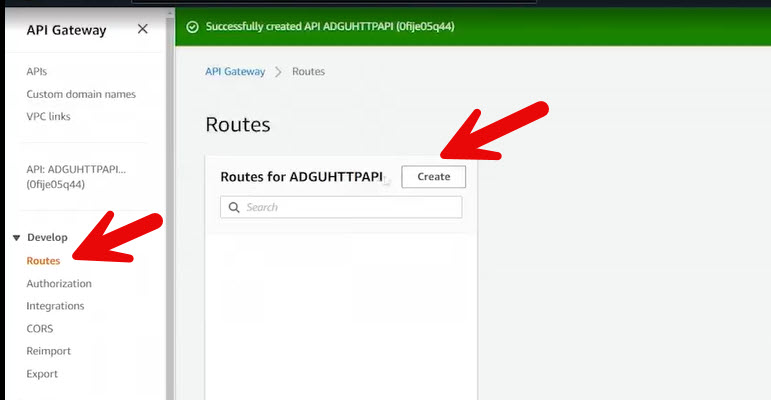

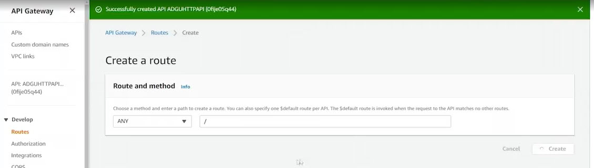

  - Created a route using the **ANY** method

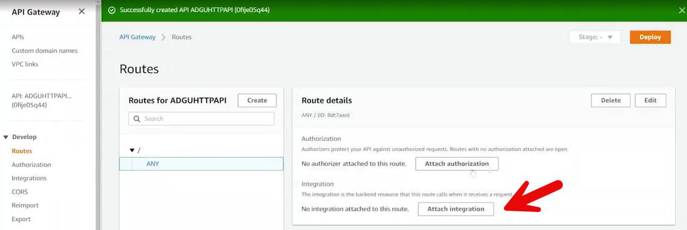

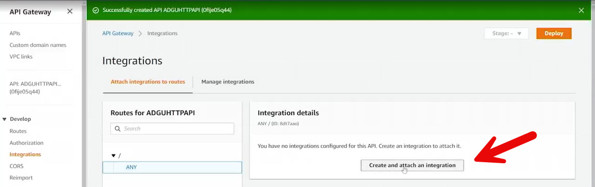

  - Attached a new integration to the route

- **Integration Configuration**
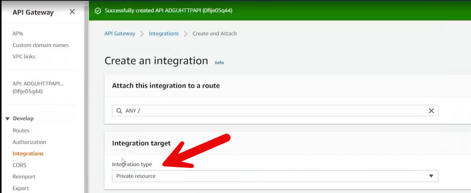

  - Integration type: **Private resource**

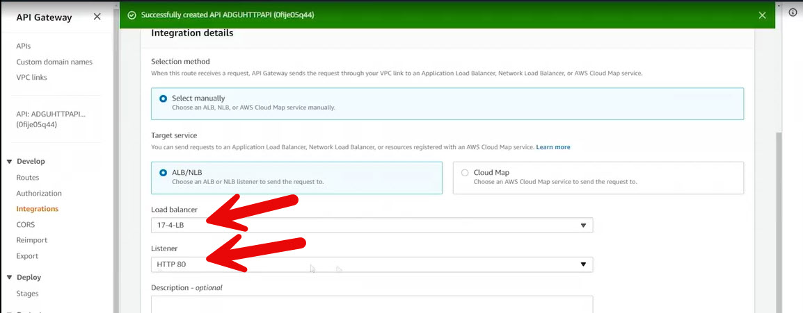

  - Selected an existing **Application Load Balancer**
  - Load balancer listener: HTTP on port 80
  - Target group points to EC2 instance running Apache

  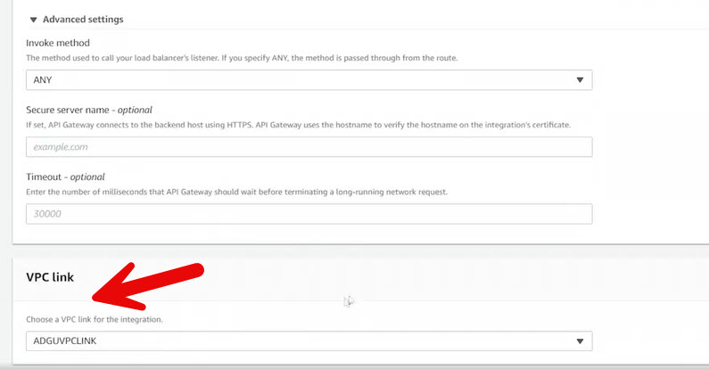

  - Associated the integration with the created **VPC link**

- **Deployment and Testing**
  - Auto-deploy handled publishing changes
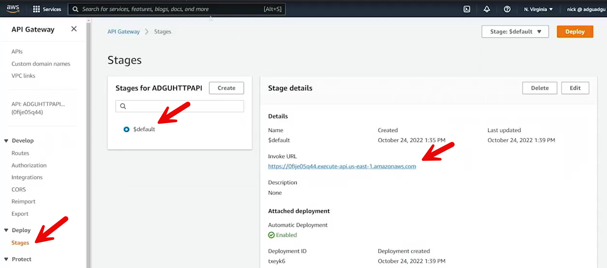
  - Accessed the API Gateway invocation URL
  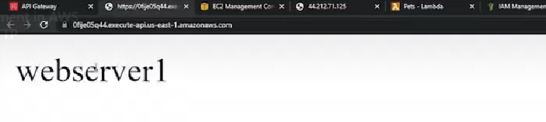
  - Successfully reached the Apache web server through API Gateway

- **Security Considerations**
  - Public IP on EC2 instance used only for demonstration
  - Best practice:
    - EC2 instances should have **no public IP**
    - Access only via load balancer and API Gateway
    - API Gateway becomes the sole internet-facing entry point

- **Benefits of HTTP Private Integration**
  - Exposes private VPC resources securely
  - Centralized access control via API Gateway
  - Supports:
    - Throttling
    - Usage plans
    - Chargebacks
    - Tagging
    - Access policies

- **Key Takeaway**
  - HTTP private integrations allow API Gateway to securely proxy traffic
  - Enables controlled internet access to private services inside a VPC

 
 ## [Context](./../context.md)