# 18.6 Securing an API Gateway 
 
 - **Purpose of the Demo**
  - Demonstrates securing an **API Gateway REST API** using **API keys**
  - Alternative to using Cognito or Lambda authorizers

- **Initial API Setup**

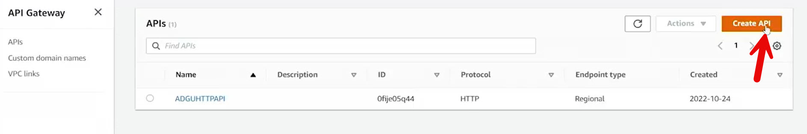
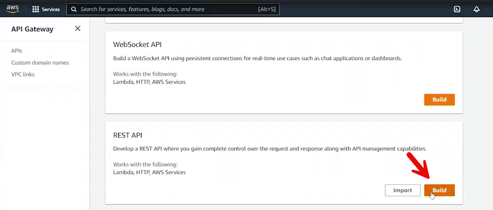
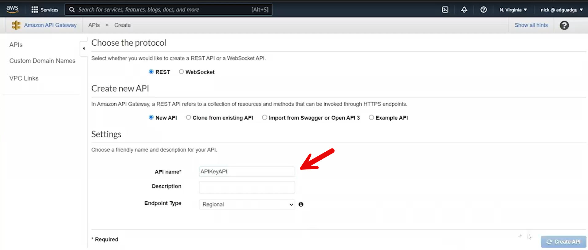

  - Created a new **REST API**
  - Endpoint type: **Regional**

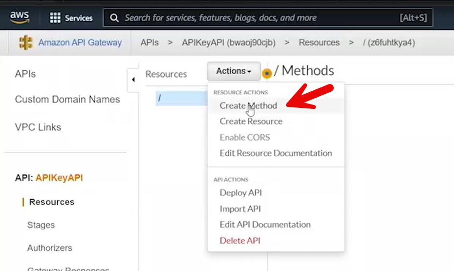
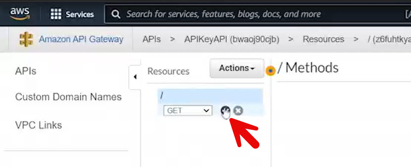
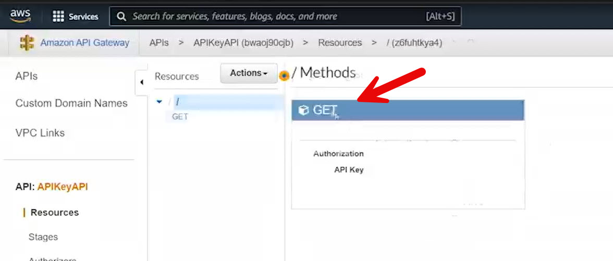

  - Added a **GET method** on the root resource
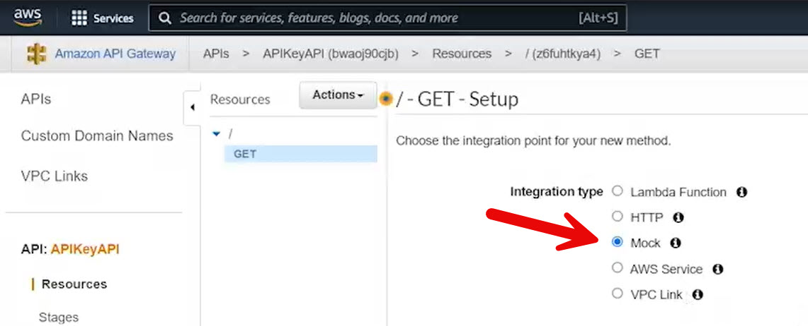
  - Integration type: **Mock**
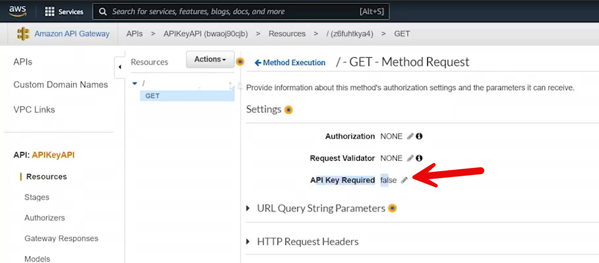

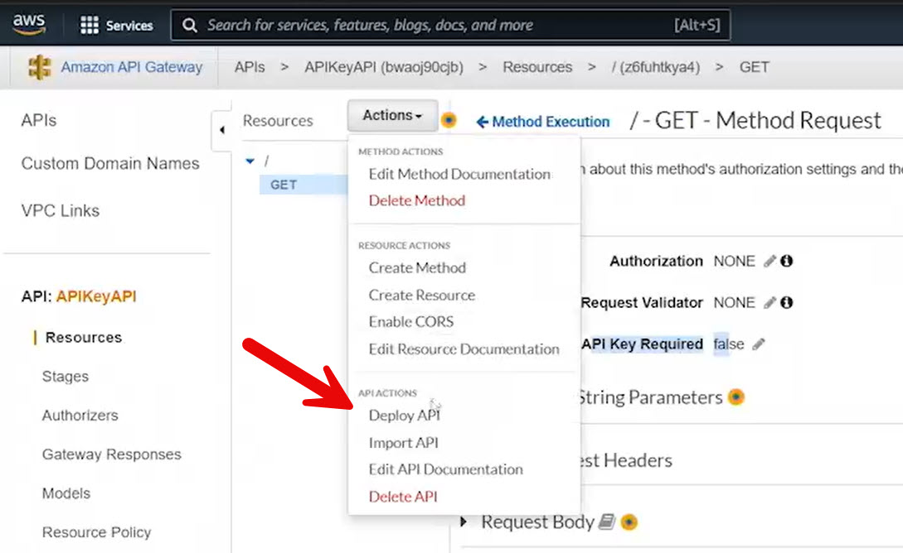
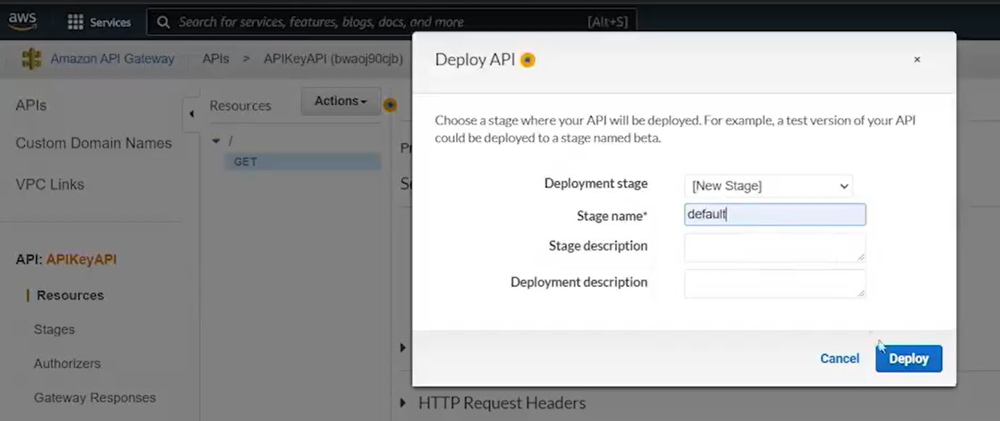

  - Deployed API to the default stage

- **Baseline Test**
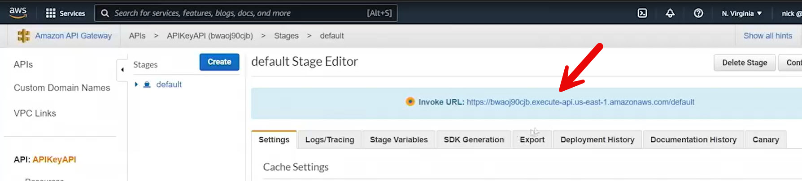
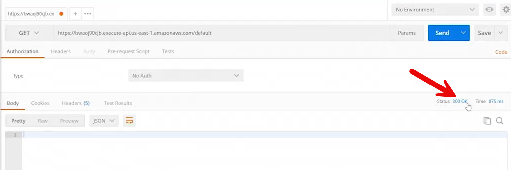

  - Sent a GET request via Postman
  - Request succeeded with **200 OK**
  - API key was not yet required

- **API Key Creation**
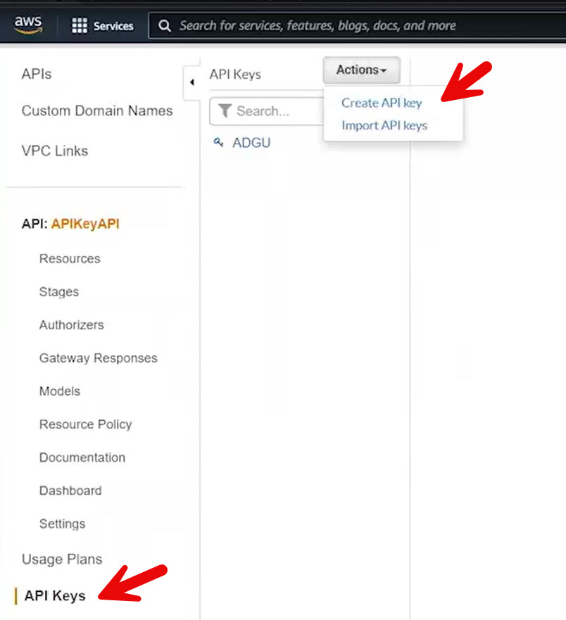
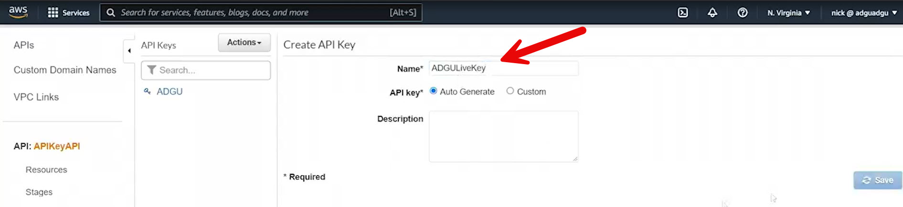

  - Created a new API key named **ADGULiveKey**
  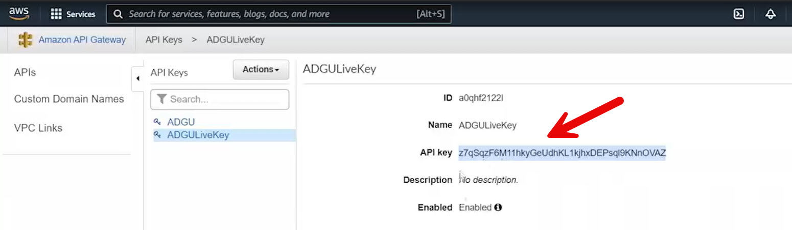
  - Key was auto-generated
  - API keys and APIs are separate resources in API Gateway

- **Enabling API Key Requirement**
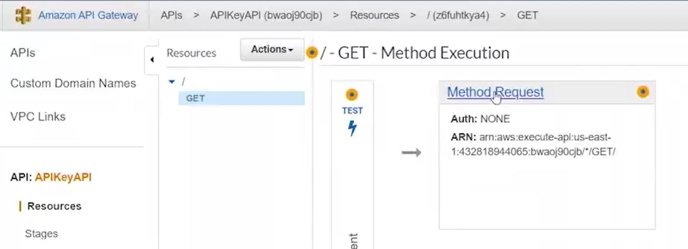
  - Modified the GET method

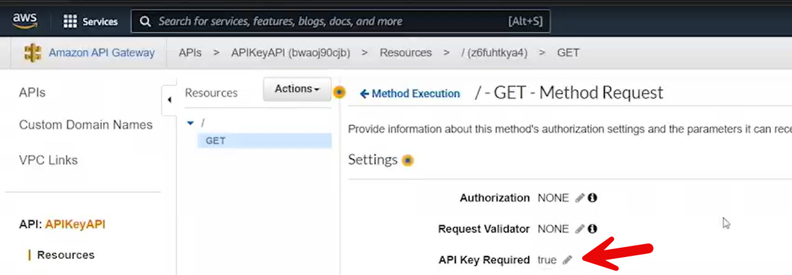
  
  - Set **API key required = true**
  
  
  - Redeployed the API
  - Request still failed to authenticate properly at this stage

- **Usage Plan Requirement**
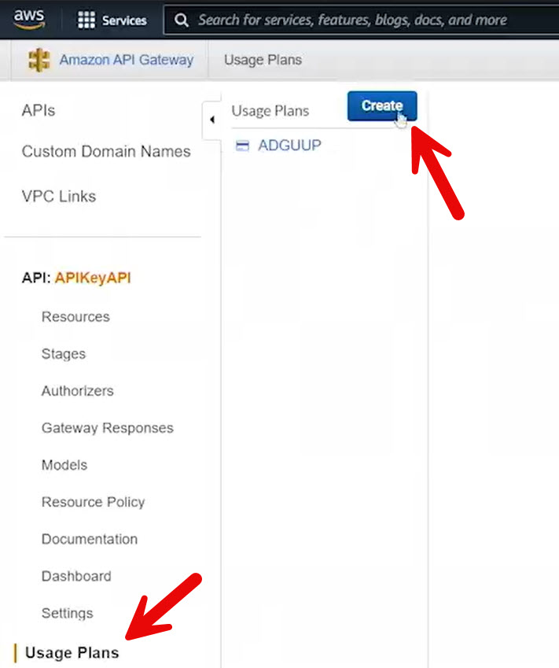

  - API keys must be associated with APIs via a **usage plan**

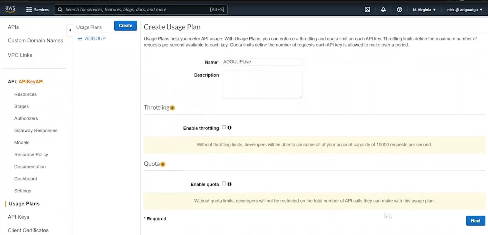

  - Created a usage plan named **AGGUUP Live**
  - Did not enable throttling or quotas (optional features)

  - Added:
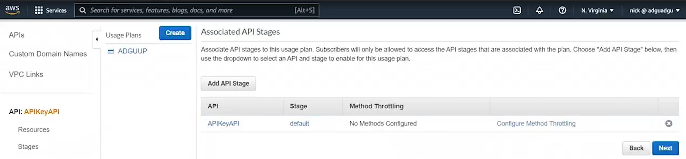
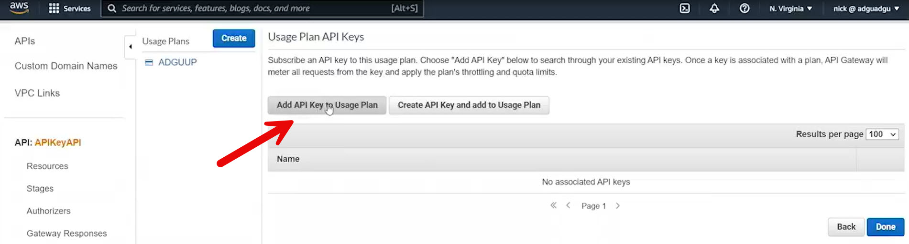
    - API and stage to the usage plan (Click on the check mark)

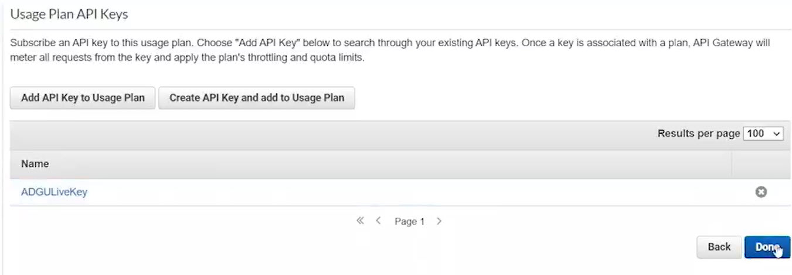
    - API key to the usage plan (Click on the check mark)

postman_header_x-api-key.jpg
- **Authentication Behavior**

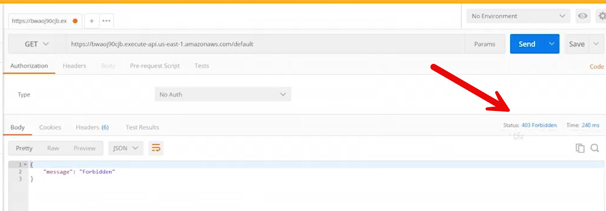

  - Request without API key returned **403 Forbidden**

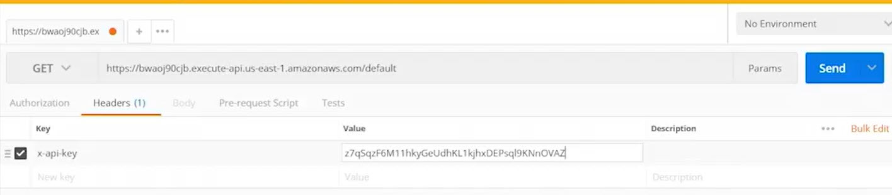
  - Added header to request:
    - `x-api-key: <API_KEY_VALUE>`

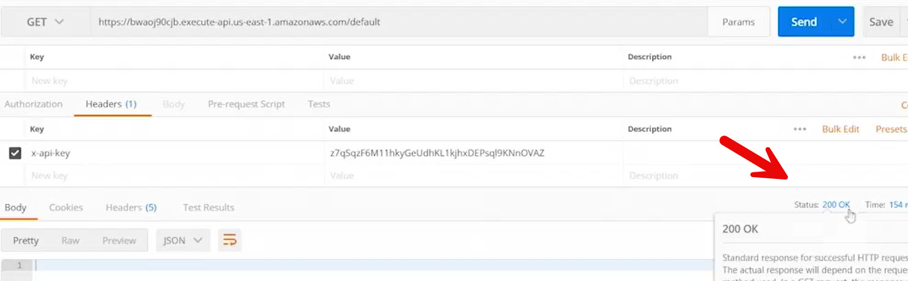

  - Request succeeded with **200 OK**

- **How API Key Security Works**
  - API key enforcement is configured at the **method request level**
  - API key must be:
    - Created
    - Linked to an API via a usage plan
    - Sent in the request header

- **Usage Plan Capabilities**
  - Connects API keys to APIs
  - Can enforce:
    - Throttling limits
    - Request quotas

  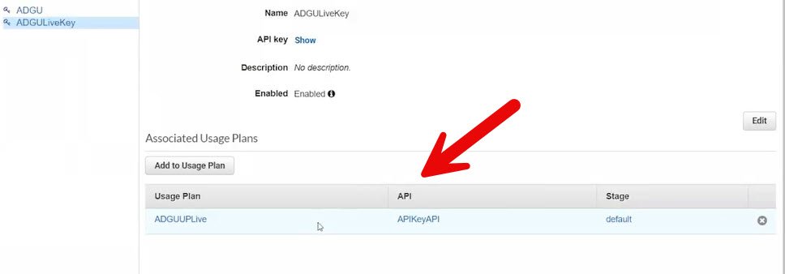

  - A single API key can be associated with:
    - One or multiple usage plans

- **Key Takeaway**
  - API keys provide simple request authentication
  - They require proper linkage through usage plans
  - Simply enabling “API key required” is not sufficient without a usage plan

 
 ## [Context](./../context.md)