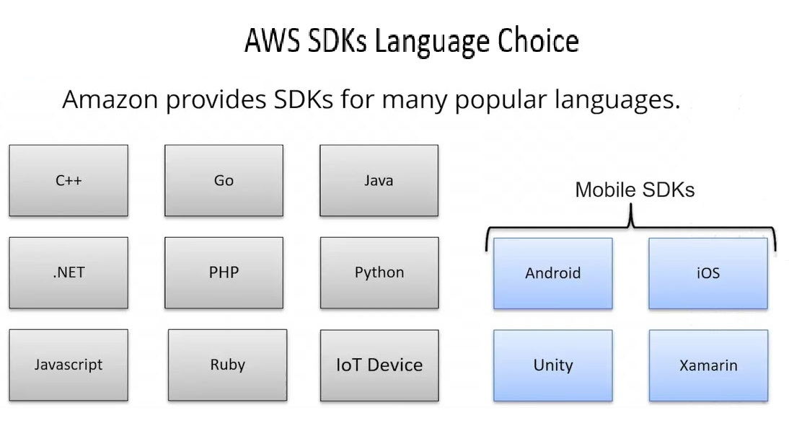

# 20.2 Understanding the AWS SDKs 

 
 - **Ways to Access AWS**
  - Web console
  - Command-line interface (CLI)
  - Software Development Kits (SDKs)

- **Purpose of AWS SDKs**
  - Enable developers to build tools and applications that access AWS services
  - Described by Amazon as tools for developing and managing applications on AWS

- **Supported Languages and Platforms**
  - Programming languages: **C++**, **Go**, **Python**, **Ruby**
  - Support for **IoT devices**
  - Mobile SDKs: **Android**, **iOS**, **Unity**, **Xamarin**

- **IDE Toolkits**
  - AWS Toolkit for **Eclipse**
  - AWS Toolkit for **Visual Studio**
  - Tools for **Visual Studio Team Services**

- **SDK Architecture**
  - Each SDK is developed and maintained independently
  - All SDKs interact with AWS services through the **AWS API**

- **Service and SDK Updates**
  - New AWS services require SDK updates to support new APIs
  - Not all SDKs support all AWS services immediately
  - Older SDK versions may not work with newer AWS services

- **SDK Maintenance Considerations**
  - Applications using outdated SDKs may require upgrades
  - Keeping SDKs up to date ensures compatibility and access to new features

- **Authentication with SDKs**
  - Programmatic access uses AWS credentials
  - Authentication methods include:
    - IAM roles
    - Environment variables
    - Embedded access keys (not recommended)
  - Requires an access key and secret access key

- **Learning and Support Resources**
  - **repost.aws** for SDK forums and community support
  - **aws.amazon.com** for SDK downloads, tools, and documentation

* [Forums](https://repost.aws/)
* [Tools for Amazon Web Services : Dev. Tools | SDKs | IDE Toolkits | CLI](https://builder.aws.com/build/tools)

- **Key Takeaway**
  - AWS SDKs simplify interaction with AWS services
  - Regular updates and proper credential management are essential for effective development

 
 ## [Context](./../context.md)