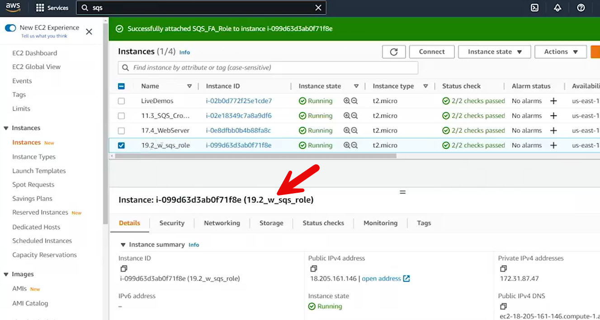
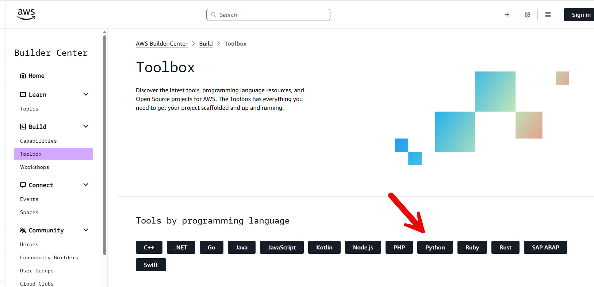
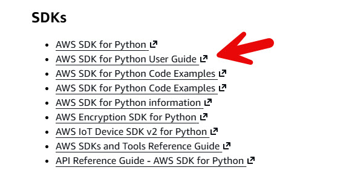
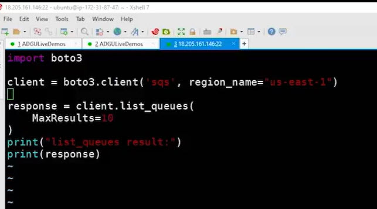
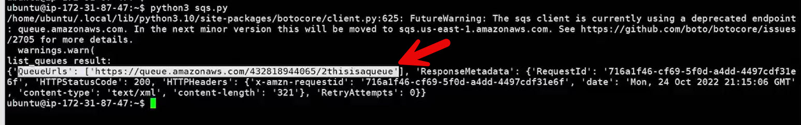
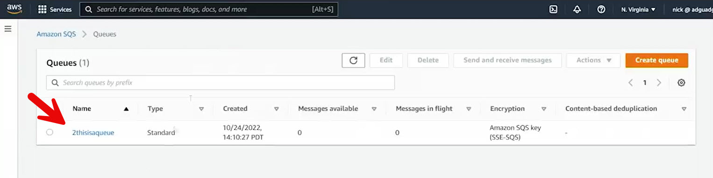
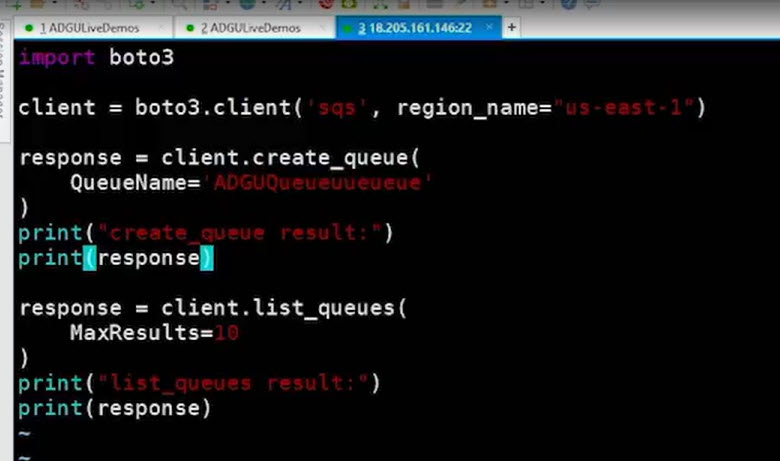
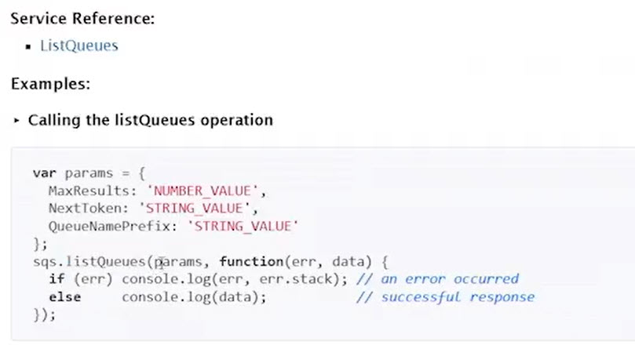

# 20.3 Finding documentation 

Instance with a Role
 
 - **Importance of Documentation**
  - SDKs rely heavily on clear, detailed documentation
  - Official AWS documentation is essential beyond community sites like Stack Overflow

- **Demo Environment Setup**
  - Launched an EC2 instance with an **IAM role** allowing access to SQS
  - Role-based access eliminates the need for embedding credentials

- **Finding SDK Documentation**

- [Builder Center Toolbox](https://builder.aws.com/build/tools)

- [Boto3 1.42.43 documentation - Quickstart
](https://boto3.amazonaws.com/v1/documentation/api/latest/guide/quickstart.html)

  - Navigated to **aws.amazon.com/tools**
  - Selected the desired language (Python)
  - Identified **AWS SDK for Python (Boto3)**
  - Found:
    - Installation instructions (`pip install boto3`)
    - Getting started guides
    - API reference documentation

- **Using Boto3 Documentation (Python Example)**

  - [Available Services](https://boto3.amazonaws.com/v1/documentation/api/latest/reference/services/index.html)
  - Located **SQS** under available services
  - Used example code from the API reference
  - [SQS Client](https://boto3.amazonaws.com/v1/documentation/api/latest/reference/services/sqs.html#client)
  - Created an SQS client using `boto3.client('sqs')`
  - Explicitly set the AWS region in the script

- **Listing Queues**

  - Used the `list_queues` method
  - Executed the script and received queue URLs
  - Learned that results are returned as an array of queue URLs
  - Pagination supported via tokens if needed

- **Creating a Queue**

  - [AWS Docs - Create Queue](https://boto3.amazonaws.com/v1/documentation/api/latest/reference/services/sqs/client/create_queue.html)

  - Found `create_queue` method in the documentation
  - Copied request syntax into the script
  - Provided a queue name
  - Executed script and confirmed queue creation
  - Verified new queue by re-running `list_queues`

- **Key Learning from Python Example**
  - SDK usage often involves copy-pasting from documentation
  - Minimal code required to interact with AWS services
  - IAM roles simplify authentication in compute environments

- **Exploring Another SDK (Node.js Example)**

  - Navigated to **AWS SDK for Node.js**
  - Installed via `npm install aws-sdk`
  - Accessed API reference documentation
  - Found SQS methods such as `listQueues`
  - Observed differences in syntax and async patterns (callbacks)

- **Key Takeaway**
  - AWS SDK documentation is well-organized and language-specific
  - Most use cases can be implemented by following API reference examples
  - Understanding where to find and how to use SDK docs is critical for AWS development

 
 ## [Context](./../context.md)