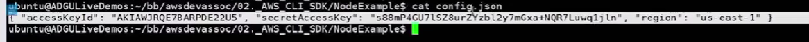
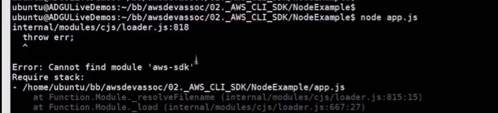
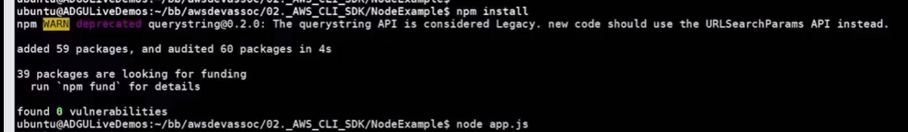
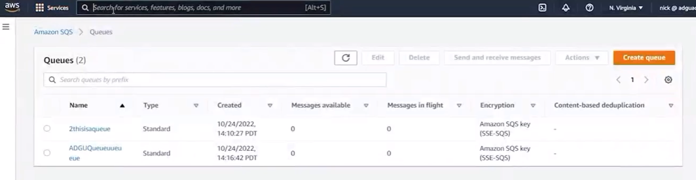
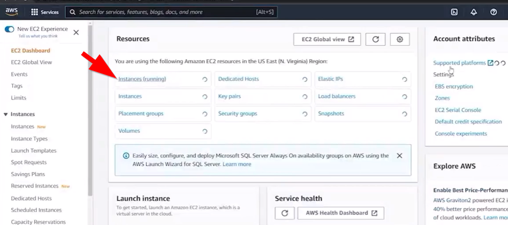
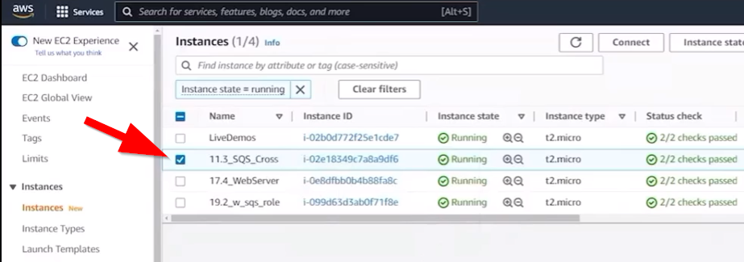
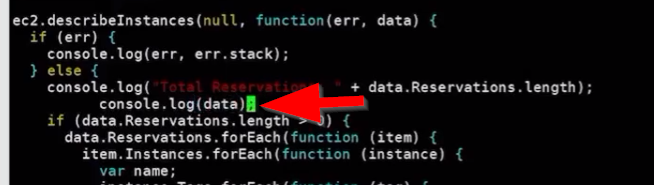
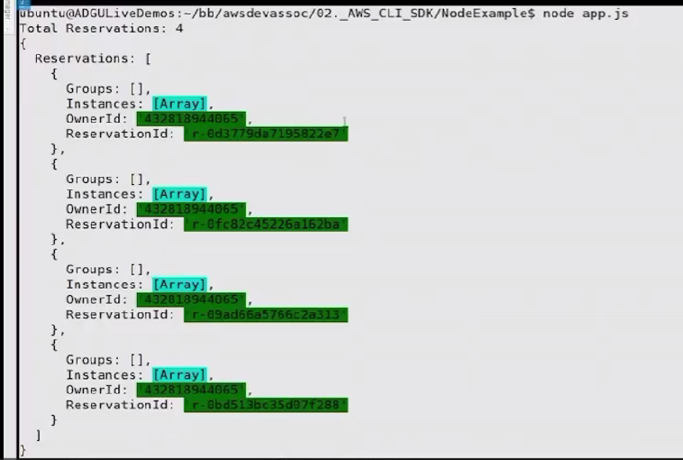

# 20.4 Using the Node.js SDK 

 - Code Base
* [app.js](./../CODE/02._AWS_CLI_SDK/NodeExample/app.js)
* [config.json](./../CODE/02._AWS_CLI_SDK/NodeExample/config.json)
* [package.json](./../CODE/02._AWS_CLI_SDK/NodeExample/package.json)
 
 - **Purpose of the Lesson**
  - Demonstrates basic usage of the **AWS SDK for Node.js**
  - Shows how to interact with AWS services programmatically

- **Project Structure**
  - Repository contains examples for:
    - Python
    - Node.js
  - Focus in this section is on the **Node.js example**

- **Configuration Setup**
  
  - Application uses a `config.json` file
  - Configuration is loaded at runtime
 
  - Application exits with an error if configuration is missing or invalid

- **Application Logic (app.js)**
  - Imports the **AWS SDK** using Node Package Manager
  - Loads configuration from `config.json`
  - Creates an **EC2 service object** (`AWS.EC2`)
  - Calls `describeInstances` to retrieve EC2 instance data

- **Processing the Response**
  - Uses a callback function to handle returned data
  - Iterates through:
    - Reservations array
    - Instances within each reservation
  - Extracts:
    - Instance **Name tag** (if present)
    - **Public IP address**
  - Outputs instance names and IPs to the console

- **Dependency Management**
  - Initial execution failed due to missing AWS SDK module
  - Resolved by installing dependencies:
  

  - `npm install` (reads from `package.json`)
  - Or `npm install aws-sdk`

- **Execution Results**

  - Successfully listed running EC2 instances
  - Displayed instance names and public IP addresses

- **Live Update Demonstration**
- 

  - Modified an EC2 instance name tag in real time

  - Re-ran the script

  - Output reflected the updated instance name immediately

- **Inspecting Raw Data**

  - Demonstrated the full JSON response from `describeInstances`
  - Highlighted the depth and richness of EC2 metadata
  - Only a small subset of the returned data was used in the example

- **Key Takeaway**
  - AWS SDK for Node.js makes AWS service interaction straightforward
  - Applications can easily retrieve and process AWS resource data
  - Minimal code is required to build functional AWS-integrated tools

 
 ## [Context](./../context.md)