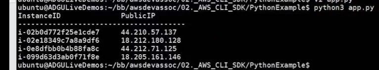

# 20.5 Using the Python SDK 

 - Code Base
* [app.py](./../CODE/02._AWS_CLI_SDK/PythonExample/app.py)
 
- **Purpose of the Example**
  - Demonstrates using the **AWS SDK for Python (Boto3)**
  - Highlights ease of use compared to other languages

- **Project Location**
  - Python example is located in the `02_AWS_CLI_SDKS` directory
  - Complements the Node.js SDK example

- **Application Logic**
  - Creates an **EC2 client** using Boto3
  - Calls `describe_instances` to retrieve EC2 instance data
  - Receives a structured response from AWS

- **Processing the Response**
  - Iterates through the `Reservations` array
  - Iterates through `Instances` within each reservation
  - Outputs the **public IP address** for each instance (if present)

- **Execution**

  - Script executed using `python3 app.py`
  - Successfully displays running EC2 instance information

- **Simplicity of the SDK**
  - Very minimal and concise code
  - Only a few lines needed beyond client setup
  - Tag parsing (e.g., instance names) omitted for simplicity

- **SDK Comparison**
  - Python example is less verbose than the Node.js version
  - Both SDKs make AWS service interaction straightforward

- **Key Takeaway**
  - AWS SDKs significantly simplify working with AWS services
  - Boto3 enables rapid development with minimal boilerplate
  - Developers are encouraged to explore the documentation and experiment
 
 
 ## [Context](./../context.md)