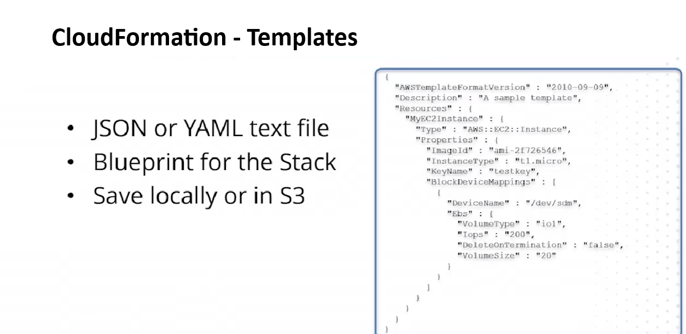
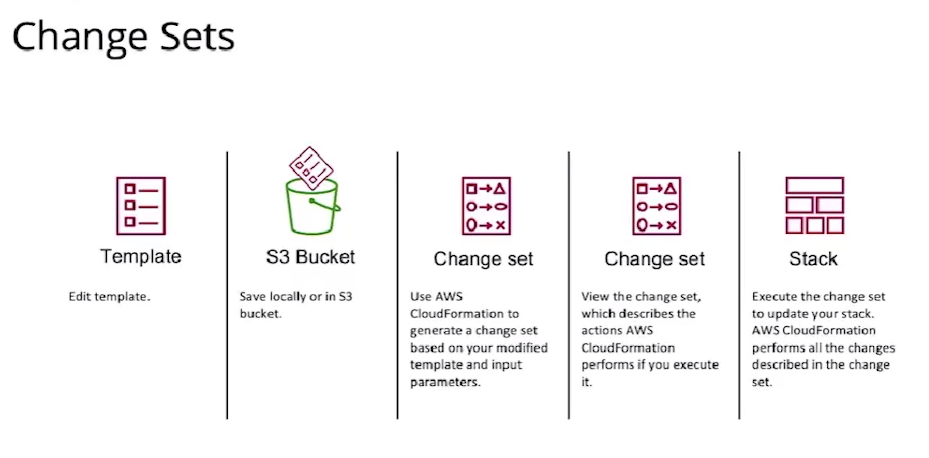
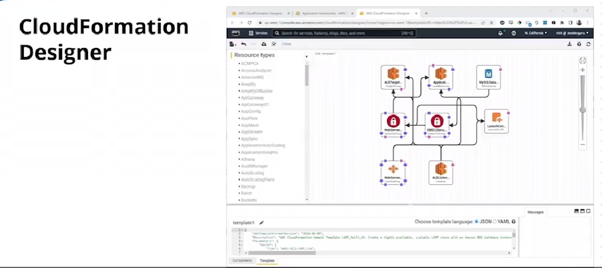
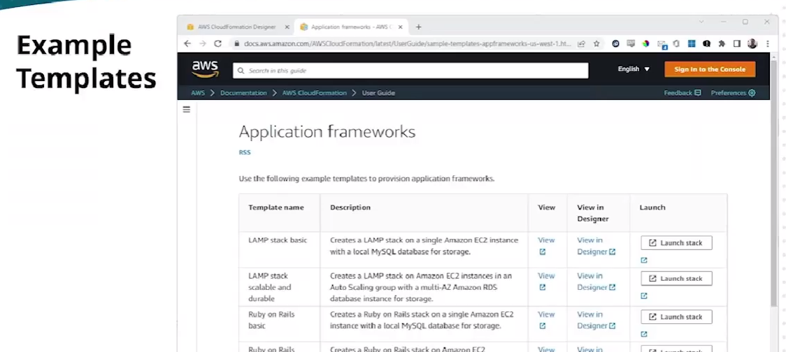

# 21.2 Understanding CloudFormation 
 
- **What is AWS CloudFormation**
  - A service for **infrastructure as code (IaC)**
  - Used to provision, configure, and deploy AWS resources automatically
  - Also used internally by services like **Elastic Beanstalk**

- **How CloudFormation Works**

  - You define infrastructure in a **template**
  - Deploying a template creates a **stack**
  - The stack provisions all defined resources

- **Supported Resources**
  - Nearly all AWS services can be defined in CloudFormation
  - Example infrastructure:
    - Load balancers
    - Web, application, and database instances
    - Subnets and network tiers
    - Security groups and access controls

- **IAM and Permissions**
  - CloudFormation uses the IAM permissions of the logged-in user
  - Stack creation or updates fail if required permissions are missing
  - Example: creating a DynamoDB table requires DynamoDB permissions

- **Core CloudFormation Concepts**
  - **Templates**
    - JSON or YAML text files
    - Act as blueprints for infrastructure
    - Stored locally or in S3
    - Automatically uploaded to S3 during deployment
  - **Stacks**
    - A collection of AWS resources managed as a single unit
    - Created, updated, or deleted together
    - Provisioned directly from templates
  - **Change Sets**
    - Preview proposed changes before updating a stack
    - Helps identify destructive actions (e.g., resource replacement)
    - Allows approval or rejection of changes before execution

- **Change Set Workflow**

  - Edit an existing template
  - Upload template to S3
  - CloudFormation generates a change set
  - Review changes
  - Approve or reject stack update

- **Why Change Sets Matter**
  - Prevent unintended data loss
  - Example: renaming an RDS instance may require deletion and recreation
  - Change sets warn about such impacts before execution

- **CloudFormation Designer**

  - Built-in graphical interface for creating templates
  - Visualizes resource relationships
  - Allows editing via:
    - GUI
    - JSON or YAML text
  - Can convert templates between JSON and YAML

- **Example Templates**

  - AWS provides pre-built templates (e.g., LAMP stack)
  - Templates can be:
    - Launched as-is
    - Customized for specific needs

- **Key Takeaway**
  - CloudFormation enables repeatable, auditable infrastructure deployment
  - Templates, stacks, and change sets are foundational concepts
  - Proper IAM permissions and change reviews are critical for safe operations
 
 
 ## [Context](./../context.md)