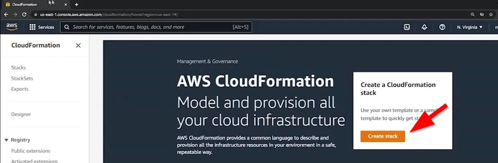
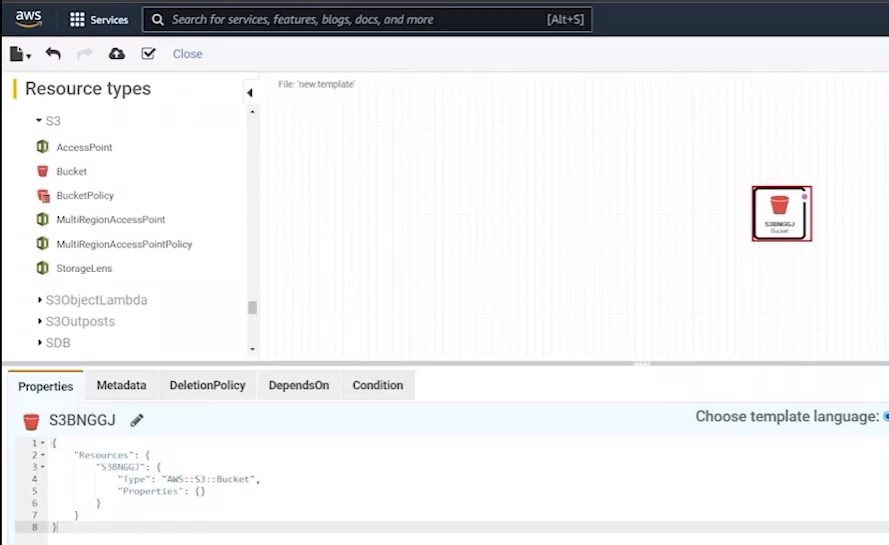
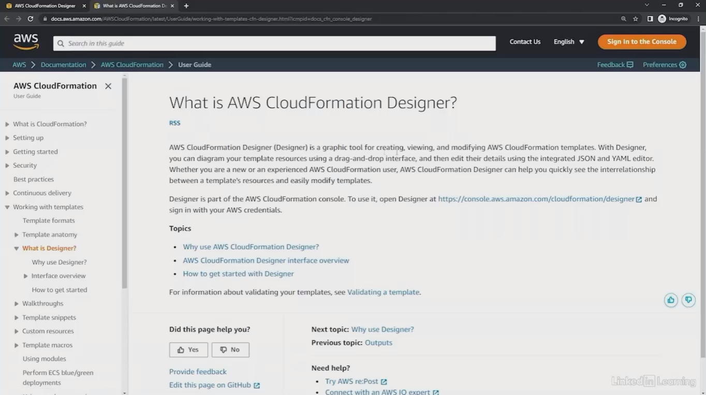

# 21.3 Using templates 
 
- **Purpose of the Demo**
  - Demonstrates basic usage of **CloudFormation templates**
  - Focuses on using the **CloudFormation Designer** UI
  - Shows how to define and deploy a simple resource

- **Creating a Template**

  - Used **Create Template in Designer** from the CloudFormation console

  - Designer provides:
    - Resource types on the left
    - Drag-and-drop canvas in the center
    - Generated template (JSON/YAML) at the bottom

- **Defining Resources**

  - Selected **Amazon S3 → Bucket** resource
  - Dragged the bucket into the Designer canvas
  - Template automatically updated with the new resource
  - Resource properties initially empty and must be defined

- **Template Format**
  - CloudFormation templates can be written in:
    - **JSON**
    - **YAML**
  - Designer allows switching formats dynamically

- **Finding Resource Properties**

  - Used the **Help (?)** link in Designer

  - Navigated to **Resource and property reference**
  - Selected **Amazon S3 → Bucket**
  - Reviewed available properties (e.g., `BucketName`)
  - Copied property definitions directly into the template

- **Template Validation**
  - Used **Validate Template** feature in Designer
  - Syntax validation checks structure, not service-specific rules
  - Demonstrated failure due to invalid bucket name (uppercase letters)

- **Stack Creation and Failure**
  - Uploaded template to S3 automatically
  - Created a stack from the template
  - Stack creation failed and rolled back
  - Error clearly reported: bucket names must be lowercase

- **Fixing and Redeploying**
  - Corrected bucket name to lowercase
  - Revalidated template
  - Created stack successfully
  - Stack status reached **CREATE_COMPLETE**

- **Verifying Results**
  - Confirmed S3 bucket was created
  - Deleted the CloudFormation stack
  - Bucket was automatically deleted
  - Stack deletion completed successfully

- **Key Takeaways**
  - CloudFormation Designer simplifies template creation
  - Templates define infrastructure as code
  - AWS documentation is essential for valid resource properties
  - CloudFormation manages full lifecycle: create, update, delete
 
 
 ## [Context](./../context.md)