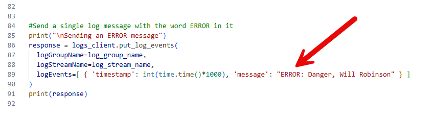
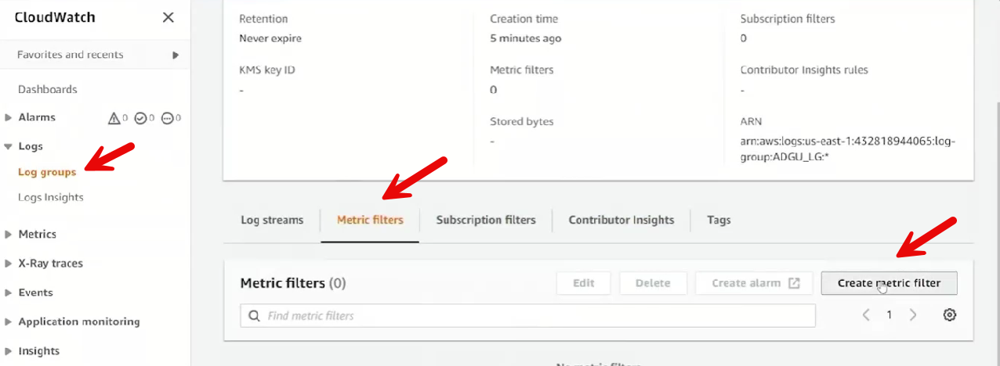
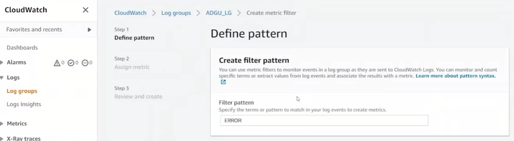
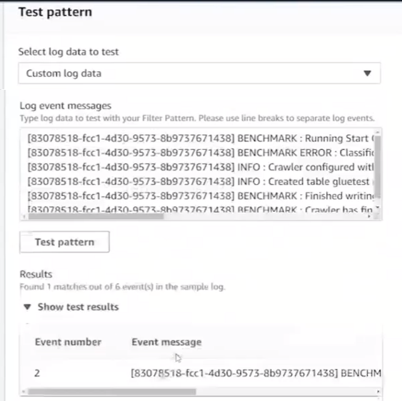
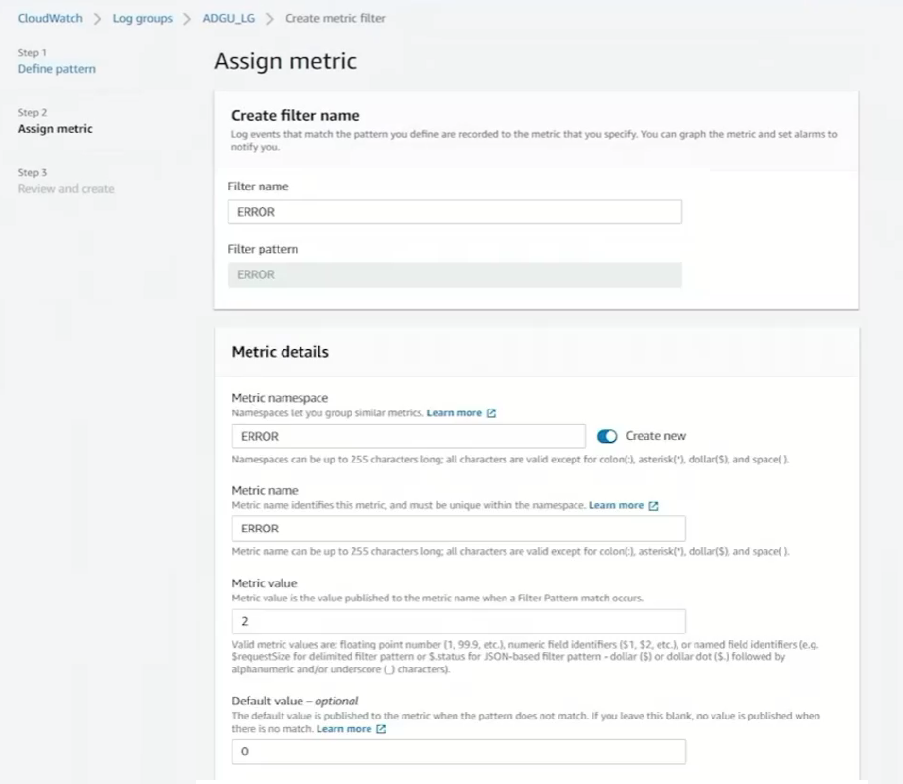

# 22.4 Understanding alarms 
 
- **Purpose of the Demo**
  - Demonstrates creating **CloudWatch alarms** based on log content
  - Shows how to trigger alerts when specific keywords appear in logs

- **Code Base**
  * [log_an_error.py](./../CODE/CloudWatch/2-AlarmOnMetricFilter/log_an_error.py)
  * [config.json)](./../CODE/CloudWatch/2-AlarmOnMetricFilter/config.json)
  

- **Example Application**

  - Application logs a single message containing the word **ERROR**
  - Uses the same CloudWatch logging setup as the previous example
  - Sends one log entry without handling sequence tokens explicitly

- **Creating a Metric Filter**
  - Navigated to the log group in **CloudWatch Logs**

  - Created a **metric filter** with pattern: `ERROR`

  - Tested the filter against sample log data to confirm matches
  - Metric configuration:
  - 

    - Metric name: `ERROR`
    - Metric value: `2`
    - Default value: `0`
    - Unit: None

- **Metric Filter Behavior**
  - Each log entry containing `ERROR` increments the metric by 2
  - Metric is associated directly with the log group

- **Creating an Alarm**
  - Created an alarm from the metric filter
  - Statistic used: **Sum**
  - Alarm condition:
    - Trigger when value is **greater than 1**
  - Alarm evaluates data within a 5-minute period

- **Notification Setup**
  - Created a new **SNS topic**
  - Subscribed an email address to the topic
  - Confirmed subscription via email
  - No auto-scaling or remediation actions configured

- **Testing the Alarm**
  - Executed the application to generate ERROR log entries
  - Log stream created and messages written successfully
  - CloudWatch detected metric data points
  - Alarm transitioned from **INSUFFICIENT_DATA** to **ALARM**

- **Alert Delivery**
  - Email notification sent when alarm entered ALARM state
  - Email included a link to view the alarm in CloudWatch

- **Additional Capabilities**
  - Metric filters can use **regular expressions**
  - Alarms can trigger:
    - Email notifications
    - Lambda functions
    - Automated remediation actions

- **Key Takeaway**
  - CloudWatch can generate alarms from log patterns
  - Metric filters bridge logs and metrics
  - Alarms enable proactive monitoring and automated responses
 
 
 ## [Context](./../context.md)