# 22.6 Using EventBridge 

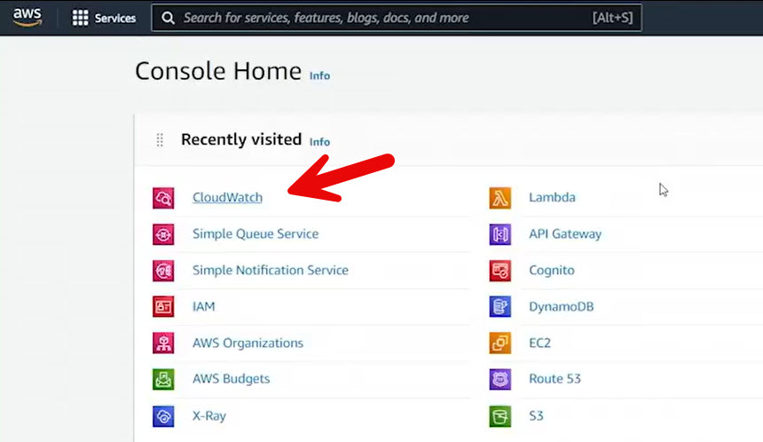
 
- **Purpose of the Example**
  - Demonstrates using **Amazon EventBridge** to trigger actions based on events
  - Shows a real-world, time-based automation use case

- **Use Case Overview**
  - Send a daily email at **4:00 PM Eastern Time**
  - Email contains the **closing price of Tesla (TSLA) stock**
  - Fully automated using AWS services

- **Services Used**
  - **Amazon EventBridge** (formerly CloudWatch Events)
  - **AWS Lambda**
  - **Amazon SNS (Simple Notification Service)**
  - Email subscription to SNS topic

- **EventBridge Configuration**
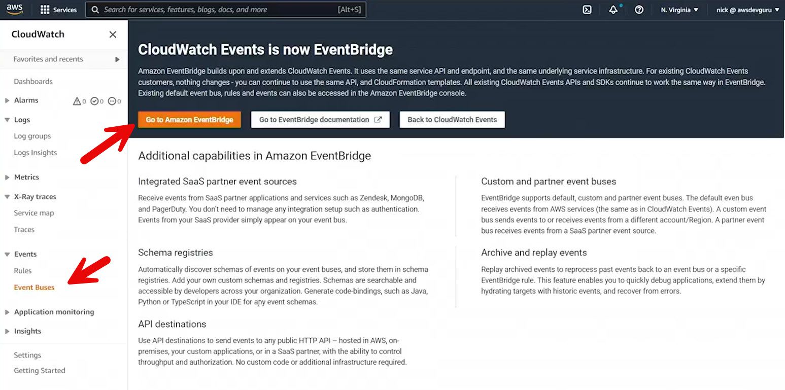

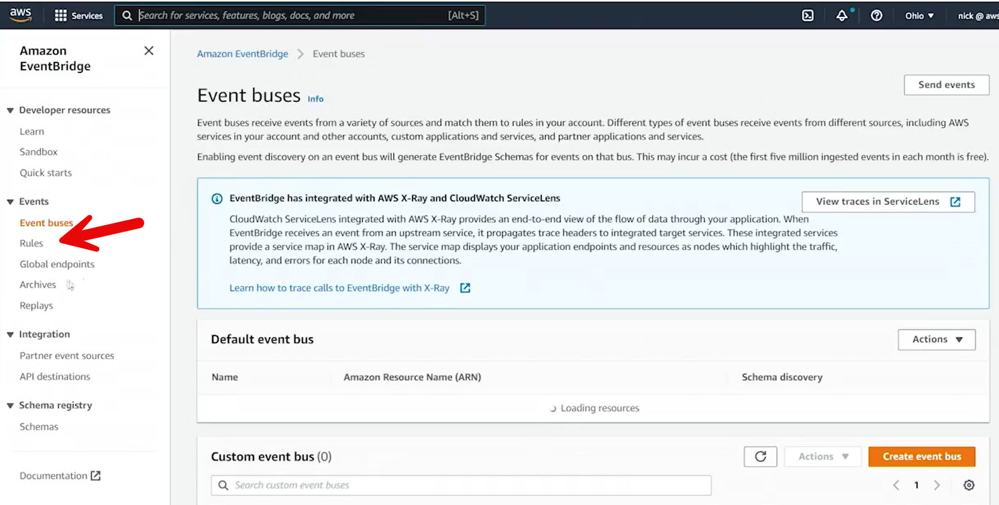

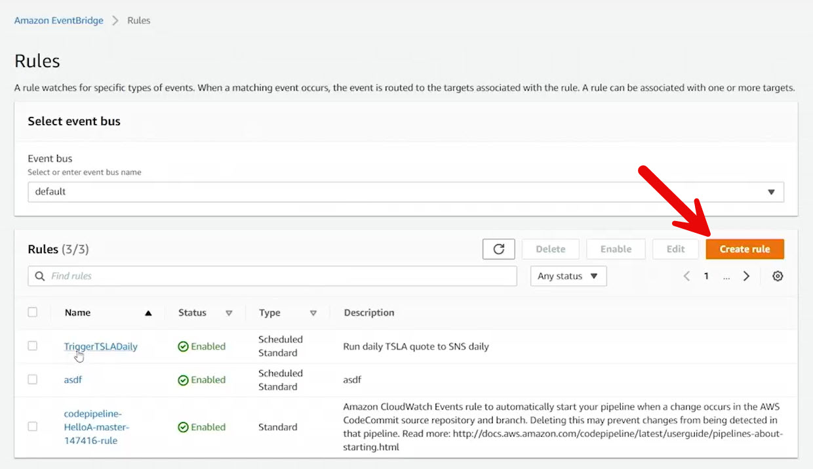

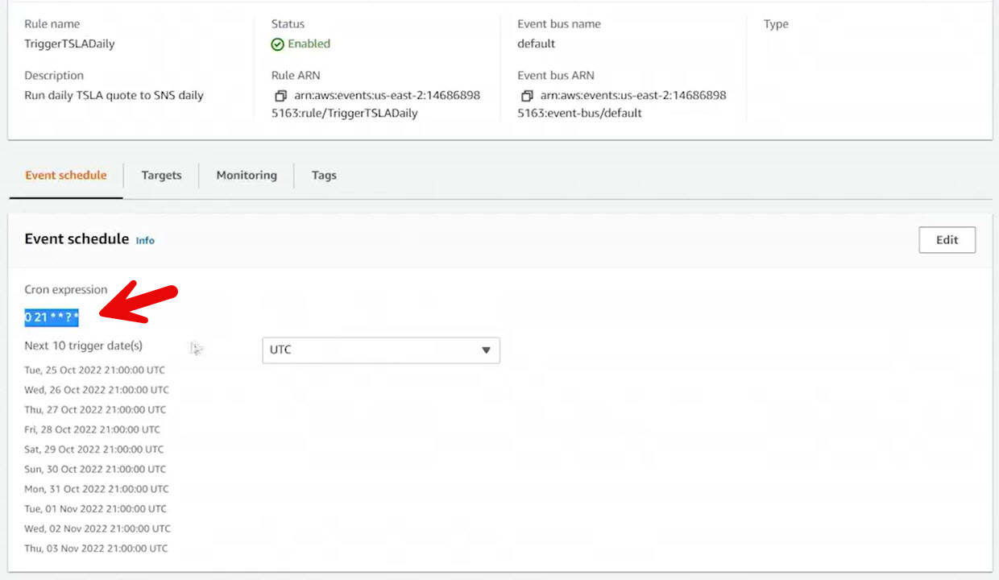

  - Created a **rule** using a **Cron expression**

  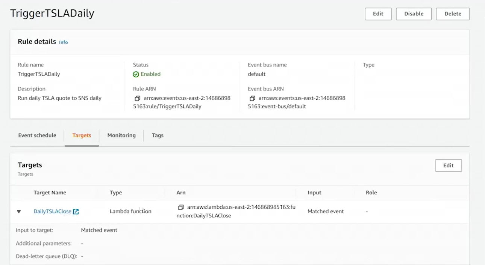

  - Rule triggers daily at the specified hour

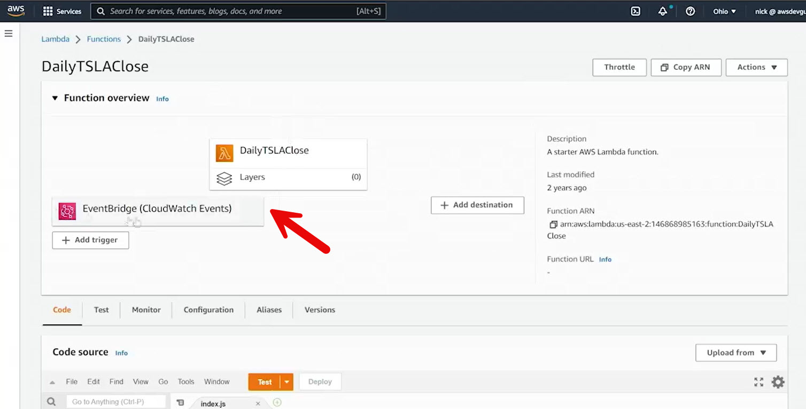

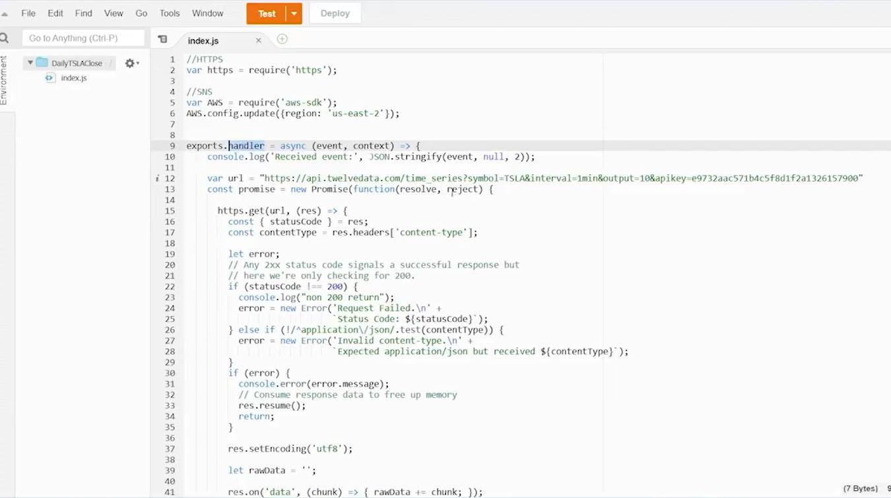

  - Rule target is a Lambda function

- **Cron-Based Scheduling**
  - Uses Cron syntax to define time-based execution
  - Rule evaluates continuously and triggers when conditions are met

- **Lambda Function**
  - Triggered by EventBridge
  - Queries an external API to retrieve TSLA stock data
  - Extracts open, high, low, and close values
  - Formats the data into a message
  - Publishes the message to an SNS topic

- **SNS Integration**

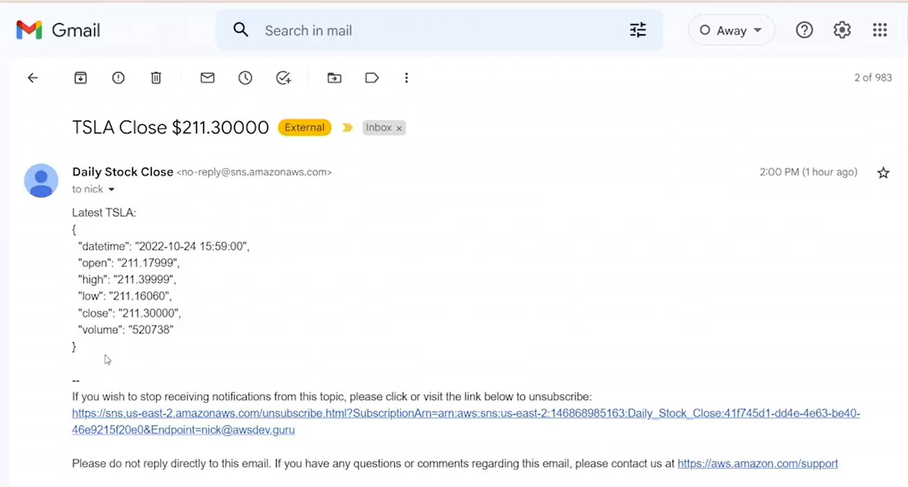
  - SNS topic configured with an **email subscription**
  - Lambda function publishes messages to the topic
  - Email is delivered automatically to the subscriber

- **IAM Permissions**

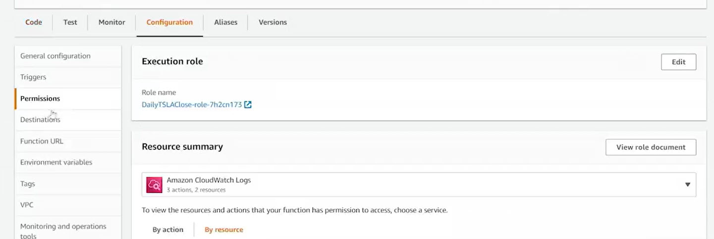
  - Lambda function uses an IAM role
  - Role includes permission to publish to SNS

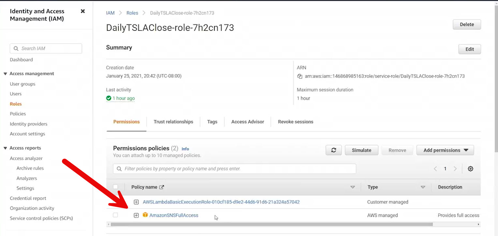

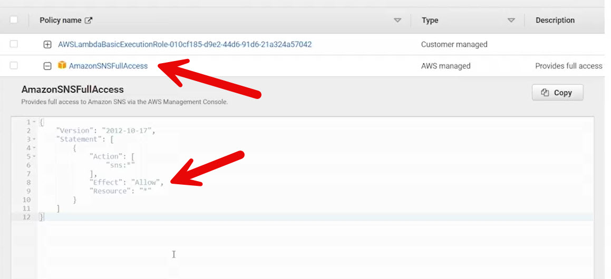

  - Example used **SNS full access** for simplicity (not best practice)

- **Result**
  - Daily automated email with Tesla stock price at market close
  - No manual intervention required

- **Key Takeaway**
  - EventBridge enables powerful event-driven and scheduled automation
  - AWS services can be easily chained together
  - Time-based triggers are ideal for reporting, notifications, and maintenance tasks
 
 
 ## [Context](./../context.md)