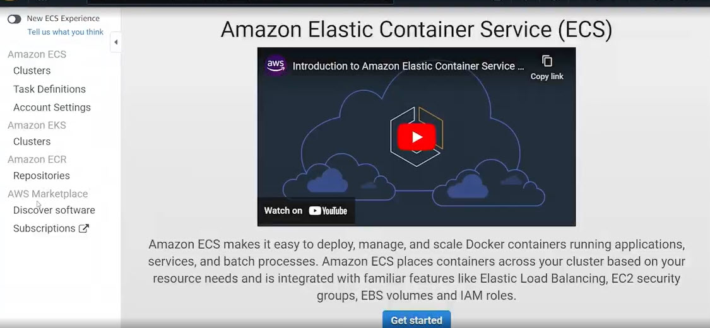
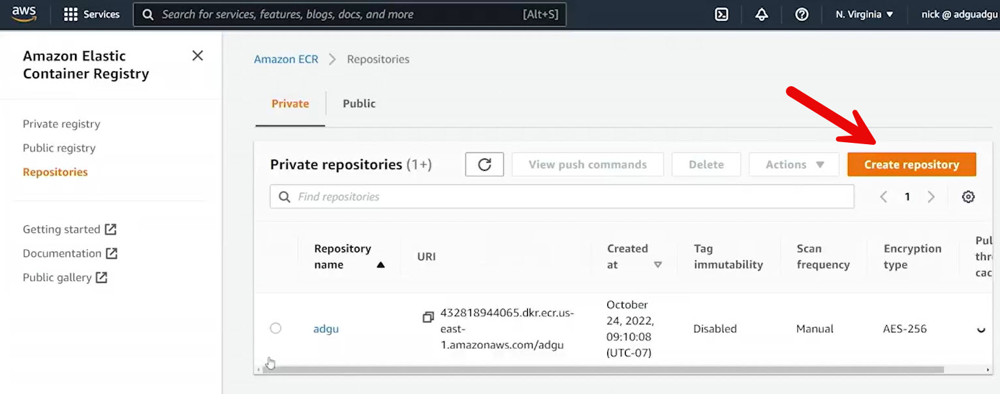
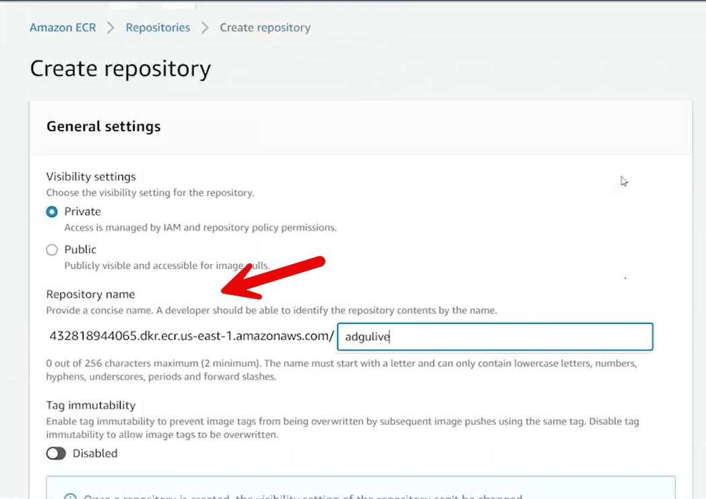
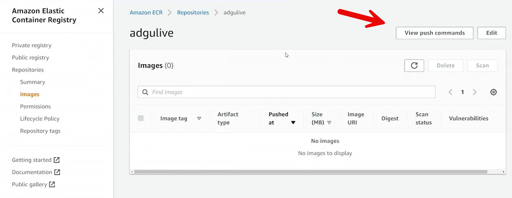
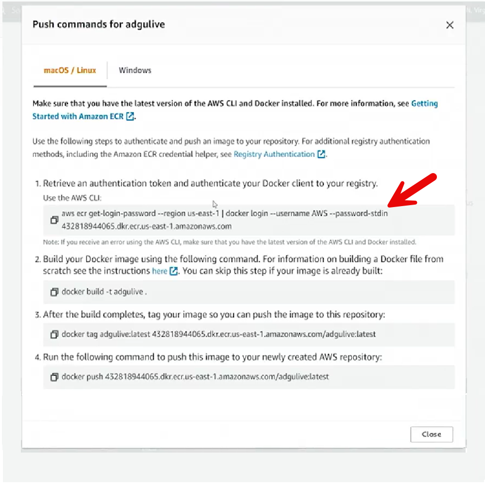

# 23.3 Exploring the Elastic Container Registry 

 
- **Purpose of the Demo**
  - Introduces **Amazon Elastic Container Registry (ECR)**

  

  - Demonstrates creating and using a **private container repository**
  - Prepares for deploying a container to **ECS Fargate**

- **What is Amazon ECR**
  - A managed service to **store, share, and deploy container images**
  - Integrated with ECS and other AWS services
  - Supports private repositories by default

- **Creating a Repository**
  - Navigated to **ECR → Repositories** in the Northern Virginia region

  

  - Created a new **private repository** named `adgulive`
  - Left optional features disabled:
    - Tag immutability
    - Image scanning
    - Encryption settings (for demo purposes)

- **Repository State**

  - Repository initially contained **no images**
  - Verified repository creation in the console

- **Container Image Source**
  - Used files from the ECS Registry directory in the repository
  - **Dockerfile**:
    - Base image: `httpd`
    - Copies `index.html` into the Apache `htdocs` directory
  - **index.html**:
    - Simple static content

- **Pushing an Image to ECR**
  - Used **View push commands** in the ECR console
  - Followed provided steps:
    - Authenticate Docker to ECR using `aws ecr get-login-password`
    - Build the Docker image
    - Tag the image with the ECR repository URI
    - Push the image to ECR

- **Authentication**
  - Docker authenticated using **IAM credentials**
  - `docker login` configured access to the private ECR repository

- **Image Upload**
  - Successfully pushed the image to the repository
  - Verified image presence with tag `latest`

- **Result**
  - Container image is now stored in ECR
  - Image is ready to be referenced in an ECS task definition

- **Key Takeaway**
  - ECR simplifies secure container image storage and management
  - Integration with ECS enables seamless container deployments
  - ECR images can be used with both EC2 and Fargate launch types
 
 
 ## [Context](./../context.md)