# 23.4 Using clusters 
 
- **Purpose of the Demo**
  - Demonstrates deploying a container from **ECR** to **ECS Fargate**

  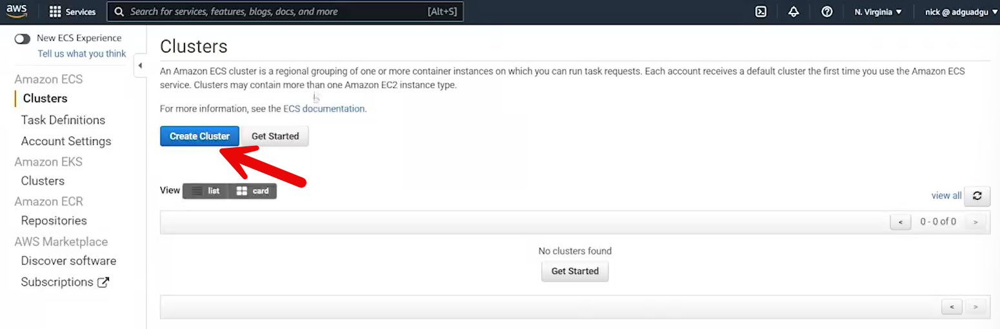

  - Shows how to use clusters, task definitions, and tasks together

- **Cluster Creation**

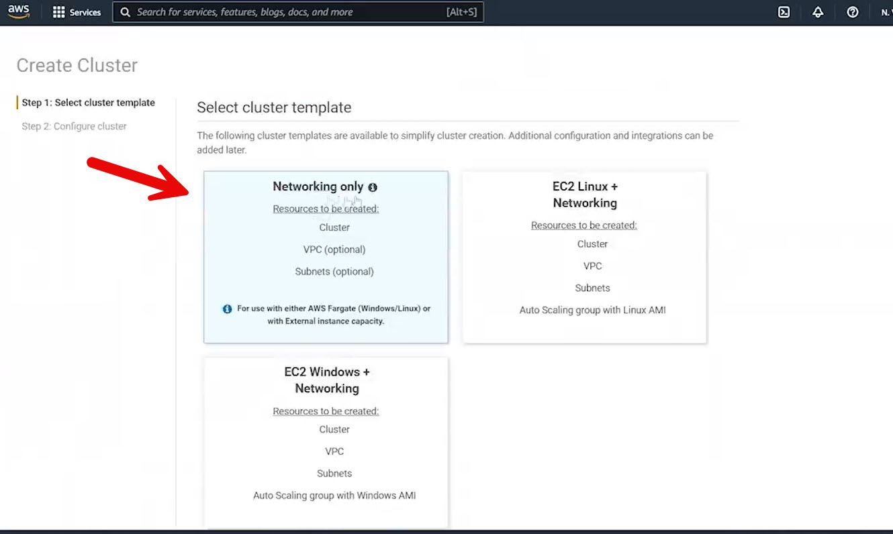
  - Created a **networking-only ECS cluster**
  - Cluster type designed for **Fargate**
  - Fargate provides **serverless container execution**
  - Used an existing VPC (no new VPC created)

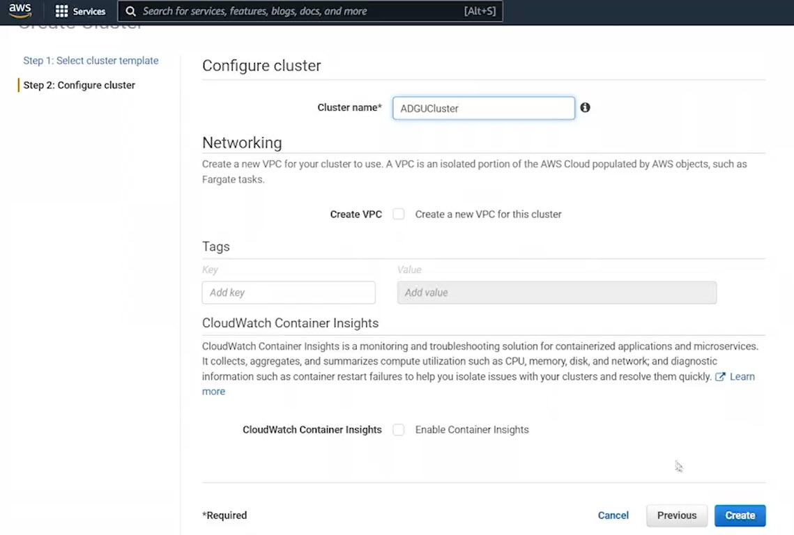

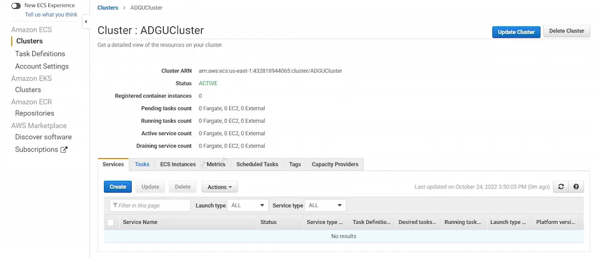

  - Cluster named **ADGU cluster**

- **Task Definition Creation**

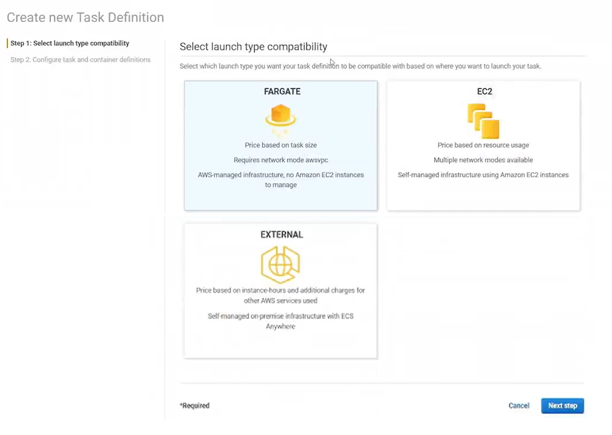

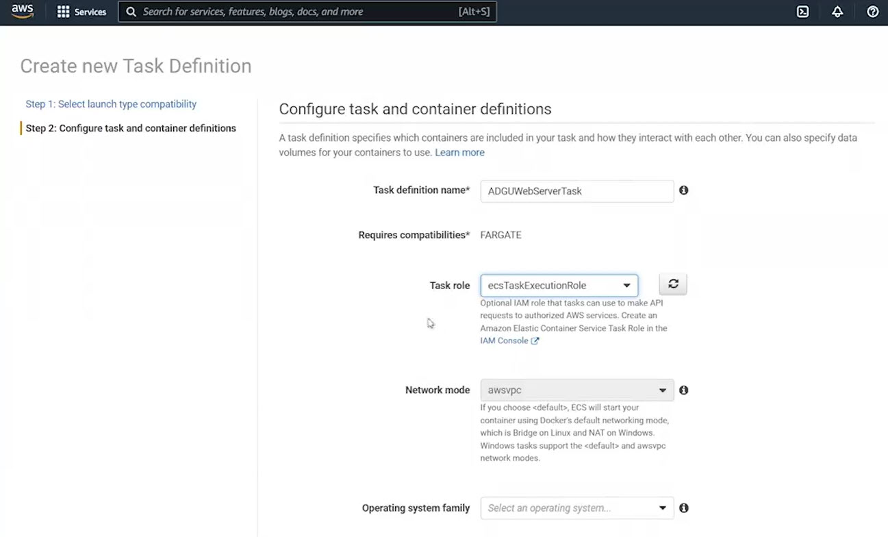

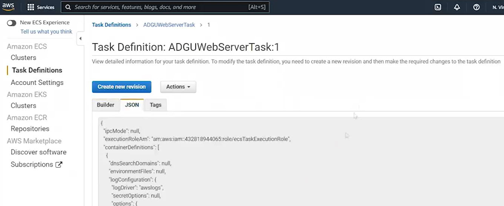

  - Created a new **Fargate task definition**
  - Task name: **ADGU Web Server Task**
  - Operating system: **Linux**
  - Execution role: **ECS Task Execution Role**
  - Resource allocation:
    - **0.5 GB memory**
    - **0.25 vCPU**

- **Container Configuration**
  - Container image pulled from **Amazon ECR**
  - Image URI provided from the previously created repository
  - Container name: **ADGU container**
  - Default container settings used

- **Task Definition Completion**

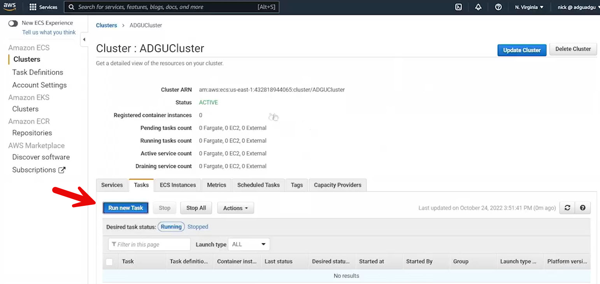

  - No service mesh, proxy, FireLens, or volumes configured
  - Task definition successfully created
  - JSON definition automatically generated by ECS

- **Running the Task**

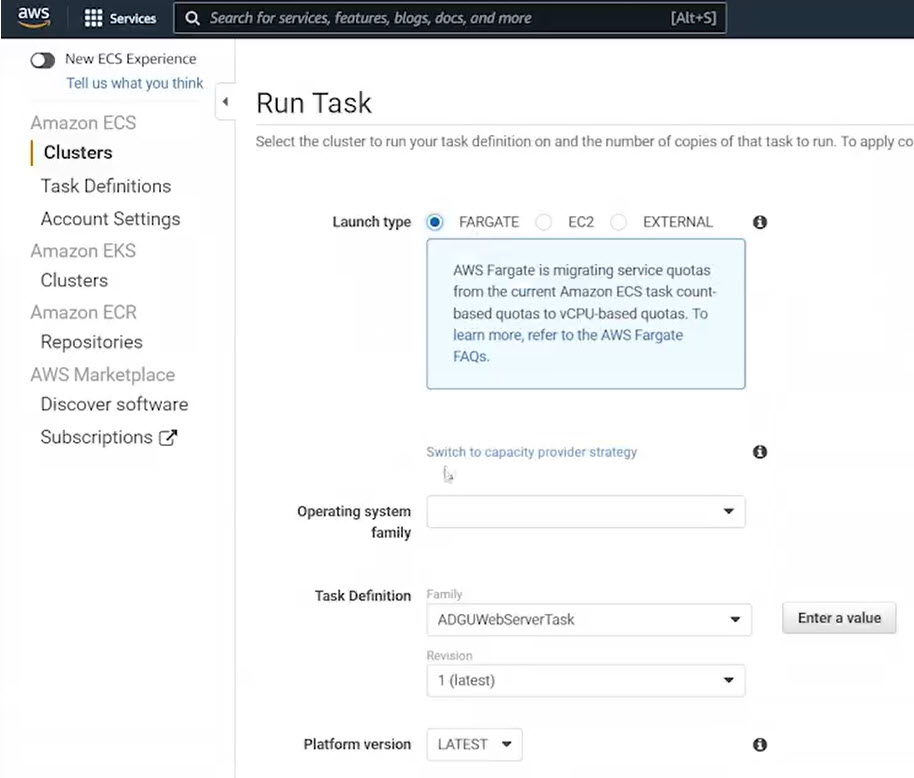

  - Launched a task from the **ADGU cluster**
  - Launch type: **Fargate**
  - Platform: **Linux**
  - Selected default VPC and subnet (1B)
  - Created a new security group automatically

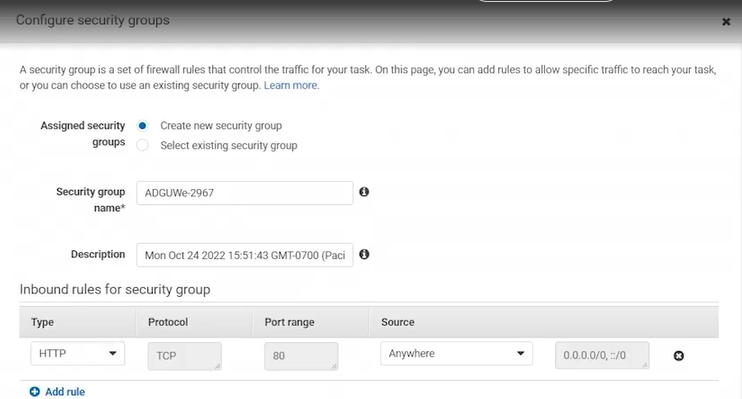

    - Allowed inbound traffic on **port 80**

- **Verification**
  - Task entered a running state

  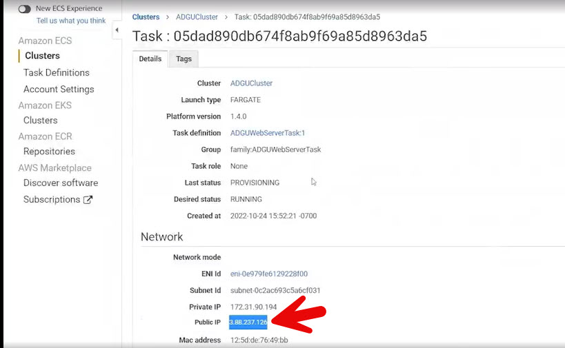

  - ECS assigned a **public IP address**

  - Accessed the container via browser
  - Confirmed Apache web server responded successfully

- **Architecture Highlights**

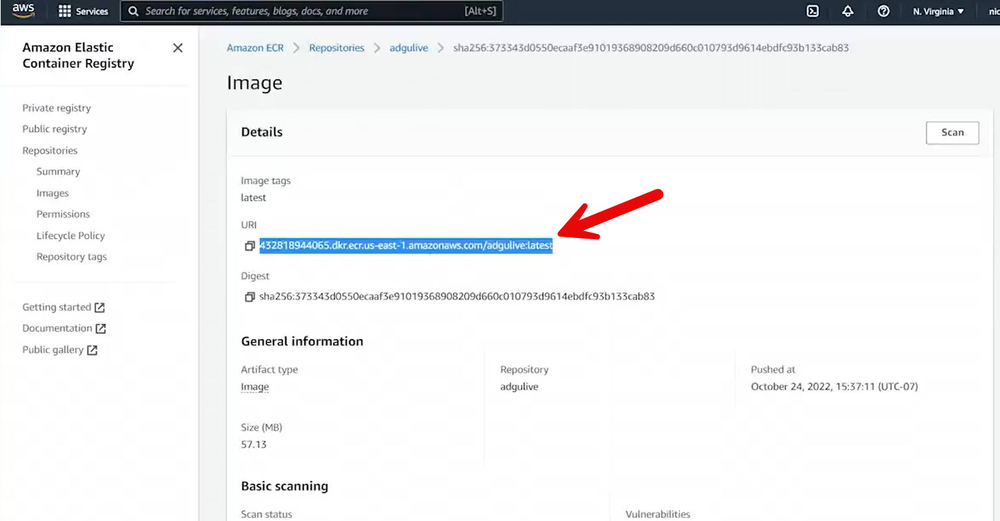

  - Container runs fully on **Fargate**
  - No EC2 instances or container hosts managed by the user
  - Image sourced directly from **Elastic Container Registry**

- **Key Takeaway**
  - ECS + ECR + Fargate enable fast, serverless container deployments
  - Ideal for running web apps and microservices
  - Provides a middle ground between EC2-based containers and fully serverless Lambda solutions
 
 
 ## [Context](./../context.md)