# 24.3 Experimenting with AWS developer tools 

 
- **Purpose of the Demo**
  - Demonstrates an end-to-end **AWS CI/CD pipeline** using Developer Tools
  - Uses **CodeStar** to tie together multiple services automatically

- **CodeStar Project Creation**

  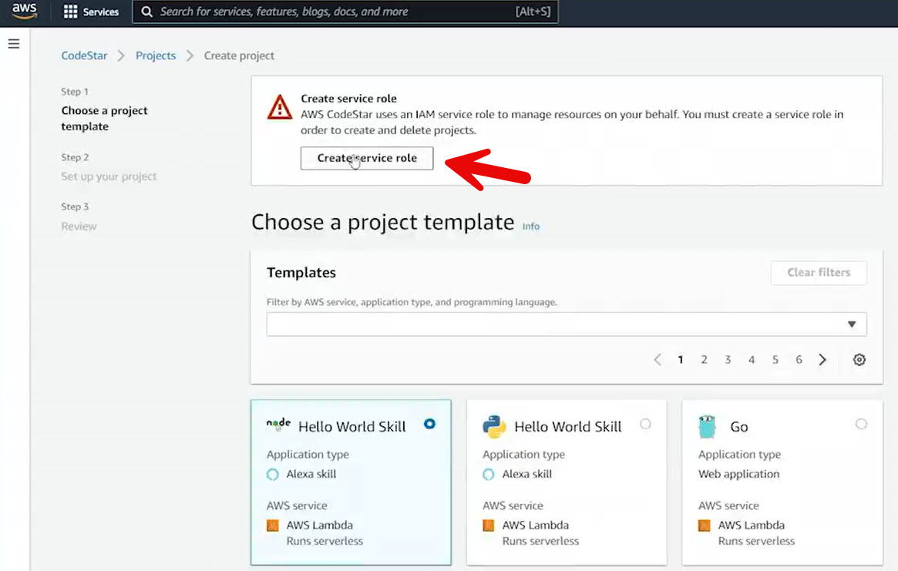

  - Created a new **CodeStar project** in Northern Virginia

  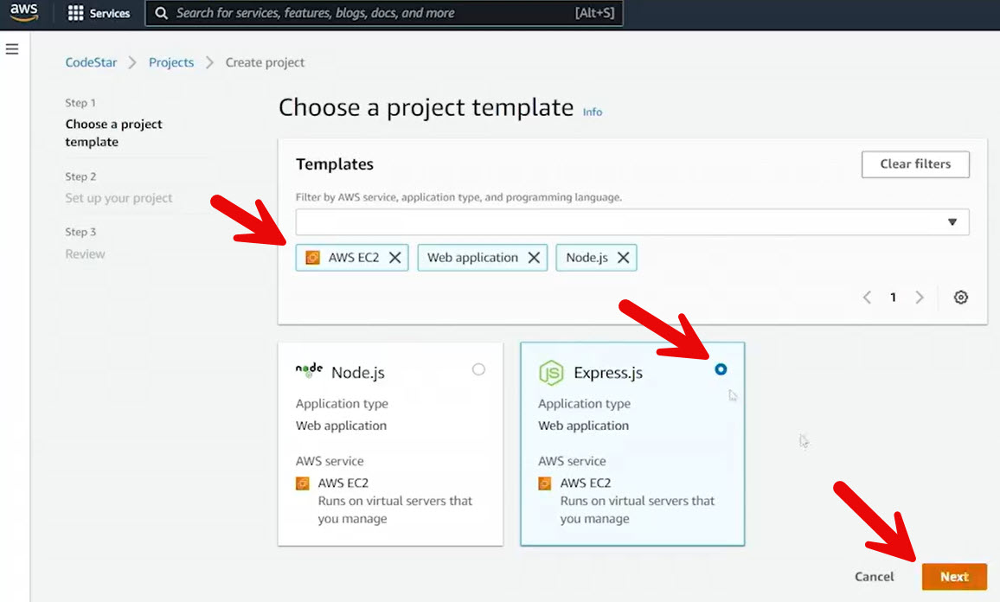

  - Selected an **EC2 Node.js Express web application** template
  - CodeStar created required service roles automatically
  - Provisioning handled via **CloudFormation**

  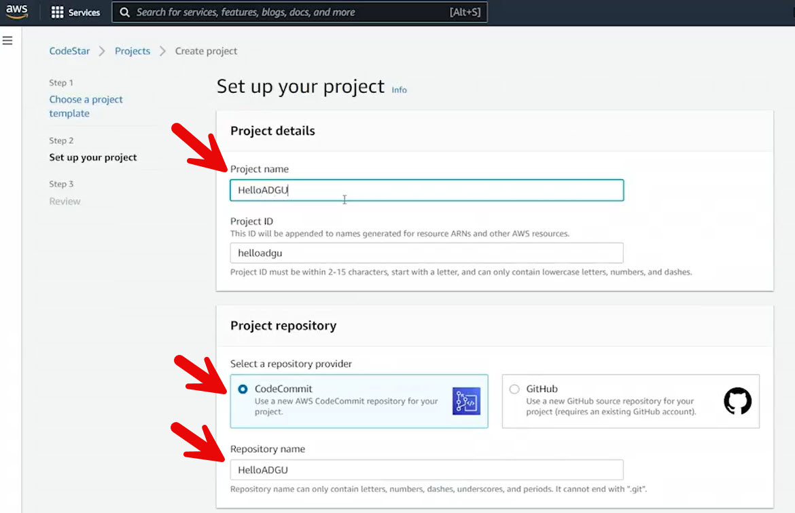

  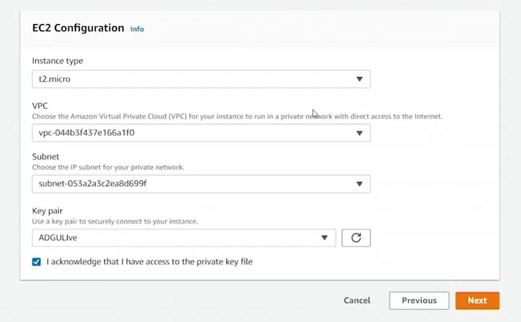

  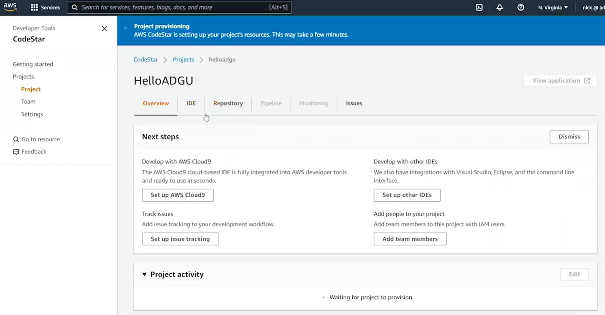

- **Services Provisioned by CodeStar**
  - **CodeCommit** repository for source control
  - **CodePipeline** for CI/CD orchestration
  - **CodeBuild** project for building and testing
  - **CodeDeploy** application for deployment
  - **EC2 instance** to run the application
  - **S3 buckets** for pipeline artifacts

- **Pipeline Structure**
  - **Source stage**
    - Triggered by commits to the CodeCommit repository
    - Produces an artifact stored in S3
  - **Build stage**
    - Uses CodeBuild
    - Executes steps defined in `buildspec.yaml`
    - Runs unit tests and produces a build artifact
  - **Deploy stage**
    - Uses CodeDeploy
    - Executes instructions in `appspec.yaml`
    - Deploys code to EC2 using the CodeDeploy agent

- **Cloud9 Integration**

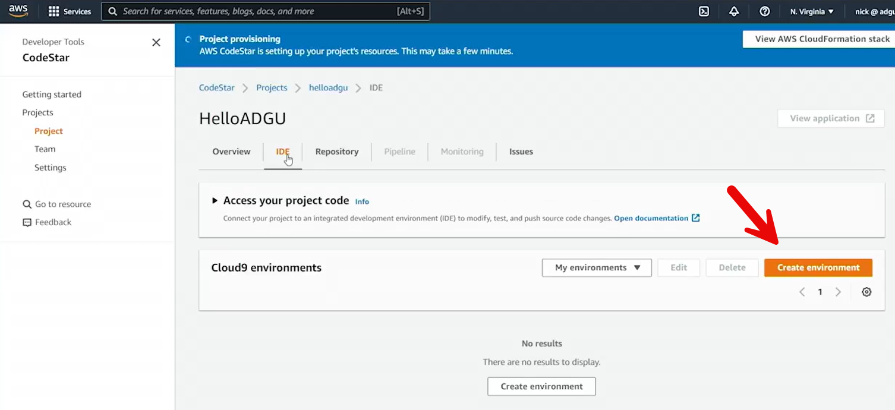

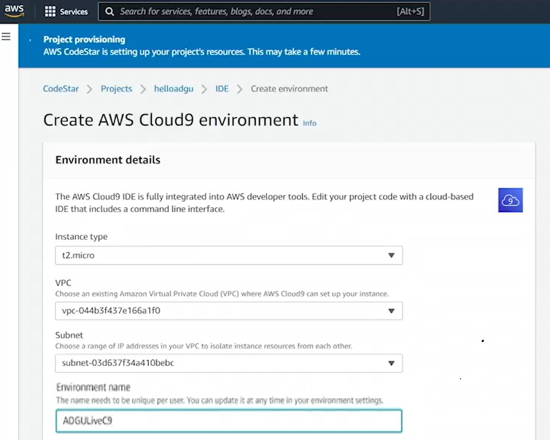

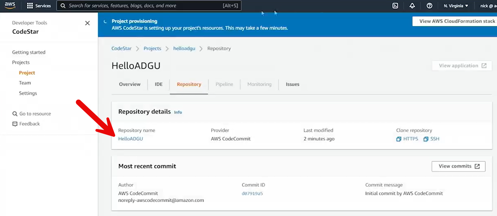

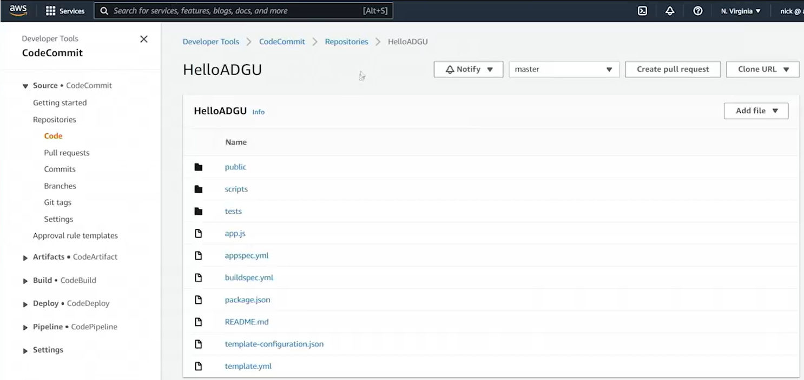

  - Created a **Cloud9 IDE** tied to the CodeStar project
  - Repository automatically cloned into the IDE
  - No manual credential setup required
  - Used Cloud9 for editing, committing, and pushing code

- **IAM and CodeCommit Access**

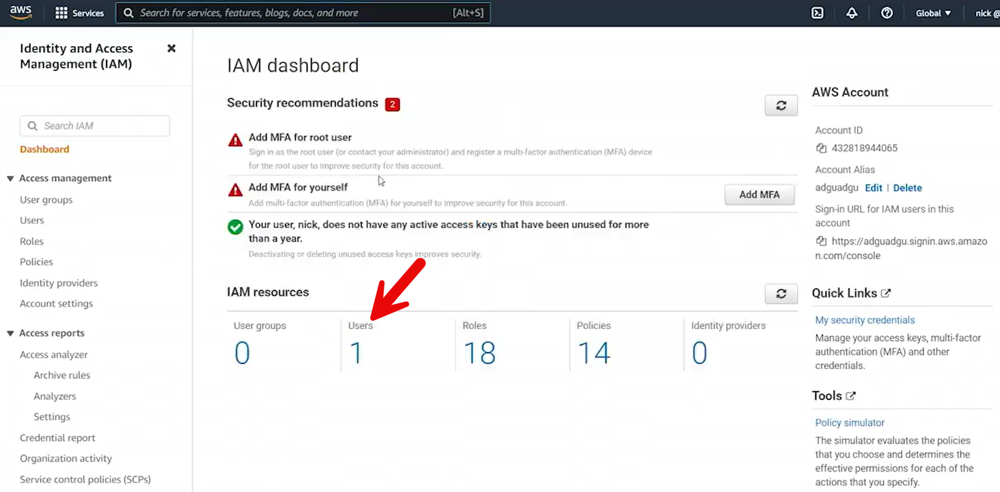

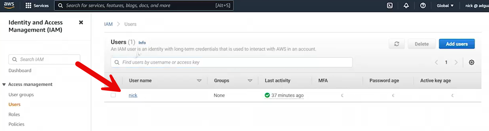

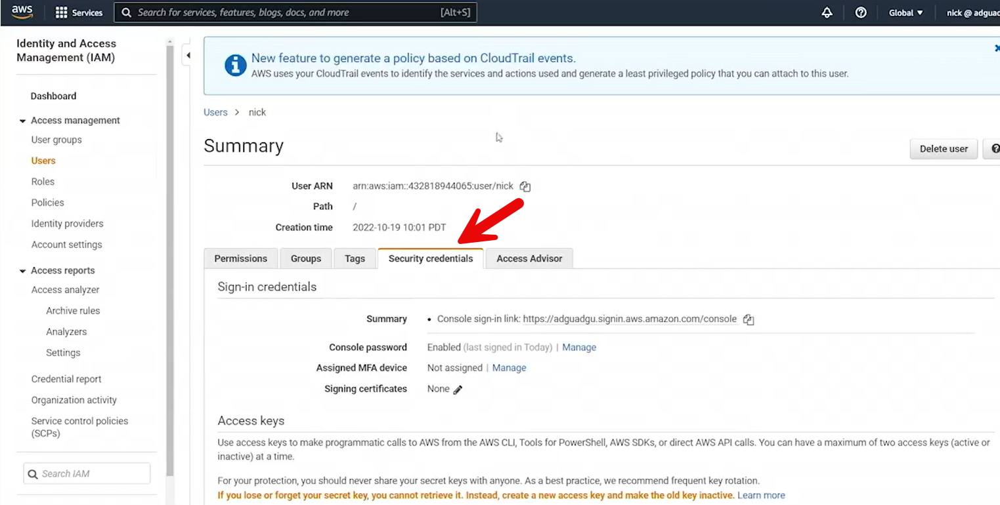

  - CodeCommit supports:

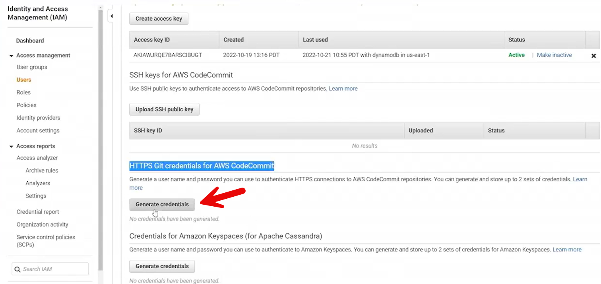

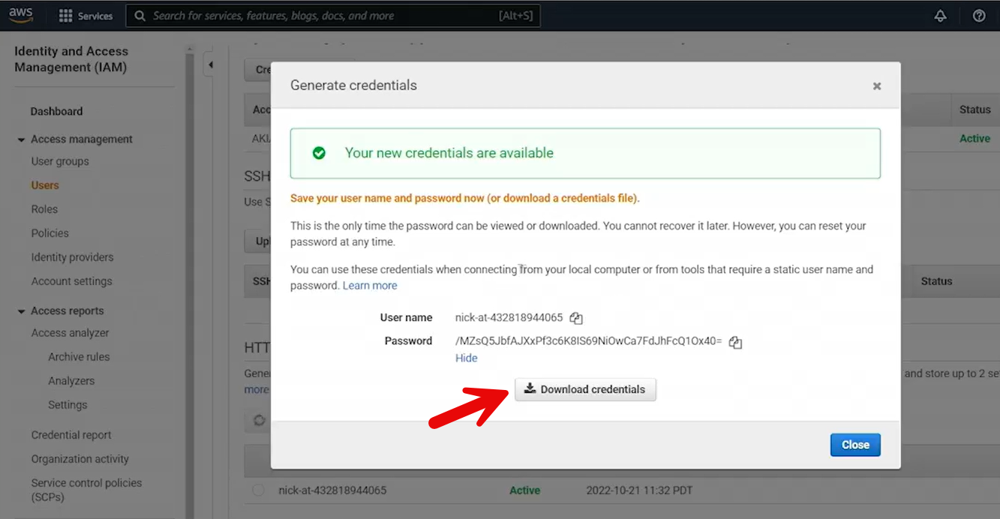

    - HTTPS credentials (username/password)
    - SSH keys
  - Cloud9 handles authentication automatically

- **Build Process Details**
  - `buildspec.yaml`:
    - Installs Node.js and dependencies
    - Runs unit tests (Mocha)
    - Creates output artifact (excluding buildspec)
  - Build fails if tests fail

- **Testing and Fixing a Failed Build**

  - Initial build failed due to a unit test mismatch

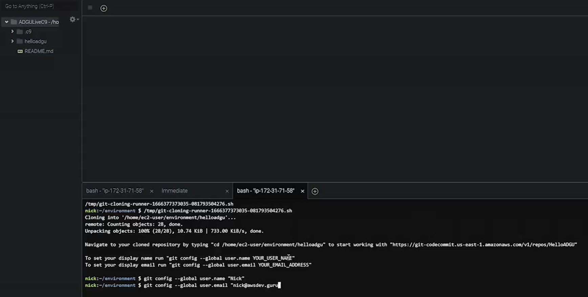

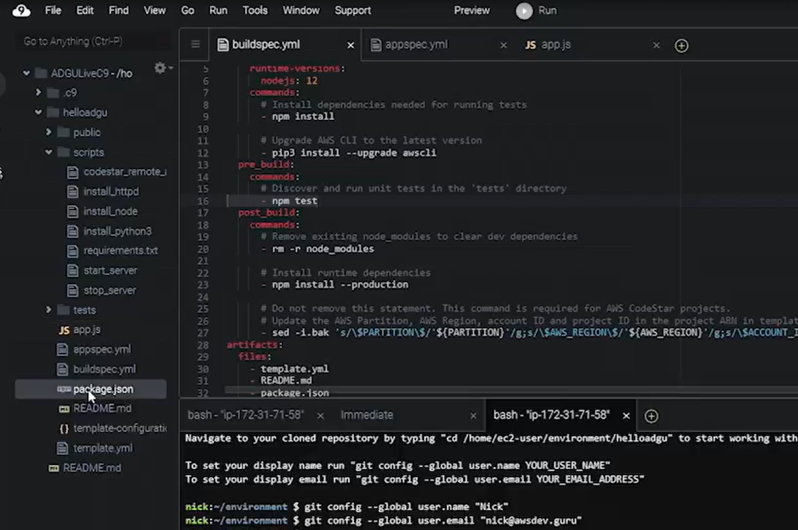

  - Updated test logic to match code changes
  - Committed and pushed fix
  - Pipeline re-ran automatically and succeeded

- **Deployment Process**
  - `appspec.yaml`:
    - Copies files to EC2 instance
    - Installs required software (Node, Apache, Python)
    - Starts the application using `forever`
  - Deployment type: **in-place**
    - Application temporarily unavailable during update

- **Verification**

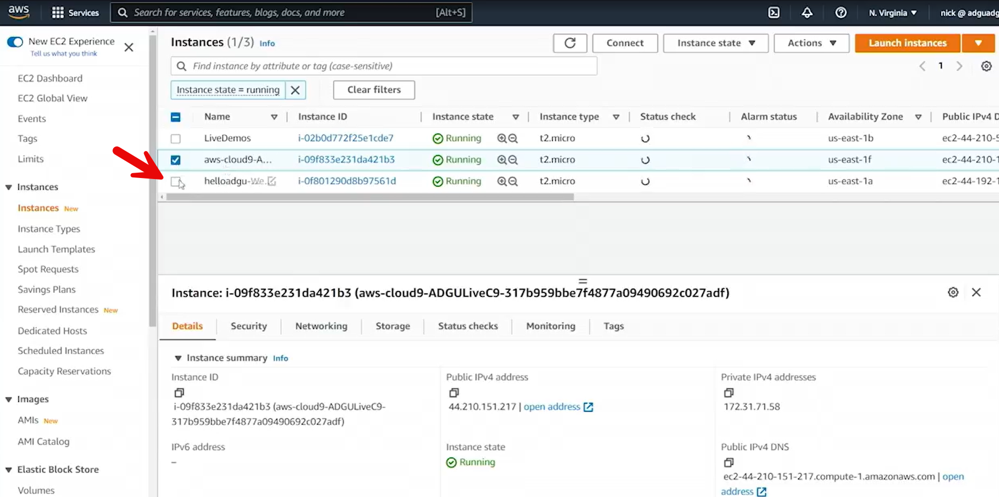

  - Confirmed EC2 instance serving updated web content
  - Successfully deployed changes to production via pipeline

- **Key Takeaways**
  - CodeStar provides a **single pane of glass** for CI/CD
  - AWS Developer Tools integrate seamlessly for rapid deployment
  - Commits automatically flow from repository to production
  - Pipelines can be extended with load balancers, approvals, and scaling
 
 
 ## [Context](./../context.md)