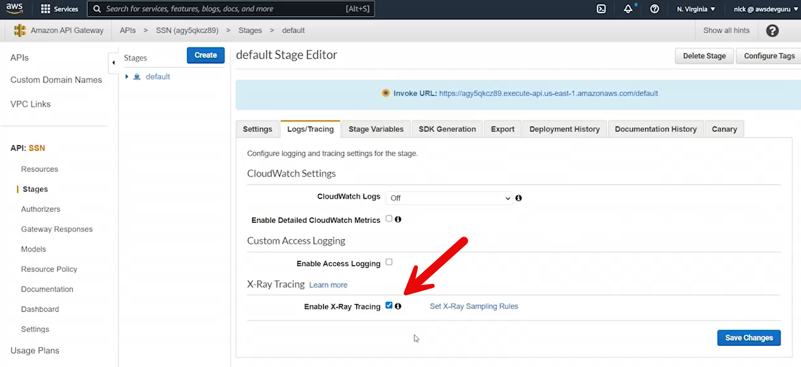
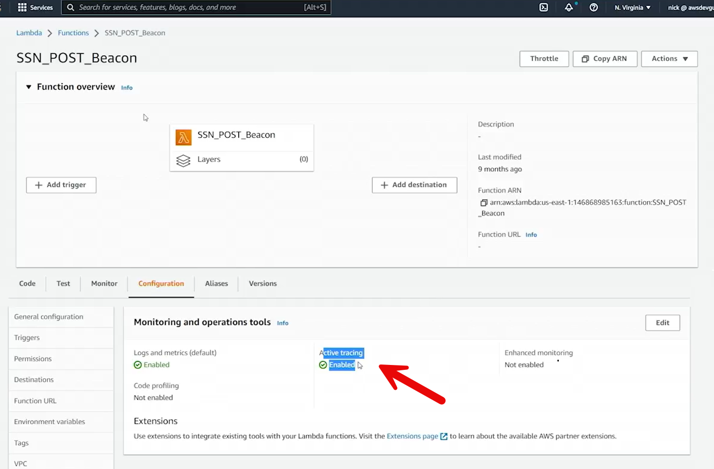
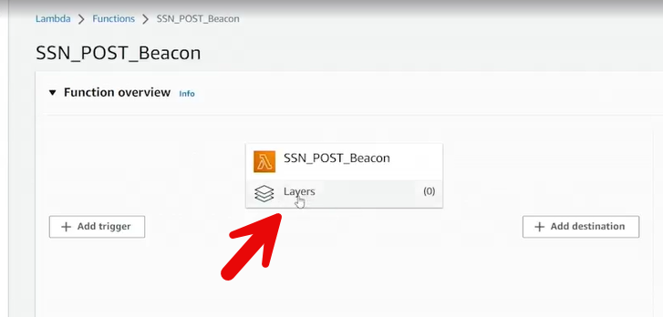
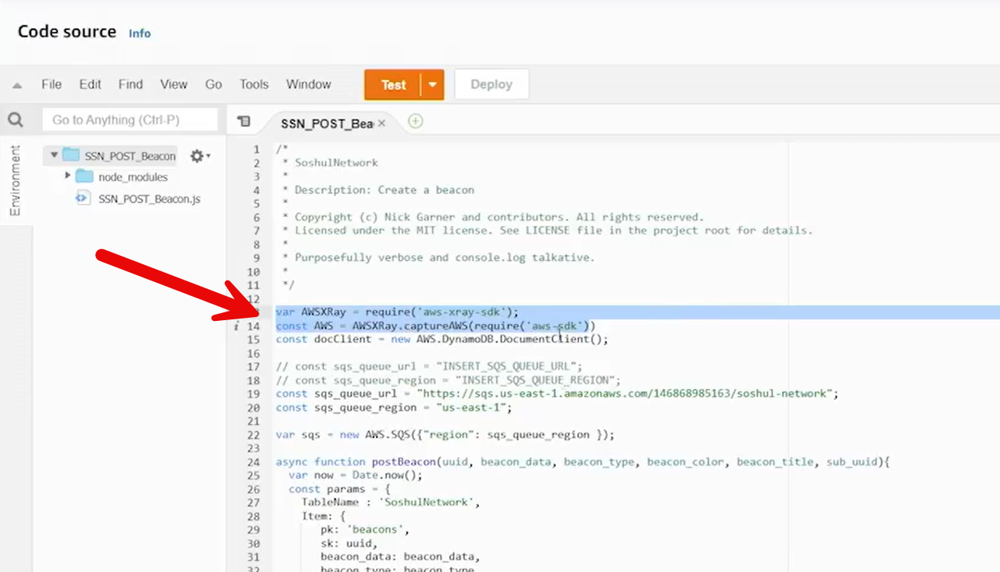
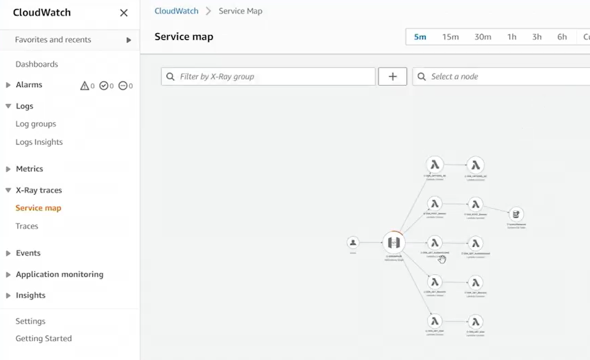

# 24.4 Exploring X-Ray 
 
- **What is AWS X-Ray**
  - A service for **analyzing and debugging distributed applications**
  - Traces requests as they flow through AWS services
  - Helps identify performance bottlenecks and errors

- **X-Ray Capabilities**
  - Instruments application code to capture service calls
  - Visualizes request paths and dependencies
  - Provides end-to-end tracing across AWS services

- **Supported SDKs**
  - Java
  - .NET / .NET Core
  - Ruby
  - Node.js
  - Python

- **How X-Ray Works**
  - Uses **interceptors** to trace incoming HTTP requests
  - Instruments AWS SDK clients to trace service-to-service calls
  - Can trace:
    - Internal HTTP calls
    - External HTTP calls
    - SQS interactions

- **Demo Application Overview**
  - Serverless social network application: **Soshul.Network**
  - Architecture includes:
    - S3 + CloudFront (frontend hosting with SSL)
    - Cognito (user authentication)
    - API Gateway (API layer)
    - Lambda (business logic)
    - DynamoDB, SQS, SES (backend services)

- **Enabling X-Ray**

  - Enabled X-Ray tracing in:
    - API Gateway stage settings

  - Lambda function configuration (Active Tracing)
  - Lambda functions instrumented with X-Ray SDK
  - SDK included either:
    - In deployment package

    - Or as a Lambda Layer

- **Lambda Instrumentation**

  - AWS SDK clients wrapped with X-Ray
  - Automatically traces all AWS service calls
  - Tracks interactions with DynamoDB, SQS, Cognito, SES

- **Service Map Visualization**

  - Displays how requests move through services
  - Shows dependencies and call relationships
  - Helps understand complex application flows

- **Trace Analysis**
  - View individual traces with timing data
  - Identify slow operations and latency sources
  - Compare response times across services

- **Example Workflow Traced**
  - User posts content via API Gateway
  - Lambda processes request
  - Data stored in DynamoDB
  - Message sent to SQS
  - Another Lambda triggered
  - Cognito queried for user data
  - Notifications sent via SES

- **Advanced Tracing**
  - Can instrument client-side JavaScript for deeper visibility
  - Provides full end-to-end request tracing

- **Benefits of X-Ray**
  - Improves application performance
  - Simplifies debugging of distributed systems
  - Provides insight into real-world production behavior

- **Key Takeaway**
  - X-Ray is essential for understanding and optimizing serverless and microservices architectures
  - Visual service maps and traces help improve reliability and user experience
 
 
 ## [Context](./../context.md)