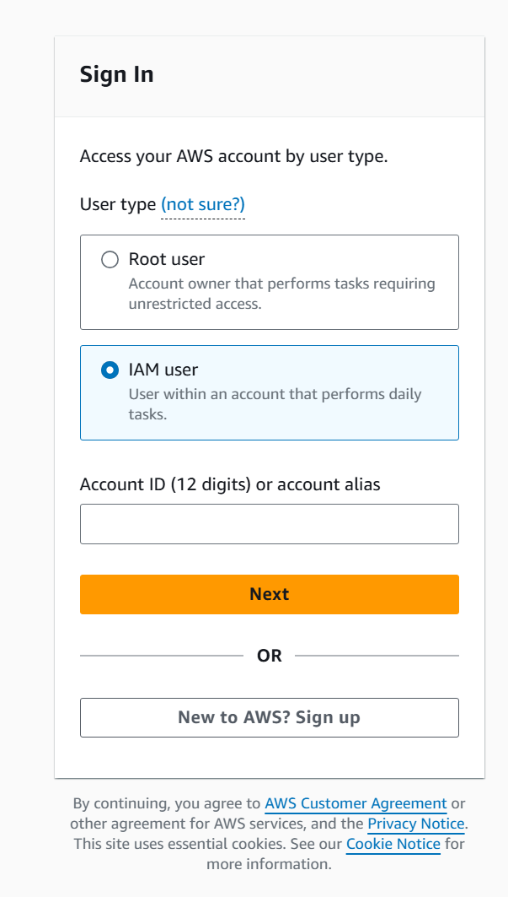

# 4.2 Setting up a local computer 
 
# 🖥️ Minimum Requirements to Follow Along
* **Computer:** Any OS—Windows, Mac, Linux, Chromebook—as long as it has internet access and can install an SSH client.

* **Browser:** Any modern browser like Chrome, Firefox, Edge, or Opera.

* **SSH Client:** Required for connecting to AWS EC2 instances.

# 🔐 SSH Client Options by Operating System

| Operating System | Built-in Option     | Free Tools             | Premium Tools                        |
|------------------|---------------------|-------------------------|---------------------------------------|
| 🪟 Windows         | None                | PuTTY, Bitvise          | XShell, SecureCRT, Tectia SSH         |
| 🍎 Mac            | Terminal (built-in) | iTerm2                 | ZOC                                   |
| 🐧 Linux          | Terminal (built-in) | SSH (usually pre-installed) | —                                 |

* **PuTTY:** Free and widely used on Windows. Supports key pair authentication.

* **XShell:** Premium SSH client used in course demos. Free for non-commercial use.

* **Windows Subsystem for Linux (WSL):** Allows running a Linux VM on Windows. Install via ```wsl --install``` and then download [Ubuntu from the Microsoft Store](https://apps.microsoft.com/detail/9pdxgncfsczv?hl=en-us&gl=US).

# 🧪 Course Setup Highlights
* Instructor uses **Windows + XShell** for demonstrations.

* Most demos are done inside **Linux EC2 instances** accessed via SSH.

* EC2 access requires **public/private key pairs**, which PuTTY and XShell support. 
  
  

| **Software** | **Location**                        |
|--------------|-------------------------------------|
| Terminal     | Built-in                            |
| iTerm2       | [https://iterm2.com/](https://iterm2.com/) |
| ZOC (¤)      | [https://www.emtec.com/zoc/](https://www.emtec.com/zoc/) |

 
 ## [Context](./../context.md)