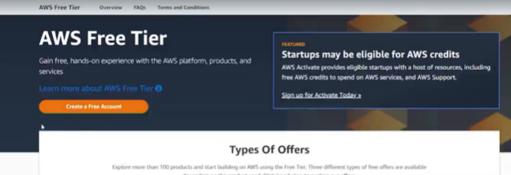
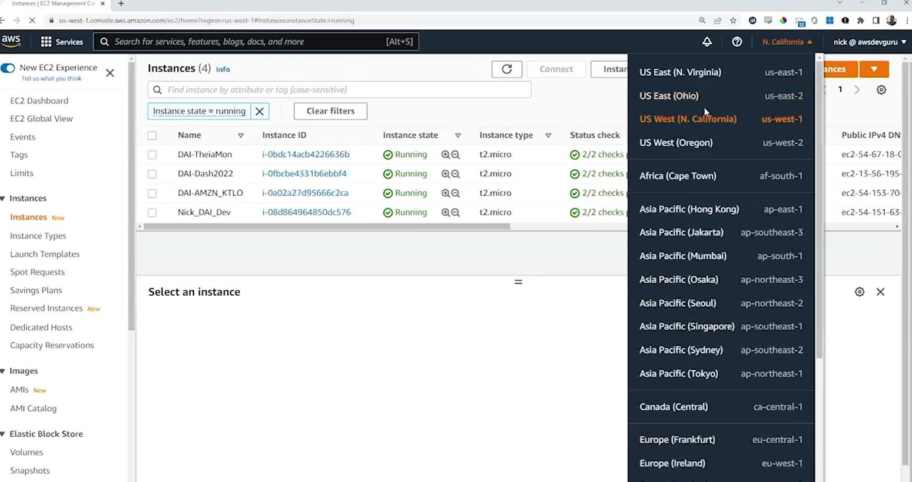

# 4.3 Creating an AWS trial account 

# 🧾 AWS Free Trial Account Setup Summary
**Objective:** Create and configure an AWS Free Tier account for use throughout the course, following best practices for security and access.


 
# 🛠️ Steps to Create the Free Trial Account
* **Navigate to:** [aws.amazon.com/free](https://aws.amazon.com/free/)

* **Click:** “Create a Free Account”

* **Provide Required Info:**

    - Valid email address

    - Physical billing address

    - Credit card (for charges beyond Free Tier limits)

    - Phone number (for SMS verification)

# AWS Chrome Interface




# 📊 AWS Free Tier Limits (Key Services)
* **EC2:** 750 hours/month

* **S3:** 5 GB storage

* **RDS:** 750 hours/month

* **Note:** Kinesis is not included in the Free Tier


# 🔐 Root User Setup
* Create root account using email and password

* Verify email with 6-digit code

* Choose Personal account type

* Store root credentials securely

* Avoid using root account for daily operations

# 👤 IAM User Creation (Best Practice)
* Open IAM service → Add user

* Username: generic

* Access type: AWS Management Console

* Set custom password (disable forced reset)

* Assign **AdministratorAccess** policy

* Skip tags → Review → Create user

# 🔗 IAM Sign-In URL & Alias
* Copy IAM user sign-in URL from dashboard

* Create account alias: generic_alias (must be globally unique and lowercase)

* Use alias-based URL for easier login:
  
```
https://adguadgu.signin.aws.amazon.com/console
```

# ✅ Final Notes
* IAM user **GENERIC** now handles all administrative tasks

* Root account is locked away for emergency use only

* Alias simplifies login and improves account management hygiene

 ## 🆚 AWS CLI vs Web GUI

### 🌐 Web Graphical User Interface (GUI)
- **Accessed through a browser**, such as:
  - Chrome
  - Firefox
  - Edge
  - Others
- **Menu and form-driven interface**
  - Click-based navigation
  - Visual dashboards
  - Ideal for beginners or visual workflows

### 💻 Command Line Interface (CLI)
- **Accessed through a terminal**, including:
  - Windows Command Prompt
  - macOS Terminal
  - Linux Shell
  - Others
- **Programmatic interaction**
  - Uses commands and sub-commands
  - Includes flags and arguments
  - Ideal for automation, scripting, and advanced users


 ## [Context](./../context.md)