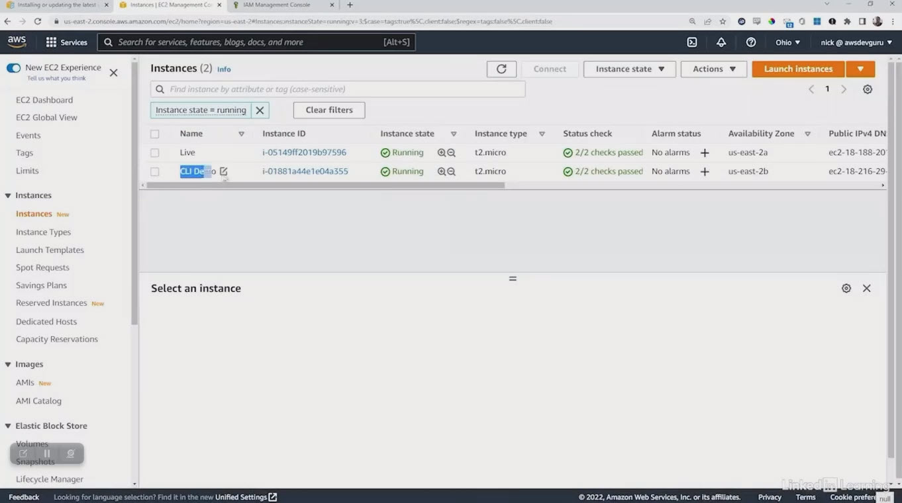

# 4.5 Using the AWS CLI

# ⚙️ AWS CLI Installation & Configuration Summary

**Goal:**

Install and configure the AWS Command Line Interface (CLI) across different platforms, using programmatic credentials.

### what is awscli
The AWS Command Line Interface (AWS CLI) is an open-source tool that allows you to
manage and interact with Amazon Web Services (AWS) using commands in your
command-line shell.

# 🧭 Access Prerequisite: Programmatic User

* Requires **Access Key ID** and **Secret Access Key**

* Created via IAM → Users → Security Credentials → Create Access Key ➡️ Will be covered in depth in the IAM section

# 💻 Installation Methods by Platform

| Platform            | Method                                | Notes                                           |
|---------------------|----------------------------------------|-------------------------------------------------|
| Linux               | `pip install awscli` or `pip3 install awscli` | May need to update `$PATH` to include `.local/bin` |
| Amazon Linux (EC2)  | Pre-installed                          | Only configuration needed                       |
| Windows             | MSI Installer                          | Adds CLI to system path for use in Command Prompt |
| Mac                 | Download pkg  | Executed via Terminal                           |


# 🛠️ Configuration Steps
Run the command:

``` bash
aws configure
```

Provide:

1. **Access Key ID**

2. **Secret Access Key**

3. **Default Region** (e.g., us-east-2)

4. **Default Output Format** (json, text, or table)

Creates:

~/.aws/credentials

~/.aws/config

 ➡️ INI-style files storing your configuration


👥 Multiple Accounts or Users
Use **named profiles:**

``` bash
aws configure --profile devuser

```
Switch between profiles using:

``` bash
aws ec2 describe-instances --profile devuser
```

# 🧪 CLI Validation & Usage

* Run: **aws ec2 describe-instances** to test setup

* Use contextual help:

``` bash
aws help
aws ec2 help
aws ec2 describe-instances help
```
# 🖥️ CLI on EC2 Instance

* Installed via **pip3 install awscli**

* Same configuration process as Windows/Mac

* Update **$PATH** if needed to access **aws** command

# 🔁 Cross-Platform Consistency

* CLI behaves identically across Windows, Linux, and Mac

* Python-based → consistent experience

## ⚙️ AWS CLI Configuration Guide

To configure the AWS Command Line Interface (CLI), run the following command in your terminal:

```bash
$ aws configure
AWS Access Key ID [None]: AKIA...IWHF
AWS Secret Access Key [None]: wJa.........rXU
Default region name [None]: us-west-2
Default output format [None]: json
```
Where do we get the **Assess Key** and **Sercret Access Key** ?

    - IAM

## 🐧 Installing AWS CLI on Linux

To install the AWS Command Line Interface (CLI) using the bundled installer, follow these steps in your terminal:

### 📥 1. Download the installer bundle
```bash
curl "https://s3.amazonaws.com/aws-cli/awscli-bundle.zip" -o "awscli-bundle.zip"
```
### 📦 2. Unzip the downloaded bundle

``` bash
unzip awscli-bundle.zip
```

### 🛠️ 3. Run the installer with elevated permissions


``` bash
sudo ./awscli-bundle/install -i /usr/local/aws -b /usr/local/bin/aws
```
This installs the AWS CLI to **/usr/local/aws** and creates a symlink at **/usr/local/bin/aws** for easy access.

# 🔧 AWS CLI Configuration Profiles
When configuring the AWS CLI, two files are created in the user's home directory:

* ~/.aws/config

* ~/.aws/credentials

These files store region settings, output format, and access credentials.

📁

```
$ cat  ~/.aws/config
[default]
region = us-east-1
output = json
```
 🔐

 ```
 $ cat ~/.aws/credentials
 [default]
aws_access_key_id = testkey
aws_secret_access_key = secretkey

 ```
💡 Note: Replace **testkey** and **secretkey** with your actual AWS credentials. Never share your real keys publicly.

## 🧭 AWS CLI – Configuration Profiles
Named profiles in AWS CLI allow you to manage multiple AWS accounts or environments with ease.

### 🛠️ Create a Named Profile
``` bash
aws configure --profile <profile_name>
```

###
🚀 Use a Named Profile
``` bash
aws <command> <sub-command> --profile <profile_name>
```

📁 Example ~/.aws/config File

``` ini
[default]
region = us-west-2
output = json

[profile user1]
region = us-east-1
output = text
```

✅ Tip: Use descriptive profile names like **dev**, **prod**, or **user1** to keep your environments organized.

# 🐧 Installing AWS CLI on Linux (via pip)
Use pip3 to install or upgrade the AWS CLI:

``` bash
pip3 install awscli --upgrade --user
```

### 📍 Installation Path
The AWS CLI will be installed in:

``` bash
$HOME/.local/bin
```
You may need to update your **PATH** environment variable:

``` bash
export PATH=$HOME/.local/bin:$PATH
```

⚠️ Note
Amazon Linux includes the AWS CLI by default — no installation needed.


# 🍎 Installing AWS CLI on macOS (GUI Installer)
### 📝 Steps
1. **Download the installer**
[AWS CLI v2 .pkg file](https://awscli.amazonaws.com/AWSCLIV2.pkg)

2. **Run the downloaded file**
Double-click the .pkg file to launch the installer.


3. **Follow the on-screen instructions**
Proceed through the installation prompts.

4. **Verify installation in Terminal**
Open Terminal and run:

``` bash
aws --version
```

✅ Tip: If the command isn’t recognized, ensure /usr/local/bin is in your PATH.

# 🖥️ Installing AWS CLI on Windows (MSI Installer)
## 📝 Steps
1. **Download the MSI installer**
Search for:
"aws cli windows msi"
Or visit the [official AWS CLI installation guide](https://docs.aws.amazon.com/cli/v1/userguide/install-windows.html#msi-on-windows)

2. **Run the installer**
Double-click the downloaded **.msi** or setup file.

3. **Follow the on-screen instructions**
Complete the installation wizard.

4. **Verify in Command Prompt**

``` cmd
aws --version
```

✅ Tip: If the command isn’t recognized, ensure the AWS CLI path is added to your system’s PATH variable.


# 📖 Viewing AWS EC2 CLI Help (Windows)
To access documentation for EC2 commands via AWS CLI, run:

``` cmd
aws ec2 help
```

### 🧭 Example (Command Prompt)

``` cmd
C:\Users\GENERIC>aws ec2 help
```

This displays detailed usage instructions, available subcommands, and options for managing EC2 instances.

💡 Tip: Use ```aws <service> help``` to explore other AWS services via CLI.


# 🖥️ Describe EC2 Instances via AWS CLI
To retrieve details about your Amazon EC2 instances, use:



``` cmd
aws ec2 describe-instances
```

### 🧭 Example (Command Prompt)
``` cmd
C:\Users\GENERIC>aws ec2 describe-instances
```

This command returns metadata for one or more EC2 instances, including:

* Instance IDs

* State (running, stopped, etc.)

* Public and private IP addresses

* Attached volumes

Tags and launch configuration

🔍 Tip: Use filters to narrow results:

```  bash
aws ec2 describe-instances --filters
```


# 🛠️ Installing AWS CLI & Exploring .local/bin
### ❌ Command Not Found
Attempting to run the AWS CLI:

``` bash
aws
```
Results in:

```
Command 'aws' not found
```

### 🧩 Suggested Installation Methods
To install the AWS CLI, use one of the following:

``` bash
sudo snap install aws-cli
```

or

```bash
sudo apt install awscli
```

📂 Navigating to .local/bin
After installation, the user explores the .local/bin directory:

```bash
cd ~/.local/bin
ls
```

### 📄 Directory Contents
The directory includes AWS CLI executables, Python scripts, and reStructuredText tools:

| **Category**           | **Files & Scripts**                                                                                      |
|------------------------|----------------------------------------------------------------------------------------------------------|
| AWS CLI Components     | `aws`, `aws.cmd`, `aws_completer`, `aws_bash_completer`, `aws_zsh_completer.sh`                         |
| Python Cache           | `__pycache__`, `jp.py`                                                                                   |
| PyRSA Tools            | `pyrsa-decrypt`, `pyrsa-encrypt`, `pyrsa-keygen`, `pyrsa-priv2pub`, `pyrsa-sign`, `pyrsa-verify`         |
| reStructuredText       | `rst2html.py`, `rst2html4.py`, `rst2html5.py`, `rst2latex.py`, `rst2man.py`, `rst2odt.py`, `rst2odt_prepstyles.py`, `rst2pseudoxml.py`, `rst2s5.py`, `rst2xetex.py`, `rst2xml.py`, `rstpep2html.py`             |


💡 **Note:** If ```aws``` is installed but still not recognized, ensure ```~/.local/bin``` is in your system’s ```PATH```.


# ⚙️ AWS CLI Usage & Configuration
### 📌 Basic Usage
Running the AWS CLI without arguments:

``` cmd
aws
```

Returns usage instructions:

```
usage: aws [options] <command> <subcommand> [<subcommand> ...] [parameters]

To see help text, you can run:
  aws help
  aws <command> help
  aws <command> <subcommand> help

aws: error: the following arguments are required: command

```

#### 🔐 Configuring AWS Credentials
To set up credentials and default settings:

```cmd
aws configure
```

You'll be prompted to enter:

```
AWS Access Key ID [None]: ********************
AWS Secret Access Key [None]: ********************
Default region name [None]: us-east-2
Default output format [None]: json
```
✅ **Tip:** Use IAM best practices—create a dedicated user with limited permissions and avoid hardcoding credentials. Consider using environment variables or AWS Vault for enhanced security.

# Reference
* [Installing or updating to the latest version of the AWS CLI](https://docs.aws.amazon.com/cli/latest/userguide/getting-started-install.html)

 ## [Context](./../context.md)
