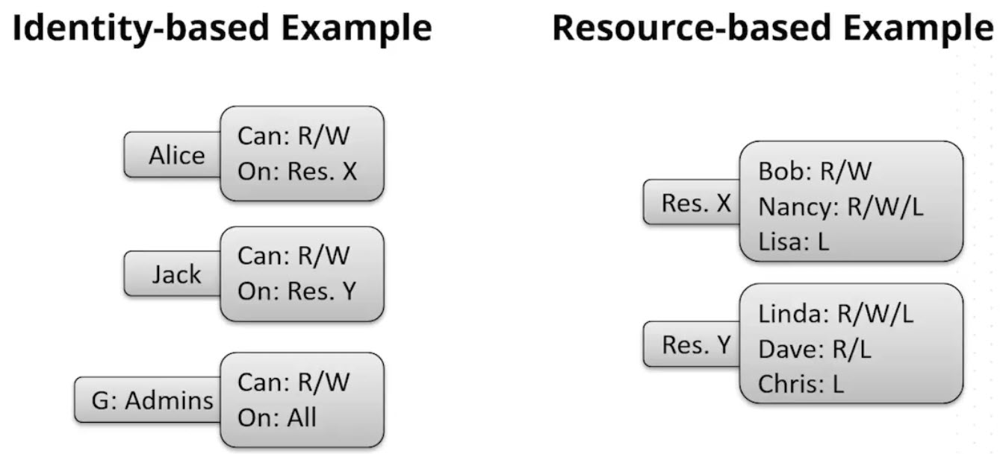
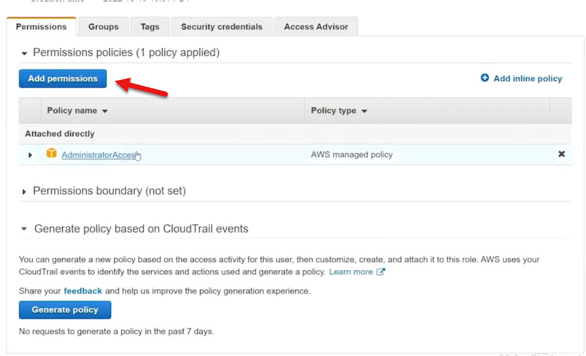

# 5.4 Understanding permissions 
 
 # 📜 IAM Policies: Core Concepts

 

**Definition:**
IAM policies are JSON documents that define permissions. They specify:

* **Effect:** Allow or Deny

* **Action:** What operation is permitted (e.g., ec2:DescribeInstances)

* **Resource:** What the action applies to

* **Condition (optional):** Contextual rules for when the policy applies

 # 🧩 Types of IAM Policies

 

 | Type            | Description                                      | Reusability     | Assignable To                  |
|-----------------|--------------------------------------------------|-----------------|--------------------------------|
| Managed Policies| Standalone policies created by AWS or the user   | ✅ Reusable     | Users, Groups, Roles           |
| Inline Policies | Embedded directly into a specific identity       | ❌ Not reusable | Only the associated user, group, or role |

# 🏷️ Policy Sources
* **AWS Managed Policies:** Predefined by AWS (e.g., AdministratorAccess, AmazonEC2ReadOnlyAccess)

* **Customer Managed Policies:** Created by users via wizard or JSON

* **Inline Policies:** Created within a specific identity and not visible globally

# 🔐 Identity-Based vs Resource-Based Policies

| Policy Type      | Perspective                    | Example                              |
|------------------|-------------------------------|--------------------------------------|
| Identity-Based   | "What can this identity do?"   | Alice can read/write to Resource X   |
| Resource-Based   | "Who can do what to me?"       | Bob can read/write to Resource X     |

* **Default Behavior:** All identities start with **no permissions** (default deny)

* **Group Inheritance:** Users inherit group policies, but **user-specific policies take precedence**

#🛠️ Policy Creation Demonstration

Amazon EC2 (Elastic Compute Cloud) is a web service that provides resizable compute capacity in the cloud. It allows users to rent virtual machines (called instances) to run applications. EC2 offers a wide range of instance types, enabling users to tailor their computing resources to specific needs, from small web servers to large-scale HPC applications. 

✅ **Managed Policy Creation**

* Used **wizard** to select service (e.g., API Gateway), actions, and resources

* Named policy **APIG_Managed_Policy_DeleteMe**

* Attached to user **GENERIC**

* Reusable across multiple identities

📎 **Inline Policy Creation**

* Created within user **GENERIC**

* Named **InlineDeleteMe**

* Allowed read/list actions on **Access Analyzer**

* Not reusable or visible to other users

# 👤 User Management

* Created user **UserDeleteMe** with no permissions

* Default permission: ability to change own password

* Could not access **InlineDeleteMe** (inline policies are not shareable)

* Could access and be assigned the managed policy

# 🧪 Summary of Permissions for User “Generic”

| Policy Type      | Name                          | Scope                                      |
|------------------|-------------------------------|--------------------------------------------|
| AWS Managed      | AdministratorAccess           | Full access to all services/resources       |
| Customer Managed | APIG_Managed_Policy_DeleteMe  | Full access to API Gateway                 |
| Inline           | InlineDeleteMe                | Read/list Access Analyzer (only for Generic)  |

IAM policies offer powerful, flexible control over AWS resources. Managed policies are ideal for scalability, while inline policies provide targeted, entity-specific permissions.

 ## [Context](./../context.md)