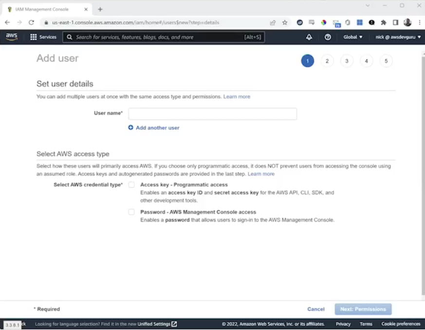
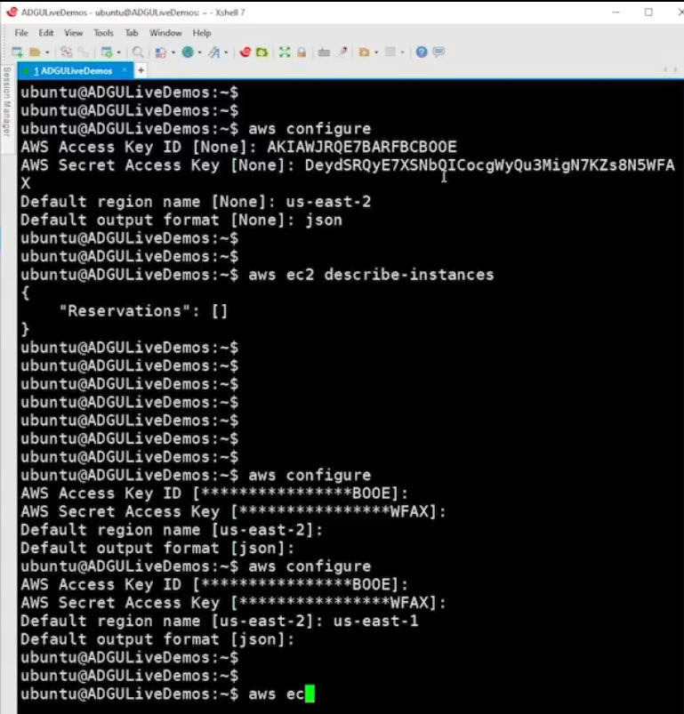

# 5.5 Exploring users and groups 

* Access key - Programmatic access
* Password - AWS Management Console Access

# 👤 IAM Users & Access Types

**IAM Users** can be granted two types of access:

| Access Type          | Description                  | Credentials                                      |
|----------------------|------------------------------|--------------------------------------------------|
| Programmatic Access  | Used for CLI, SDK, API calls | Access Key ID + Secret Access Key (shown only once) |
| Web Console Access   | Used for browser-based login | Username + Password                              |

 ➡️ Users can have either or both access types.

# 🔐 Policy Assignment Methods

* **Direct Assignment:** Attach policies during or after user creation

* **Group Inheritance:** Users inherit permissions from assigned groups

* **Copy from Another User:** One-time copy; future changes don’t sync

* **Manual Policy Attachment:** Add policies individually to users

**Note:**

* User-specific policies override group policies

* Default behavior is **deny all** until permissions are explicitly granted

# 🧪 Demo Summary

### ✅ User Creation

* Created user deleteme with:

    - Web Console access

    - Programmatic access

    - EC2 Full Access policy

### 🔐 Permissions in Action

* **S3 Access:** Denied — user cannot list or interact with buckets

* **EC2 Access:** Allowed — user can view and manage EC2 instances

* **SQS Access via CLI:** Denied — not included in assigned policy

### 🧰 CLI Configuration

Used **aws configure** with saved credentials:

* EC2 commands worked **(describe-instances)**

* SQS commands failed **(list-queues)** due to lack of permissions

# 🧠 Key Takeaways

* IAM users must be explicitly granted permissions to access services

* Programmatic credentials must be saved immediately — secret key is only shown once

* Policies define what users can see and do in AWS

* IAM enforces **least privilege** by default
 
 
 ## [Context](./../context.md)