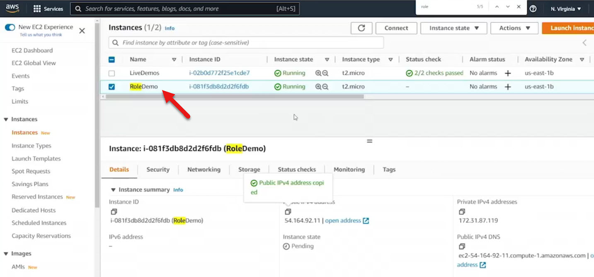

# 5.6 Exploring roles 
 
# 🛡️ What Is an IAM Role?

An **IAM role** is an identity in AWS that can be assumed by:

* AWS services (like EC2)

* Users or applications

* External accounts (cross-account access)

Roles allow temporary access without sharing long-term credentials.

# 🔐 Why Use Roles Instead of Programmatic Credentials?

Without roles:

* You’d create a user with **Access Key ID** and **Secret Access Key**

* Developers might embed these in code or environment variables

* Risk of credential exposure (e.g., committing to public repositories)

With roles:

* No credentials are distributed

* Permissions are securely granted via role association

* Ideal for applications running on EC2 instances

# 🧪 Demo Summary: Role-Based Access for EC2

### 🖥️ Scenario

* EC2 instance named **RoleDemo** running Amazon Linux

* CLI pre-installed, but no credentials configured

### ❌ Initial Attempt
* Running **aws ec2 describe-instances** failed due to missing credentials

### ✅ Role Creation & Attachment
* Created IAM role: **EC2RoleToInteractWithEC2**

* Attached **EC2FullAccess** policy

* Associated role with the EC2 instance via IAM settings

### 🔄 Re-Test
* Re-ran the same CLI command

* It succeeded without configuring credentials

# 🧠 Key Takeaways

* IAM roles eliminate the need to share sensitive credentials

* Roles can be attached to EC2 instances to grant secure access

* Once attached, applications or CLI commands on the instance inherit permissions

* This method is safer, scalable, and ideal for production environments
 
 ## [Context](./../context.md)